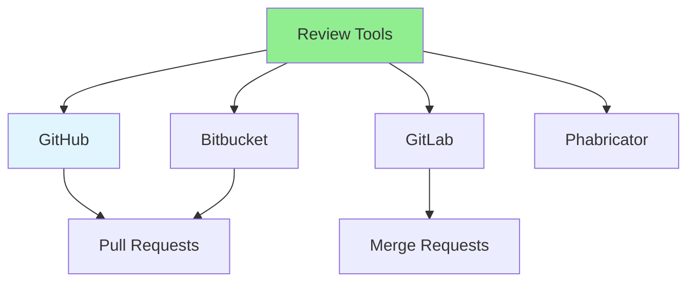

# 08.10 Review Tools / Công cụ review

## Table of Contents / Mục lục
1. [Introduction / Giới thiệu](#introduction--giới-thiệu)
2. [Code Review Tools / Công cụ review code](#code-review-tools--công-cụ-review-code)
3. [Tool Features / Tính năng công cụ](#tool-features--tính-năng-công-cụ)
4. [Best Practices / Thực hành tốt nhất](#best-practices--thực-hành-tốt-nhất)
5. [Summary / Tóm tắt](#summary--tóm-tắt)

---

## Introduction / Giới thiệu

### Overview / Tổng quan

**English**: Code review tools streamline the review process. Learn to use tools like GitHub, GitLab, and Bitbucket for efficient code reviews.

**Vietnamese**: Công cụ review code hợp lý hóa quy trình review. Học cách sử dụng công cụ như GitHub, GitLab và Bitbucket cho review code hiệu quả.

### Code Review Tools / Công cụ review code



---

## Code Review Tools / Công cụ review code

### Example 1: Tool Comparison / Ví dụ 1: So sánh công cụ

```markdown
# Code Review Tools Comparison

## GitHub
- Pull Requests / Yêu cầu kéo
- Inline comments / Comment nội tuyến
- Review approvals / Phê duyệt review
- CI/CD integration / Tích hợp CI/CD
- Code suggestions / Đề xuất code

## GitLab
- Merge Requests / Yêu cầu hợp nhất
- Inline comments / Comment nội tuyến
- Review approvals / Phê duyệt review
- CI/CD integration / Tích hợp CI/CD
- Code quality reports / Báo cáo chất lượng code

## Bitbucket
- Pull Requests / Yêu cầu kéo
- Inline comments / Comment nội tuyến
- Review approvals / Phê duyệt review
- CI/CD integration / Tích hợp CI/CD
```

---

## Best Practices / Thực hành tốt nhất

1. **Use tools** - Leverage review tool features
2. **Inline comments** - Comment on specific lines
3. **Suggestions** - Use code suggestion features
4. **Approve/Request changes** - Use approval workflow
5. **Track status** - Monitor review status

---

## Summary / Tóm tắt

### Key Takeaways / Điểm chính

- **Review tools**: GitHub, GitLab, Bitbucket
- **Features**: Inline comments, approvals, suggestions
- **Workflow**: Use tool workflows
- **Integration**: CI/CD integration
- **Efficiency**: Tools streamline process

### Next Steps / Bước tiếp theo

- [08.11 Review Best Practices](./08.11_Review_Best_Practices.md) - Next: Best Practices

---

**Last Updated / Cập nhật lần cuối**: 2024


