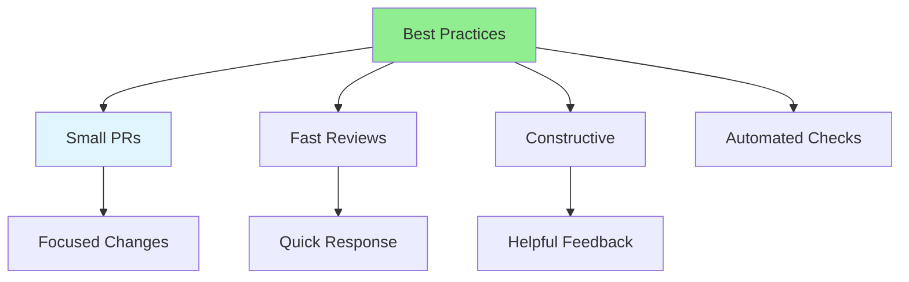

# 08.11 Review Best Practices / Thực hành tốt nhất review

## Table of Contents / Mục lục
1. [Introduction / Giới thiệu](#introduction--giới-thiệu)
2. [Best Practices / Thực hành tốt nhất](#best-practices--thực-hành-tốt-nhất)
3. [Common Patterns / Mẫu phổ biến](#common-patterns--mẫu-phổ-biến)
4. [Summary / Tóm tắt](#summary--tóm-tắt)

---

## Introduction / Giới thiệu

### Overview / Tổng quan

**English**: Following best practices makes code reviews effective and efficient. Learn proven practices for successful code reviews.

**Vietnamese**: Tuân theo thực hành tốt nhất làm cho review code hiệu quả. Học thực hành đã được chứng minh cho review code thành công.

### Review Best Practices / Thực hành tốt nhất review



---

## Best Practices / Thực hành tốt nhất

### Example 1: Best Practices List / Ví dụ 1: Danh sách thực hành tốt nhất

```markdown
# Code Review Best Practices

## For Authors / Cho tác giả
- Keep PRs small and focused / Giữ PR nhỏ và tập trung
- Self-review before submitting / Tự review trước khi submit
- Write clear commit messages / Viết commit message rõ ràng
- Respond to comments promptly / Phản hồi comment nhanh chóng
- Fix issues before requesting re-review / Sửa vấn đề trước khi yêu cầu review lại

## For Reviewers / Cho reviewer
- Review promptly (within 24 hours) / Review nhanh chóng (trong 24 giờ)
- Be constructive and respectful / Mang tính xây dựng và tôn trọng
- Focus on important issues / Tập trung vào vấn đề quan trọng
- Approve when ready / Phê duyệt khi sẵn sàng
- Explain reasoning / Giải thích lý do

## General / Chung
- Use automated checks / Sử dụng kiểm tra tự động
- Set clear standards / Đặt tiêu chuẩn rõ ràng
- Keep reviews focused / Giữ review tập trung
- Learn from reviews / Học từ review
- Maintain positive culture / Duy trì văn hóa tích cực
```

---

## Summary / Tóm tắt

### Key Takeaways / Điểm chính

- **Small PRs**: Keep changes focused
- **Fast reviews**: Review promptly
- **Constructive**: Provide helpful feedback
- **Automated**: Use automated checks
- **Culture**: Maintain positive environment

### Next Steps / Bước tiếp theo

- [08.12 Common Review Issues](./08.12_Common_Review_Issues.md) - Next: Common Issues

---

**Last Updated / Cập nhật lần cuối**: 2024

