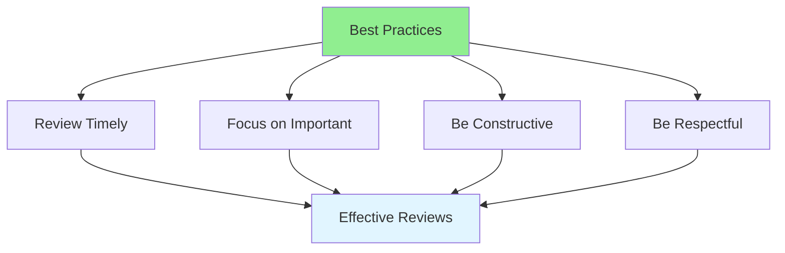

# 08.11 Review Best Practices / Review Best Practices

## Table of Contents / Mục lục
1. [Introduction / Giới thiệu](#introduction--giới-thiệu)
2. [Review Guidelines / Hướng dẫn review](#review-guidelines--hướng-dẫn-review)
3. [Common Practices / Thực hành phổ biến](#common-practices--thực-hành-phổ-biến)
4. [Best Practices / Thực hành tốt nhất](#best-practices--thực-hành-tốt-nhất)
5. [Summary / Tóm tắt](#summary--tóm-tắt)

---

## Introduction / Giới thiệu

### Overview / Tổng quan

**English**: Following code review best practices ensures effective reviews and positive team collaboration. Understanding best practices improves review quality and team dynamics.

**Vietnamese**: Tuân theo thực hành tốt nhất review code đảm bảo review hiệu quả và hợp tác nhóm tích cực. Hiểu thực hành tốt nhất cải thiện chất lượng review và động lực nhóm.

### Best Practices Framework / Khung thực hành tốt nhất



---

## Review Guidelines / Hướng dẫn review

### Example 1: Review Guidelines / Ví dụ 1: Hướng dẫn review

```typescript
interface ReviewGuidelines {
  timing: {
    reviewWithin: string; // e.g., "24 hours" / ví dụ: "24 giờ"
    donRush: boolean;
    donDelay: boolean;
  };
  focus: {
    importantChanges: boolean;
    donNitpick: boolean;
    prioritize: boolean;
  };
  communication: {
    constructive: boolean;
    respectful: boolean;
    specific: boolean;
  };
  approval: {
    approveWhenReady: boolean;
    donBlockUnnecessarily: boolean;
    requestChangesWhenNeeded: boolean;
  };
}

const guidelines: ReviewGuidelines = {
  timing: {
    reviewWithin: '24 hours',
    donRush: true,
    donDelay: true
  },
  focus: {
    importantChanges: true,
    donNitpick: true,
    prioritize: true
  },
  communication: {
    constructive: true,
    respectful: true,
    specific: true
  },
  approval: {
    approveWhenReady: true,
    donBlockUnnecessarily: true,
    requestChangesWhenNeeded: true
  }
};
```

---

## Common Practices / Thực hành phổ biến

### Example 2: Practice Examples / Ví dụ 2: Ví dụ thực hành

```typescript
// ✅ Good practices / Thực hành tốt
const goodPractices = {
  reviewTimely: 'Review within 24 hours',
  beSpecific: 'Provide specific, actionable feedback',
  explainWhy: 'Explain reasoning behind suggestions',
  provideExamples: 'Show how to fix issues',
  beRespectful: 'Focus on code, not person',
  approveWhenReady: 'Approve if code is good, even with minor suggestions'
};

// ❌ Bad practices / Thực hành xấu
const badPractices = {
  delayReview: 'Taking days to review',
  vagueFeedback: 'This is wrong (without explanation)',
  personalAttacks: 'This code is terrible',
  blockUnnecessarily: 'Blocking for style preferences',
  nitpick: 'Focusing on minor style issues'
};
```

---

## Best Practices / Thực hành tốt nhất

1. **Review timely** - Within 24 hours
2. **Focus on important** - Don't nitpick
3. **Be constructive** - Helpful suggestions
4. **Be respectful** - Professional tone
5. **Approve when ready** - Don't block unnecessarily

---

## Summary / Tóm tắt

### Key Takeaways / Điểm chính

- **Timely**: Review promptly
- **Focus**: Important changes
- **Constructive**: Helpful feedback
- **Respectful**: Professional communication

### Next Steps / Bước tiếp theo

- [08.12 Common Issues](./08.12_Common_Review_Issues.md) - Next: Common Issues

---

**Last Updated / Cập nhật lần cuối**: 2024

