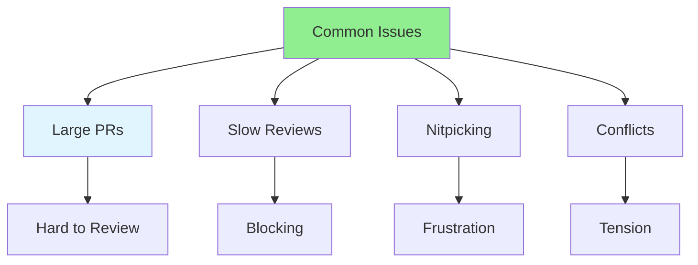

# 08.12 Common Review Issues / Vấn đề review phổ biến

## Table of Contents / Mục lục
1. [Introduction / Giới thiệu](#introduction--giới-thiệu)
2. [Common Issues / Vấn đề phổ biến](#common-issues--vấn-đề-phổ-biến)
3. [Solutions / Giải pháp](#solutions--giải-pháp)
4. [Best Practices / Thực hành tốt nhất](#best-practices--thực-hành-tốt-nhất)
5. [Summary / Tóm tắt](#summary--tóm-tắt)

---

## Introduction / Giới thiệu

### Overview / Tổng quan

**English**: Understanding common review issues helps avoid them. Learn to identify and address frequent code review problems.

**Vietnamese**: Hiểu vấn đề review phổ biến giúp tránh chúng. Học cách xác định và giải quyết vấn đề review code thường gặp.

### Common Review Issues / Vấn đề review phổ biến



---

## Common Issues / Vấn đề phổ biến

### Example 1: Common Problems / Ví dụ 1: Vấn đề phổ biến

```markdown
# Common Code Review Issues

## Large Pull Requests
**Problem**: PRs with 1000+ lines are hard to review
**Solution**: Break into smaller PRs, focus on one feature

## Slow Reviews
**Problem**: Reviews take days, blocking development
**Solution**: Set review SLA (e.g., 24 hours), assign reviewers

## Nitpicking
**Problem**: Focusing on minor style issues instead of important problems
**Solution**: Use automated formatters, focus on logic and architecture

## Conflicts
**Problem**: Disagreements become personal
**Solution**: Focus on code, be respectful, discuss objectively

## Incomplete Reviews
**Problem**: Approving without thorough review
**Solution**: Take time, use checklist, review systematically
```

---

## Best Practices / Thực hành tốt nhất

1. **Keep PRs small** - Easier to review
2. **Review promptly** - Don't block others
3. **Focus on important** - Don't nitpick
4. **Be respectful** - Professional communication
5. **Use tools** - Automated checks for style

---

## Summary / Tóm tắt

### Key Takeaways / Điểm chính

- **Large PRs**: Break into smaller changes
- **Slow reviews**: Set review SLAs
- **Nitpicking**: Use automated tools
- **Conflicts**: Stay professional
- **Incomplete**: Review thoroughly

### Next Steps / Bước tiếp theo

- [08.13 Review Automation](./08.13_Review_Automation.md) - Next: Automation

---

**Last Updated / Cập nhật lần cuối**: 2024

