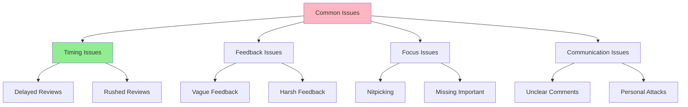

# 08.12 Common Review Issues / Common Review Issues

## Table of Contents / Mục lục
1. [Introduction / Giới thiệu](#introduction--giới-thiệu)
2. [Common Issues / Vấn đề phổ biến](#common-issues--vấn-đề-phổ-biến)
3. [How to Avoid / Cách tránh](#how-to-avoid--cách-tránh)
4. [Best Practices / Thực hành tốt nhất](#best-practices--thực-hành-tốt-nhất)
5. [Summary / Tóm tắt](#summary--tóm-tắt)

---

## Introduction / Giới thiệu

### Overview / Tổng quan

**English**: Understanding common review issues helps avoid them and improve review quality. Learning from common mistakes makes reviews more effective.

**Vietnamese**: Hiểu vấn đề review phổ biến giúp tránh chúng và cải thiện chất lượng review. Học từ lỗi phổ biến làm review hiệu quả hơn.

### Common Issues / Vấn đề phổ biến



---

## Common Issues / Vấn đề phổ biến

### Example 1: Issue Examples / Ví dụ 1: Ví dụ vấn đề

```typescript
interface CommonIssue {
  issue: string;
  impact: string;
  solution: string;
}

const commonIssues: CommonIssue[] = [
  {
    issue: 'Delayed reviews',
    impact: 'Blocks development, slows down team',
    solution: 'Set review time limit (e.g., 24 hours), use reminders'
  },
  {
    issue: 'Vague feedback',
    impact: 'Author doesn\'t know how to fix',
    solution: 'Be specific, provide examples, explain why'
  },
  {
    issue: 'Nitpicking',
    impact: 'Wastes time, frustrates authors',
    solution: 'Focus on important issues, approve minor style differences'
  },
  {
    issue: 'Missing critical issues',
    impact: 'Bugs reach production',
    solution: 'Use checklist, review systematically'
  },
  {
    issue: 'Harsh feedback',
    impact: 'Damages team morale',
    solution: 'Be respectful, focus on code, provide constructive feedback'
  }
];
```

---

## How to Avoid / Cách tránh

### Example 2: Prevention Strategies / Ví dụ 2: Chiến lược phòng ngừa

```typescript
// Prevention strategies / Chiến lược phòng ngừa
const prevention = {
  timing: {
    setDeadline: 'Review within 24 hours',
    useReminders: 'Set calendar reminders',
    prioritize: 'Review blocking PRs first'
  },
  feedback: {
    useTemplate: 'Use feedback template',
    beSpecific: 'Always be specific',
    provideExamples: 'Include code examples'
  },
  focus: {
    useChecklist: 'Follow review checklist',
    prioritize: 'Focus on critical issues first',
    approveMinor: 'Approve if only minor issues'
  },
  communication: {
    beRespectful: 'Always be professional',
    explainWhy: 'Explain reasoning',
    offerHelp: 'Offer to help fix issues'
  }
};
```

---

## Best Practices / Thực hành tốt nhất

1. **Review timely** - Set time limits
2. **Be specific** - Clear, actionable feedback
3. **Focus on important** - Don't nitpick
4. **Be respectful** - Professional communication
5. **Use checklist** - Systematic review

---

## Summary / Tóm tắt

### Key Takeaways / Điểm chính

- **Issues**: Timing, feedback, focus, communication
- **Avoid**: Use best practices
- **Improve**: Learn from mistakes

### Next Steps / Bước tiếp theo

- [08.13 Review Automation](./08.13_Review_Automation.md) - Next: Review Automation

---

**Last Updated / Cập nhật lần cuối**: 2024

