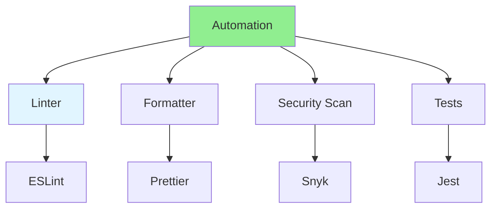

# 08.13 Review Automation / Tự động hóa review

## Table of Contents / Mục lục
1. [Introduction / Giới thiệu](#introduction--giới-thiệu)
2. [Automation Tools / Công cụ tự động hóa](#automation-tools--công-cụ-tự-động-hóa)
3. [Automation Setup / Thiết lập tự động hóa](#automation-setup--thiết-lập-tự-động-hóa)
4. [Best Practices / Thực hành tốt nhất](#best-practices--thực-hành-tốt-nhất)
5. [Summary / Tóm tắt](#summary--tóm-tắt)

---

## Introduction / Giới thiệu

### Overview / Tổng quan

**English**: Automated reviews catch issues before human review. Learn to set up automated checks for code quality, security, and style.

**Vietnamese**: Review tự động phát hiện vấn đề trước khi review thủ công. Học cách thiết lập kiểm tra tự động cho chất lượng code, bảo mật và phong cách.

### Review Automation / Tự động hóa review



---

## Automation Tools / Công cụ tự động hóa

### Example 1: CI/CD Automation / Ví dụ 1: Tự động hóa CI/CD

```yaml
# GitHub Actions automation / Tự động hóa GitHub Actions
name: Code Review Checks

on:
  pull_request:
    branches: [main]

jobs:
  lint:
    runs-on: ubuntu-latest
    steps:
      - uses: actions/checkout@v3
      - uses: actions/setup-node@v3
      - run: npm ci
      - run: npm run lint
  
  test:
    runs-on: ubuntu-latest
    steps:
      - uses: actions/checkout@v3
      - uses: actions/setup-node@v3
      - run: npm ci
      - run: npm test
  
  security:
    runs-on: ubuntu-latest
    steps:
      - uses: actions/checkout@v3
      - run: npm audit
      - uses: snyk/actions/node@master
```

---

## Best Practices / Thực hành tốt nhất

1. **Automate checks** - Linting, formatting, tests
2. **Fail fast** - Block PRs with issues
3. **Clear messages** - Explain what failed
4. **Keep fast** - Quick feedback
5. **Update rules** - Keep rules current

---

## Summary / Tóm tắt

### Key Takeaways / Điểm chính

- **Automation**: Linters, formatters, security scans
- **CI/CD**: Integrate with CI/CD pipelines
- **Fast feedback**: Quick automated checks
- **Block issues**: Prevent merging bad code
- **Update**: Keep automation rules current

### Next Steps / Bước tiếp theo

- [08.14 Code Review Culture](./08.14_Code_Review_Culture.md) - Next: Review Culture

---

**Last Updated / Cập nhật lần cuối**: 2024

