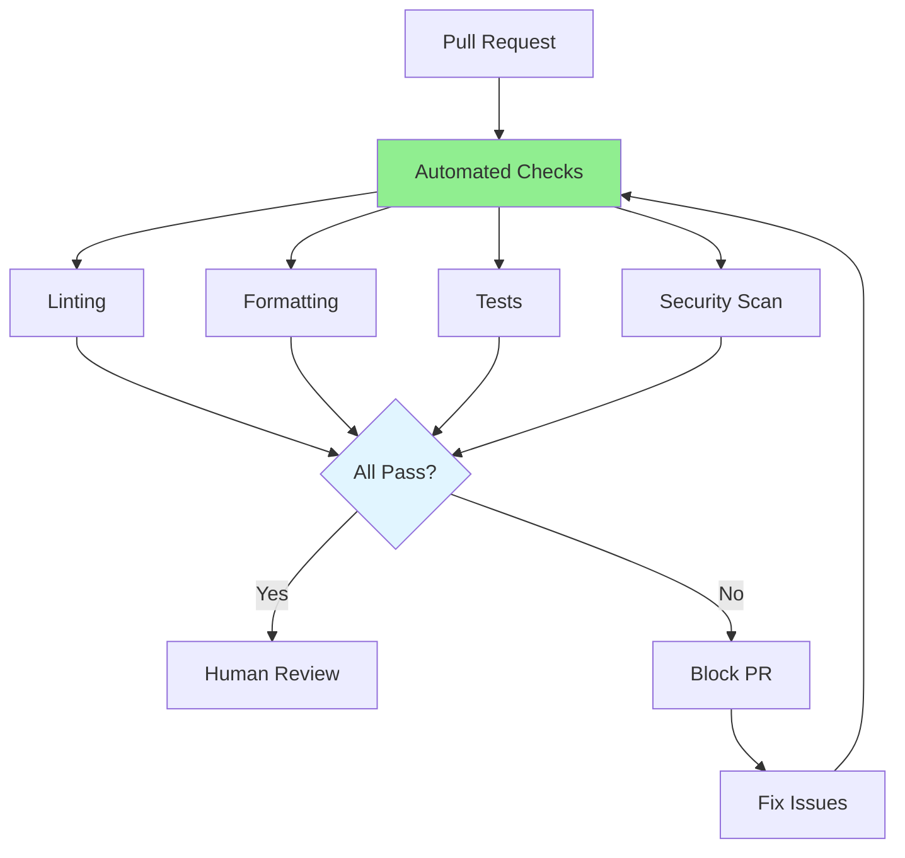

# 08.13 Review Automation / Review Automation

## Table of Contents / Mục lục
1. [Introduction / Giới thiệu](#introduction--giới-thiệu)
2. [Automated Checks / Kiểm tra tự động](#automated-checks--kiểm-tra-tự-động)
3. [CI/CD Integration / Tích hợp CI/CD](#cicd-integration--tích-hợp-cicd)
4. [Best Practices / Thực hành tốt nhất](#best-practices--thực-hành-tốt-nhất)
5. [Summary / Tóm tắt](#summary--tóm-tắt)

---

## Introduction / Giới thiệu

### Overview / Tổng quan

**English**: Automated code review checks catch issues before human review. Integrating automated checks into CI/CD improves code quality and review efficiency.

**Vietnamese**: Kiểm tra review code tự động phát hiện vấn đề trước khi review thủ công. Tích hợp kiểm tra tự động vào CI/CD cải thiện chất lượng code và hiệu quả review.

### Automation Flow / Luồng tự động hóa



---

## Automated Checks / Kiểm tra tự động

### Example 1: Automation Setup / Ví dụ 1: Thiết lập tự động hóa

```yaml
# GitHub Actions automated checks / Kiểm tra tự động GitHub Actions
# .github/workflows/pr-checks.yml
name: PR Checks

on:
  pull_request:
    branches: [main, develop]

jobs:
  lint:
    runs-on: ubuntu-latest
    steps:
      - uses: actions/checkout@v3
      - uses: actions/setup-node@v3
      - run: npm ci
      - run: npm run lint
  
  test:
    runs-on: ubuntu-latest
    steps:
      - uses: actions/checkout@v3
      - uses: actions/setup-node@v3
      - run: npm ci
      - run: npm run test
      - run: npm run test:coverage
  
  security:
    runs-on: ubuntu-latest
    steps:
      - uses: actions/checkout@v3
      - run: npm audit
      - uses: github/super-linter@v4
```

---

## CI/CD Integration / Tích hợp CI/CD

### Example 2: CI/CD Pipeline / Ví dụ 2: Pipeline CI/CD

```typescript
// CI/CD pipeline with automated reviews / Pipeline CI/CD với review tự động
interface CICDPipeline {
  stages: PipelineStage[];
}

interface PipelineStage {
  name: string;
  type: 'Lint' | 'Test' | 'Security' | 'Build';
  required: boolean; // Block PR if fails / Chặn PR nếu thất bại
}

const pipeline: CICDPipeline = {
  stages: [
    {
      name: 'Linting',
      type: 'Lint',
      required: true
    },
    {
      name: 'Unit Tests',
      type: 'Test',
      required: true
    },
    {
      name: 'Security Scan',
      type: 'Security',
      required: true
    },
    {
      name: 'Build',
      type: 'Build',
      required: true
    }
  ]
};
```

---

## Best Practices / Thực hành tốt nhất

1. **Automate checks** - Linting, formatting, tests
2. **Block on failures** - Prevent merging bad code
3. **Fast feedback** - Quick automated checks
4. **Human review** - After automated checks pass
5. **Update rules** - Refine based on experience

---

## Summary / Tóm tắt

### Key Takeaways / Điểm chính

- **Automate**: Linting, tests, security scans
- **CI/CD**: Integrate into pipeline
- **Block**: Prevent bad code from merging
- **Fast**: Quick feedback

### Next Steps / Bước tiếp theo

- [08.14 Code Review Culture](./08.14_Code_Review_Culture.md) - Next: Review Culture

---

**Last Updated / Cập nhật lần cuối**: 2024

