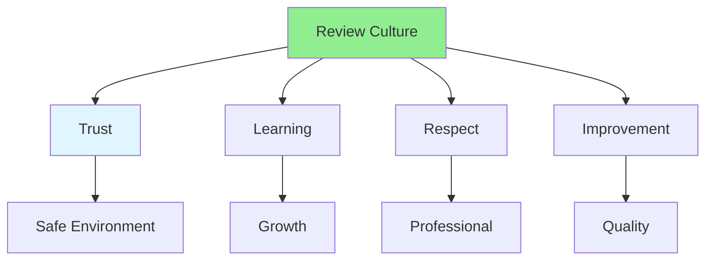

# 08.14 Code Review Culture / Văn hóa review code

## Table of Contents / Mục lục
1. [Introduction / Giới thiệu](#introduction--giới-thiệu)
2. [Building Review Culture / Xây dựng văn hóa review](#building-review-culture--xây-dựng-văn-hóa-review)
3. [Cultural Elements / Yếu tố văn hóa](#cultural-elements--yếu-tố-văn-hóa)
4. [Best Practices / Thực hành tốt nhất](#best-practices--thực-hành-tốt-nhất)
5. [Summary / Tóm tắt](#summary--tóm-tắt)

---

## Introduction / Giới thiệu

### Overview / Tổng quan

**English**: A positive code review culture improves team collaboration and code quality. Learn to foster a constructive review culture.

**Vietnamese**: Văn hóa review code tích cực cải thiện cộng tác nhóm và chất lượng code. Học cách nuôi dưỡng văn hóa review mang tính xây dựng.

### Code Review Culture / Văn hóa review code



---

## Building Review Culture / Xây dựng văn hóa review

### Example 1: Cultural Elements / Ví dụ 1: Yếu tố văn hóa

```markdown
# Code Review Culture Elements

## Trust
- Reviews are about code, not people / Review về code, không phải người
- Safe to make mistakes / An toàn để mắc lỗi
- Learning opportunity / Cơ hội học tập

## Respect
- Professional communication / Giao tiếp chuyên nghiệp
- Acknowledge good work / Ghi nhận công việc tốt
- Constructive feedback / Phản hồi mang tính xây dựng

## Learning
- Share knowledge / Chia sẻ kiến thức
- Explain reasoning / Giải thích lý do
- Learn from each other / Học từ nhau

## Improvement
- Focus on making code better / Tập trung làm code tốt hơn
- Continuous improvement / Cải thiện liên tục
- Team growth / Phát triển nhóm
```

---

## Best Practices / Thực hành tốt nhất

1. **Lead by example** - Model good review behavior
2. **Encourage participation** - Everyone reviews
3. **Celebrate learning** - Reviews are learning opportunities
4. **Be respectful** - Professional, constructive
5. **Improve continuously** - Evolve review process

---

## Summary / Tóm tắt

### Key Takeaways / Điểm chính

- **Culture**: Positive review culture improves quality
- **Trust**: Safe environment for learning
- **Respect**: Professional communication
- **Learning**: Reviews as learning opportunities
- **Improvement**: Continuous improvement mindset

### Next Steps / Bước tiếp theo

- [08.15 Review Metrics](./08.15_Review_Metrics.md) - Next: Review Metrics

---

**Last Updated / Cập nhật lần cuối**: 2024

