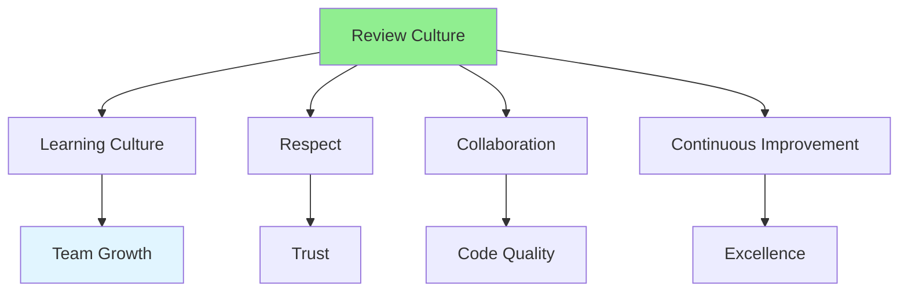

# 08.14 Code Review Culture / Code Review Culture

## Table of Contents / Mục lục
1. [Introduction / Giới thiệu](#introduction--giới-thiệu)
2. [Building Culture / Xây dựng văn hóa](#building-culture--xây-dựng-văn-hóa)
3. [Team Practices / Thực hành nhóm](#team-practices--thực-hành-nhóm)
4. [Best Practices / Thực hành tốt nhất](#best-practices--thực-hành-tốt-nhất)
5. [Summary / Tóm tắt](#summary--tóm-tắt)

---

## Introduction / Giới thiệu

### Overview / Tổng quan

**English**: A positive code review culture improves code quality and team collaboration. Building a culture of learning and improvement makes reviews valuable for everyone.

**Vietnamese**: Văn hóa review code tích cực cải thiện chất lượng code và hợp tác nhóm. Xây dựng văn hóa học hỏi và cải thiện làm review có giá trị cho mọi người.

### Review Culture Elements / Yếu tố văn hóa review



---

## Building Culture / Xây dựng văn hóa

### Example 1: Culture Elements / Ví dụ 1: Yếu tố văn hóa

```typescript
interface ReviewCulture {
  values: {
    learning: string;
    respect: string;
    collaboration: string;
    improvement: string;
  };
  practices: {
    regularReviews: boolean;
    knowledgeSharing: boolean;
    constructiveFeedback: boolean;
    celebrateImprovements: boolean;
  };
}

const culture: ReviewCulture = {
  values: {
    learning: 'Reviews are learning opportunities, not criticism',
    respect: 'Respectful communication, focus on code',
    collaboration: 'Work together to improve code',
    improvement: 'Continuous improvement mindset'
  },
  practices: {
    regularReviews: true,
    knowledgeSharing: true,
    constructiveFeedback: true,
    celebrateImprovements: true
  }
};
```

---

## Team Practices / Thực hành nhóm

### Example 2: Team Practices / Ví dụ 2: Thực hành nhóm

```typescript
// Team review practices / Thực hành review nhóm
const teamPractices = {
  reviewPairs: 'Pair developers for reviews',
  reviewRotation: 'Rotate reviewers to share knowledge',
  reviewGuidelines: 'Document review guidelines',
  reviewMetrics: 'Track review metrics (time, quality)',
  reviewRetrospectives: 'Regular retrospectives on review process'
};

// Knowledge sharing / Chia sẻ kiến thức
const knowledgeSharing = {
  reviewSessions: 'Group review sessions for learning',
  bestPractices: 'Share review best practices',
  commonIssues: 'Document common issues and solutions',
  toolTips: 'Share tips on using review tools'
};
```

---

## Best Practices / Thực hành tốt nhất

1. **Foster learning** - Reviews as learning opportunities
2. **Be respectful** - Professional communication
3. **Share knowledge** - Help team members learn
4. **Improve continuously** - Refine review process
5. **Celebrate improvements** - Recognize good code

---

## Summary / Tóm tắt

### Key Takeaways / Điểm chính

- **Culture**: Learning, respect, collaboration
- **Practices**: Regular reviews, knowledge sharing
- **Improvement**: Continuous refinement
- **Value**: Reviews benefit everyone

### Next Steps / Bước tiếp theo

- [08.15 Review Metrics](./08.15_Review_Metrics.md) - Next: Review Metrics

---

**Last Updated / Cập nhật lần cuối**: 2024

