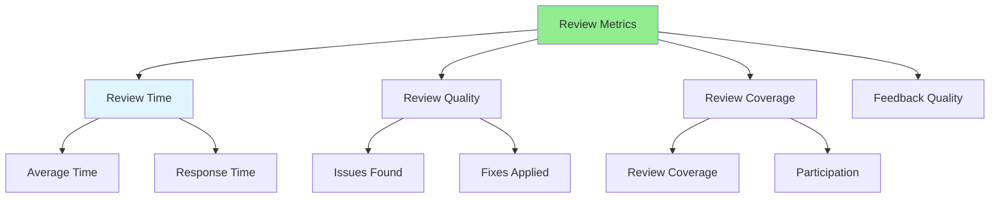

# 08.15 Review Metrics / Review Metrics - Đo lường hiệu quả

## Table of Contents / Mục lục
1. [Introduction / Giới thiệu](#introduction--giới-thiệu)
2. [Key Metrics / Chỉ số chính](#key-metrics--chỉ-số-chính)
3. [Using Metrics / Sử dụng chỉ số](#using-metrics--sử-dụng-chỉ-số)
4. [Best Practices / Thực hành tốt nhất](#best-practices--thực-hành-tốt-nhất)
5. [Summary / Tóm tắt](#summary--tóm-tắt)

---

## Introduction / Giới thiệu

### Overview / Tổng quan

**English**: Review metrics help measure review effectiveness and identify areas for improvement. Tracking metrics enables data-driven improvements to the review process.

**Vietnamese**: Chỉ số review giúp đo lường hiệu quả review và xác định lĩnh vực cần cải thiện. Theo dõi chỉ số cho phép cải thiện dựa trên dữ liệu cho quy trình review.

### Review Metrics / Chỉ số review



---

## Key Metrics / Chỉ số chính

### Example 1: Metrics Definition / Ví dụ 1: Định nghĩa chỉ số

```typescript
interface ReviewMetrics {
  time: {
    averageReviewTime: number; // hours / giờ
    averageResponseTime: number; // hours / giờ
    timeToFirstReview: number; // hours / giờ
  };
  quality: {
    issuesFoundPerPR: number;
    criticalIssuesFound: number;
    bugsPrevented: number;
  };
  coverage: {
    prsReviewed: number;
    reviewParticipation: number; // percentage / phần trăm
    reviewersPerPR: number;
  };
  feedback: {
    commentsPerPR: number;
    constructiveComments: number;
    approvalsPerPR: number;
  };
}

// Example metrics / Ví dụ chỉ số
const metrics: ReviewMetrics = {
  time: {
    averageReviewTime: 2, // hours / giờ
    averageResponseTime: 4, // hours / giờ
    timeToFirstReview: 1 // hour / giờ
  },
  quality: {
    issuesFoundPerPR: 3,
    criticalIssuesFound: 0.5,
    bugsPrevented: 10 // per month / mỗi tháng
  },
  coverage: {
    prsReviewed: 100, // percentage / phần trăm
    reviewParticipation: 80, // percentage / phần trăm
    reviewersPerPR: 2
  },
  feedback: {
    commentsPerPR: 5,
    constructiveComments: 4.5,
    approvalsPerPR: 1.2
  }
};
```

---

## Using Metrics / Sử dụng chỉ số

### Example 2: Metrics Analysis / Ví dụ 2: Phân tích chỉ số

```typescript
// Metrics analysis / Phân tích chỉ số
function analyzeReviewMetrics(metrics: ReviewMetrics): Analysis {
  const analysis: Analysis = {
    strengths: [],
    improvements: [],
    recommendations: []
  };
  
  // Analyze time metrics / Phân tích chỉ số thời gian
  if (metrics.time.averageReviewTime > 24) {
    analysis.improvements.push('Review time is too long, aim for < 24 hours');
  }
  
  // Analyze quality metrics / Phân tích chỉ số chất lượng
  if (metrics.quality.criticalIssuesFound > 0) {
    analysis.strengths.push('Good at catching critical issues');
  }
  
  // Analyze coverage / Phân tích coverage
  if (metrics.coverage.reviewParticipation < 80) {
    analysis.improvements.push('Increase review participation');
  }
  
  return analysis;
}
```

---

## Best Practices / Thực hành tốt nhất

1. **Track metrics** - Measure review effectiveness
2. **Set goals** - Target metrics (e.g., < 24h review time)
3. **Analyze trends** - Identify patterns
4. **Improve process** - Based on metrics
5. **Share insights** - With team

---

## Summary / Tóm tắt

### Key Takeaways / Điểm chính

- **Metrics**: Time, quality, coverage, feedback
- **Track**: Measure review effectiveness
- **Analyze**: Identify improvements
- **Improve**: Refine based on data

### Next Steps / Bước tiếp theo

- Complete Group 08: Code Review ✅
- Move to [Group 09: Complex Functions](../Group-09-Complex-Functions/) - Coming soon

---

**Last Updated / Cập nhật lần cuối**: 2024

