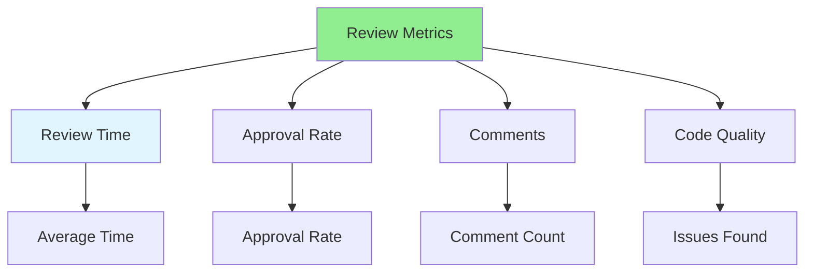

# 08.15 Review Metrics / Chỉ số review

## Table of Contents / Mục lục
1. [Introduction / Giới thiệu](#introduction--giới-thiệu)
2. [Key Metrics / Chỉ số chính](#key-metrics--chỉ-số-chính)
3. [Tracking Metrics / Theo dõi chỉ số](#tracking-metrics--theo-dõi-chỉ-số)
4. [Best Practices / Thực hành tốt nhất](#best-practices--thực-hành-tốt-nhất)
5. [Summary / Tóm tắt](#summary--tóm-tắt)

---

## Introduction / Giới thiệu

### Overview / Tổng quan

**English**: Review metrics help measure review effectiveness. Learn to track metrics like review time, approval rate, and code quality.

**Vietnamese**: Chỉ số review giúp đo lường hiệu quả review. Học cách theo dõi chỉ số như thời gian review, tỷ lệ phê duyệt và chất lượng code.

### Review Metrics / Chỉ số review



---

## Key Metrics / Chỉ số chính

### Example 1: Metrics to Track / Ví dụ 1: Chỉ số cần theo dõi

```typescript
// Review metrics interface / Interface chỉ số review
interface ReviewMetrics {
  averageReviewTime: number;      // Hours / Giờ
  averageTimeToFirstReview: number; // Hours / Giờ
  approvalRate: number;             // Percentage / Phần trăm
  averageCommentsPerPR: number;
  averageIssuesFound: number;
  codeQualityScore: number;        // 0-100
  reviewerParticipation: number;   // Percentage / Phần trăm
}

// Example metrics / Ví dụ chỉ số
const metrics: ReviewMetrics = {
  averageReviewTime: 4,           // 4 hours average / Trung bình 4 giờ
  averageTimeToFirstReview: 2,     // 2 hours to first review / 2 giờ đến review đầu tiên
  approvalRate: 85,                // 85% approval rate / Tỷ lệ phê duyệt 85%
  averageCommentsPerPR: 3.5,
  averageIssuesFound: 2.1,
  codeQualityScore: 88,            // 88/100 / 88/100
  reviewerParticipation: 90       // 90% of team reviews / 90% nhóm review
};
```

---

## Best Practices / Thực hành tốt nhất

1. **Track metrics** - Measure review effectiveness
2. **Set targets** - Define target metrics
3. **Review regularly** - Review metrics periodically
4. **Improve** - Use metrics to improve process
5. **Don't game** - Metrics are tools, not goals

---

## Summary / Tóm tắt

### Key Takeaways / Điểm chính

- **Metrics**: Track review effectiveness
- **Time**: Average review time
- **Quality**: Code quality indicators
- **Participation**: Reviewer engagement
- **Improvement**: Use metrics to improve

### Next Steps / Bước tiếp theo

- ✅ Complete Group 08: Code Review
- Move to [Group 09: Complex Functions](../Group-09-Complex-Functions/) - Coming next

---

**Last Updated / Cập nhật lần cuối**: 2024

