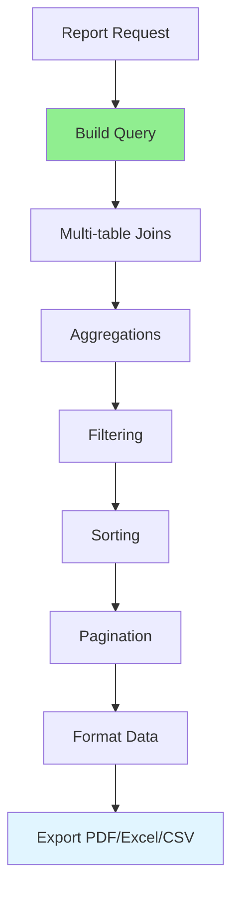

# 09.01 Advanced Search / Report phức tạp - Báo cáo đa dạng

## Table of Contents / Mục lục
1. [Introduction / Giới thiệu](#introduction--giới-thiệu)
2. [Complex Report Features / Tính năng báo cáo phức tạp](#complex-report-features--tính-năng-báo-cáo-phức-tạp)
3. [Report Implementation / Triển khai báo cáo](#report-implementation--triển-khai-báo-cáo)
4. [Export Formats / Định dạng xuất](#export-formats--định-dạng-xuất)
5. [Performance Optimization / Tối ưu hiệu năng](#performance-optimization--tối-ưu-hiệu-năng)
6. [Best Practices / Thực hành tốt nhất](#best-practices--thực-hành-tốt-nhất)
7. [Summary / Tóm tắt](#summary--tóm-tắt)

---

## Introduction / Giới thiệu

### Overview / Tổng quan

**English**: Complex reports involve multi-table joins, aggregations, grouping, filtering, and sorting. Implementing efficient reports with export capabilities is essential for business intelligence.

**Vietnamese**: Báo cáo phức tạp bao gồm join nhiều bảng, tổng hợp, nhóm, lọc và sắp xếp. Triển khai báo cáo hiệu quả với khả năng xuất rất quan trọng cho business intelligence.

### Report Generation Flow / Luồng tạo báo cáo



---

## Complex Report Features / Tính năng báo cáo phức tạp

### Example 1: Complex Report Query / Ví dụ 1: Truy vấn báo cáo phức tạp

```typescript
// Complex sales report / Báo cáo bán hàng phức tạp
interface SalesReportParams {
  startDate: Date;
  endDate: Date;
  categoryId?: string;
  groupBy: 'day' | 'week' | 'month';
}

async function generateSalesReport(params: SalesReportParams) {
  const report = await prisma.$queryRaw`
    SELECT 
      DATE_TRUNC(${params.groupBy}, o.created_at) as period,
      p.category_id,
      c.name as category_name,
      COUNT(DISTINCT o.id) as order_count,
      COUNT(oi.id) as item_count,
      SUM(oi.quantity) as total_quantity,
      SUM(oi.price * oi.quantity) as total_revenue,
      AVG(oi.price * oi.quantity) as avg_order_value
    FROM orders o
    INNER JOIN order_items oi ON o.id = oi.order_id
    INNER JOIN products p ON oi.product_id = p.id
    INNER JOIN categories c ON p.category_id = c.id
    WHERE o.created_at BETWEEN ${params.startDate} AND ${params.endDate}
      ${params.categoryId ? Prisma.sql`AND p.category_id = ${params.categoryId}` : Prisma.empty}
    GROUP BY 
      DATE_TRUNC(${params.groupBy}, o.created_at),
      p.category_id,
      c.name
    ORDER BY period DESC, total_revenue DESC
  `;
  
  return report;
}
```

---

## Report Implementation / Triển khai báo cáo

### Example 2: Report Service / Ví dụ 2: Service báo cáo

```typescript
@Injectable()
export class ReportService {
  constructor(private prisma: PrismaService) {}
  
  async generateReport(
    type: ReportType,
    filters: ReportFilters,
    options: ReportOptions
  ): Promise<ReportData> {
    // Build query based on type / Xây dựng truy vấn dựa trên loại
    const query = this.buildQuery(type, filters);
    
    // Execute query / Thực thi truy vấn
    const data = await this.prisma.$queryRaw(query);
    
    // Apply pagination if needed / Áp dụng phân trang nếu cần
    if (options.paginate) {
      return this.paginate(data, options.page, options.limit);
    }
    
    return { data, total: data.length };
  }
  
  private buildQuery(type: ReportType, filters: ReportFilters): Prisma.Sql {
    switch (type) {
      case 'sales':
        return this.buildSalesQuery(filters);
      case 'inventory':
        return this.buildInventoryQuery(filters);
      case 'customer':
        return this.buildCustomerQuery(filters);
      default:
        throw new Error(`Unknown report type: ${type}`);
    }
  }
}
```

---

## Export Formats / Định dạng xuất

### Example 3: Export Implementation / Ví dụ 3: Triển khai xuất

```typescript
import * as ExcelJS from 'exceljs';
import * as PDFDocument from 'pdfkit';

@Injectable()
export class ReportExportService {
  async exportToExcel(data: any[], filename: string): Promise<Buffer> {
    const workbook = new ExcelJS.Workbook();
    const worksheet = workbook.addWorksheet('Report');
    
    // Add headers / Thêm tiêu đề
    worksheet.columns = Object.keys(data[0]).map(key => ({
      header: key,
      key: key,
      width: 15
    }));
    
    // Add data / Thêm dữ liệu
    data.forEach(row => worksheet.addRow(row));
    
    // Generate buffer / Tạo buffer
    return await workbook.xlsx.writeBuffer();
  }
  
  async exportToPDF(data: any[], filename: string): Promise<Buffer> {
    const doc = new PDFDocument();
    const buffers: Buffer[] = [];
    
    doc.on('data', buffers.push.bind(buffers));
    doc.on('end', () => Buffer.concat(buffers));
    
    // Add content / Thêm nội dung
    doc.fontSize(20).text('Report', { align: 'center' });
    doc.moveDown();
    
    data.forEach(row => {
      doc.fontSize(12).text(JSON.stringify(row));
      doc.moveDown();
    });
    
    doc.end();
    return Buffer.concat(buffers);
  }
  
  async exportToCSV(data: any[]): Promise<string> {
    const headers = Object.keys(data[0]);
    const rows = data.map(row => 
      headers.map(header => row[header]).join(',')
    );
    
    return [headers.join(','), ...rows].join('\n');
  }
}
```

---

## Performance Optimization / Tối ưu hiệu năng

### Example 4: Optimization Techniques / Ví dụ 4: Kỹ thuật tối ưu

```typescript
// Optimize report queries / Tối ưu truy vấn báo cáo
async function optimizedReport(params: ReportParams) {
  // Use indexes / Sử dụng index
  // Ensure indexes on: created_at, category_id, status
  
  // Use materialized views for complex reports / Sử dụng materialized view cho báo cáo phức tạp
  await prisma.$executeRaw`
    REFRESH MATERIALIZED VIEW CONCURRENTLY sales_summary;
  `;
  
  // Paginate large results / Phân trang kết quả lớn
  const pageSize = 1000;
  let offset = 0;
  const results = [];
  
  while (true) {
    const page = await prisma.$queryRaw`
      SELECT * FROM sales_summary
      LIMIT ${pageSize} OFFSET ${offset}
    `;
    
    if (page.length === 0) break;
    results.push(...page);
    offset += pageSize;
  }
  
  return results;
}
```

---

## Best Practices / Thực hành tốt nhất

1. **Optimize queries** - Use indexes, materialized views
2. **Paginate results** - Handle large datasets
3. **Cache reports** - Cache frequently accessed reports
4. **Async generation** - Generate large reports asynchronously
5. **Error handling** - Handle report generation errors

---

## Summary / Tóm tắt

### Key Takeaways / Điểm chính

- **Features**: Joins, aggregations, grouping, filtering
- **Export**: PDF, Excel, CSV formats
- **Performance**: Indexes, pagination, caching
- **Optimization**: Materialized views, async generation

### Next Steps / Bước tiếp theo

- [09.02 Complex Filtering](./09.02_Complex_Filtering.md) - Next: Complex Filtering

---

**Last Updated / Cập nhật lần cuối**: 2024

