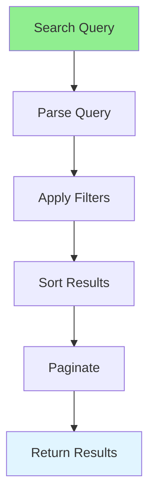

# 09.01 Advanced Search / Tìm kiếm nâng cao

## Table of Contents / Mục lục
1. [Introduction / Giới thiệu](#introduction--giới-thiệu)
2. [Advanced Search Features / Tính năng tìm kiếm nâng cao](#advanced-search-features--tính-năng-tìm-kiếm-nâng-cao)
3. [Implementation / Triển khai](#implementation--triển-khai)
4. [Best Practices / Thực hành tốt nhất](#best-practices--thực-hành-tốt-nhất)
5. [Summary / Tóm tắt](#summary--tóm-tắt)

---

## Introduction / Giới thiệu

### Overview / Tổng quan

**English**: Advanced search includes filters, sorting, full-text search, and faceted search. Learn to implement comprehensive search functionality.

**Vietnamese**: Tìm kiếm nâng cao bao gồm bộ lọc, sắp xếp, tìm kiếm toàn văn và tìm kiếm phân loại. Học cách triển khai chức năng tìm kiếm toàn diện.

### Advanced Search Flow / Luồng tìm kiếm nâng cao



---

## Advanced Search Features / Tính năng tìm kiếm nâng cao

### Example 1: Advanced Search Implementation / Ví dụ 1: Triển khai tìm kiếm nâng cao

```typescript
// Advanced search interface / Interface tìm kiếm nâng cao
interface SearchParams {
  query?: string;
  filters?: {
    category?: string[];
    priceRange?: { min: number; max: number };
    rating?: number;
    inStock?: boolean;
  };
  sortBy?: 'price' | 'rating' | 'date' | 'relevance';
  sortOrder?: 'asc' | 'desc';
  page?: number;
  limit?: number;
}

// Advanced search function / Hàm tìm kiếm nâng cao
async function advancedSearch(params: SearchParams) {
  const { query, filters, sortBy = 'relevance', sortOrder = 'desc', page = 1, limit = 20 } = params;
  
  let where: any = {};
  
  // Text search / Tìm kiếm văn bản
  if (query) {
    where.OR = [
      { name: { contains: query, mode: 'insensitive' } },
      { description: { contains: query, mode: 'insensitive' } }
    ];
  }
  
  // Filters / Bộ lọc
  if (filters) {
    if (filters.category) {
      where.categoryId = { in: filters.category };
    }
    if (filters.priceRange) {
      where.price = {
        gte: filters.priceRange.min,
        lte: filters.priceRange.max
      };
    }
    if (filters.rating) {
      where.rating = { gte: filters.rating };
    }
    if (filters.inStock !== undefined) {
      where.stockQuantity = filters.inStock ? { gt: 0 } : 0;
    }
  }
  
  // Sorting / Sắp xếp
  const orderBy: any = {};
  if (sortBy === 'price') orderBy.price = sortOrder;
  else if (sortBy === 'rating') orderBy.rating = sortOrder;
  else if (sortBy === 'date') orderBy.createdAt = sortOrder;
  
  // Pagination / Phân trang
  const skip = (page - 1) * limit;
  
  const [products, total] = await Promise.all([
    prisma.product.findMany({
      where,
      orderBy,
      skip,
      take: limit
    }),
    prisma.product.count({ where })
  ]);
  
  return {
    products,
    total,
    page,
    totalPages: Math.ceil(total / limit)
  };
}
```

---

## Best Practices / Thực hành tốt nhất

1. **Index search fields** - Index frequently searched columns
2. **Use full-text search** - For better text matching
3. **Cache results** - Cache frequent searches
4. **Limit results** - Use pagination
5. **Optimize queries** - Avoid N+1 problems

---

## Summary / Tóm tắt

### Key Takeaways / Điểm chính

- **Advanced search**: Filters, sorting, pagination
- **Full-text search**: Better text matching
- **Performance**: Index and optimize
- **User experience**: Fast, relevant results
- **Scalability**: Handle large datasets

### Next Steps / Bước tiếp theo

- [09.02 Complex Filtering](./09.02_Complex_Filtering.md) - Next: Complex Filtering

---

**Last Updated / Cập nhật lần cuối**: 2024

