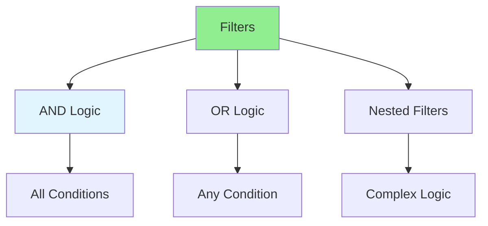

# 09.02 Complex Filtering / Lọc phức tạp

## Table of Contents / Mục lục
1. [Introduction / Giới thiệu](#introduction--giới-thiệu)
2. [Filtering Strategies / Chiến lược lọc](#filtering-strategies--chiến-lược-lọc)
3. [Implementation / Triển khai](#implementation--triển-khai)
4. [Best Practices / Thực hành tốt nhất](#best-practices--thực-hành-tốt-nhất)
5. [Summary / Tóm tắt](#summary--tóm-tắt)

---

## Introduction / Giới thiệu

### Overview / Tổng quan

**English**: Complex filtering allows users to narrow results with multiple criteria. Learn to implement multi-criteria filtering with AND/OR logic.

**Vietnamese**: Lọc phức tạp cho phép người dùng thu hẹp kết quả với nhiều tiêu chí. Học cách triển khai lọc đa tiêu chí với logic AND/OR.

### Complex Filtering / Lọc phức tạp



---

## Filtering Strategies / Chiến lược lọc

### Example 1: Complex Filtering / Ví dụ 1: Lọc phức tạp

```typescript
// Complex filter interface / Interface lọc phức tạp
interface ComplexFilter {
  and?: FilterCondition[];
  or?: FilterCondition[];
  not?: FilterCondition;
}

interface FilterCondition {
  field: string;
  operator: 'eq' | 'ne' | 'gt' | 'gte' | 'lt' | 'lte' | 'in' | 'contains';
  value: any;
}

// Build Prisma where clause / Xây dựng mệnh đề where Prisma
function buildWhereClause(filter: ComplexFilter): any {
  const where: any = {};
  
  if (filter.and) {
    where.AND = filter.and.map(condition => buildCondition(condition));
  }
  
  if (filter.or) {
    where.OR = filter.or.map(condition => buildCondition(condition));
  }
  
  if (filter.not) {
    where.NOT = buildCondition(filter.not);
  }
  
  return where;
}

function buildCondition(condition: FilterCondition): any {
  const { field, operator, value } = condition;
  const fieldPath = field.split('.');
  
  let conditionObj: any = {};
  let current = conditionObj;
  
  for (let i = 0; i < fieldPath.length - 1; i++) {
    current[fieldPath[i]] = {};
    current = current[fieldPath[i]];
  }
  
  const lastField = fieldPath[fieldPath.length - 1];
  
  switch (operator) {
    case 'eq':
      current[lastField] = value;
      break;
    case 'in':
      current[lastField] = { in: value };
      break;
    case 'contains':
      current[lastField] = { contains: value, mode: 'insensitive' };
      break;
    case 'gt':
      current[lastField] = { gt: value };
      break;
    case 'gte':
      current[lastField] = { gte: value };
      break;
    case 'lt':
      current[lastField] = { lt: value };
      break;
    case 'lte':
      current[lastField] = { lte: value };
      break;
  }
  
  return conditionObj;
}

// Usage / Sử dụng
const filter: ComplexFilter = {
  and: [
    { field: 'price', operator: 'gte', value: 10 },
    { field: 'price', operator: 'lte', value: 100 }
  ],
  or: [
    { field: 'category', operator: 'eq', value: 'electronics' },
    { field: 'category', operator: 'eq', value: 'computers' }
  ]
};

const where = buildWhereClause(filter);
// Result: { AND: [...], OR: [...] }
```

---

## Best Practices / Thực hành tốt nhất

1. **Validate filters** - Validate filter inputs
2. **Index filtered fields** - Index frequently filtered columns
3. **Limit complexity** - Don't allow overly complex filters
4. **Cache results** - Cache filtered results when possible
5. **Document filters** - Document available filters

---

## Summary / Tóm tắt

### Key Takeaways / Điểm chính

- **Complex filtering**: Multi-criteria filtering
- **AND/OR logic**: Support complex filter combinations
- **Performance**: Index filtered fields
- **Validation**: Validate filter inputs
- **Documentation**: Document available filters

### Next Steps / Bước tiếp theo

- [09.03 Data Aggregation](./09.03_Data_Aggregation.md) - Next: Data Aggregation

---

**Last Updated / Cập nhật lần cuối**: 2024

