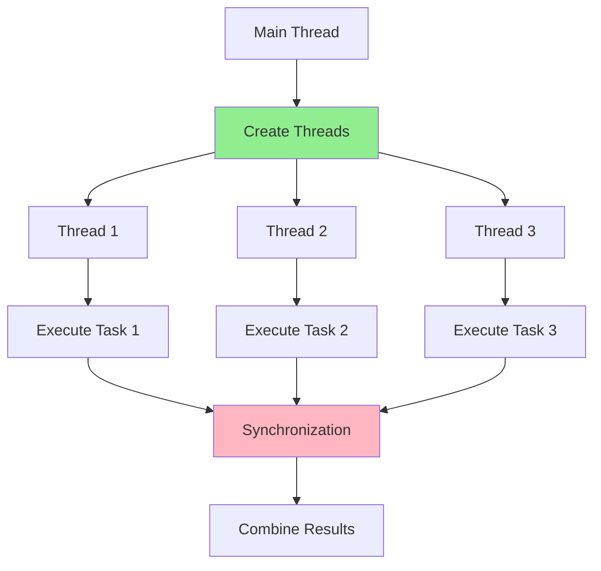

# 09.02 Complex Filtering / Multi-threading - Xử lý đa luồng

## Table of Contents / Mục lục
1. [Introduction / Giới thiệu](#introduction--giới-thiệu)
2. [Multi-threading Concepts / Khái niệm đa luồng](#multi-threading-concepts--khái-niệm-đa-luồng)
3. [Thread Implementation / Triển khai thread](#thread-implementation--triển-khai-thread)
4. [Concurrency Issues / Vấn đề đồng thời](#concurrency-issues--vấn-đề-đồng-thời)
5. [Best Practices / Thực hành tốt nhất](#best-practices--thực-hành-tốt-nhất)
6. [Summary / Tóm tắt](#summary--tóm-tắt)

---

## Introduction / Giới thiệu

### Overview / Tổng quan

**English**: Multi-threading enables concurrent execution of tasks, improving performance. Understanding threads, concurrency, and synchronization is essential for building efficient applications.

**Vietnamese**: Đa luồng cho phép thực thi đồng thời các tác vụ, cải thiện hiệu năng. Hiểu thread, đồng thời và đồng bộ hóa rất quan trọng cho xây dựng ứng dụng hiệu quả.

### Multi-threading Flow / Luồng đa luồng



---

## Multi-threading Concepts / Khái niệm đa luồng

### Example 1: Thread Concepts / Ví dụ 1: Khái niệm thread

```typescript
// Node.js: Worker Threads / Node.js: Worker Threads
import { Worker, isMainThread, parentPort, workerData } from 'worker_threads';

if (isMainThread) {
  // Main thread / Luồng chính
  const worker = new Worker(__filename, {
    workerData: { start: 0, end: 1000000 }
  });
  
  worker.on('message', (result) => {
    console.log('Result:', result);
  });
  
  worker.on('error', (error) => {
    console.error('Worker error:', error);
  });
} else {
  // Worker thread / Luồng worker
  const { start, end } = workerData;
  let sum = 0;
  
  for (let i = start; i < end; i++) {
    sum += i;
  }
  
  parentPort.postMessage({ sum });
}

// Python: Threading / Python: Threading
// import threading
// 
// def worker(num):
//     print(f'Worker {num}')
// 
// threads = []
// for i in range(5):
//     t = threading.Thread(target=worker, args=(i,))
//     threads.append(t)
//     t.start()
// 
// for t in threads:
//     t.join()
```

---

## Thread Implementation / Triển khai thread

### Example 2: Thread Pool Example / Ví dụ 2: Ví dụ thread pool

```typescript
// Thread pool implementation / Triển khai thread pool
import { Worker } from 'worker_threads';
import { EventEmitter } from 'events';

class ThreadPool extends EventEmitter {
  private workers: Worker[] = [];
  private queue: Array<{ task: any; resolve: Function; reject: Function }> = [];
  private activeWorkers = 0;
  
  constructor(private size: number, private workerPath: string) {
    super();
    this.initializeWorkers();
  }
  
  private initializeWorkers() {
    for (let i = 0; i < this.size; i++) {
      const worker = new Worker(this.workerPath);
      worker.on('message', (result) => {
        this.activeWorkers--;
        this.processQueue();
        this.emit('taskComplete', result);
      });
      this.workers.push(worker);
    }
  }
  
  async execute(task: any): Promise<any> {
    return new Promise((resolve, reject) => {
      this.queue.push({ task, resolve, reject });
      this.processQueue();
    });
  }
  
  private processQueue() {
    if (this.queue.length === 0 || this.activeWorkers >= this.size) {
      return;
    }
    
    const { task, resolve, reject } = this.queue.shift()!;
    const worker = this.workers[this.activeWorkers];
    this.activeWorkers++;
    
    worker.postMessage(task);
    worker.once('message', resolve);
    worker.once('error', reject);
  }
}
```

---

## Concurrency Issues / Vấn đề đồng thời

### Example 3: Race Conditions and Locks / Ví dụ 3: Race condition và lock

```typescript
// Race condition example / Ví dụ race condition
let counter = 0;

// ❌ Without synchronization / Không có đồng bộ hóa
async function incrementUnsafe() {
  const value = counter;
  await new Promise(resolve => setTimeout(resolve, 10));
  counter = value + 1; // Race condition / Race condition
}

// ✅ With mutex / Với mutex
import { Mutex } from 'async-mutex';

const mutex = new Mutex();

async function incrementSafe() {
  const release = await mutex.acquire();
  try {
    const value = counter;
    await new Promise(resolve => setTimeout(resolve, 10));
    counter = value + 1;
  } finally {
    release();
  }
}
```

---

## Best Practices / Thực hành tốt nhất

1. **Use thread pools** - Manage threads efficiently
2. **Synchronize access** - Prevent race conditions
3. **Handle errors** - Proper error handling
4. **Avoid deadlocks** - Careful lock ordering
5. **Monitor threads** - Track thread performance

---

## Summary / Tóm tắt

### Key Takeaways / Điểm chính

- **Concepts**: Threads, concurrency, parallelism
- **Implementation**: Worker threads, thread pools
- **Issues**: Race conditions, deadlocks
- **Solutions**: Synchronization, locks

### Next Steps / Bước tiếp theo

- [09.03 Data Aggregation](./09.03_Data_Aggregation.md) - Next: Data Aggregation

---

**Last Updated / Cập nhật lần cuối**: 2024

