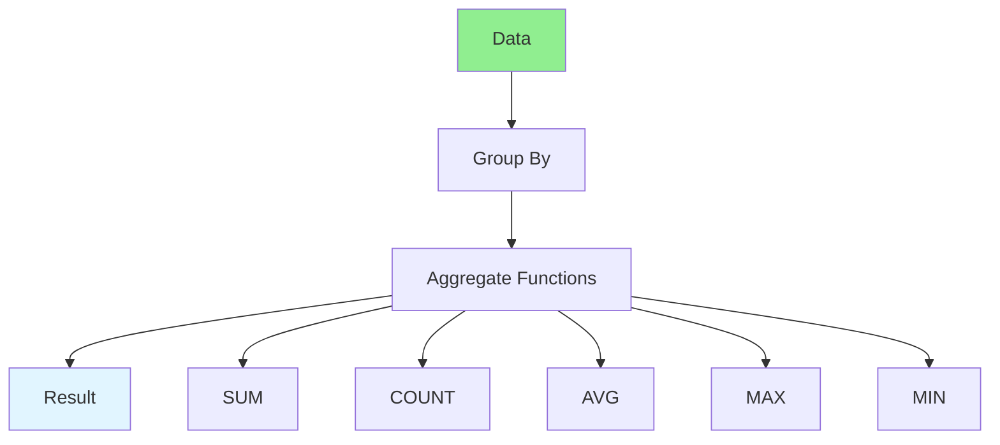

# 09.03 Data Aggregation / Tổng hợp dữ liệu

## Table of Contents / Mục lục
1. [Introduction / Giới thiệu](#introduction--giới-thiệu)
2. [Aggregation Functions / Hàm tổng hợp](#aggregation-functions--hàm-tổng-hợp)
3. [Implementation / Triển khai](#implementation--triển-khai)
4. [Best Practices / Thực hành tốt nhất](#best-practices--thực-hành-tốt-nhất)
5. [Summary / Tóm tắt](#summary--tóm-tắt)

---

## Introduction / Giới thiệu

### Overview / Tổng quan

**English**: Data aggregation summarizes data using functions like SUM, COUNT, AVG, GROUP BY. Learn to implement efficient data aggregation.

**Vietnamese**: Tổng hợp dữ liệu tóm tắt dữ liệu sử dụng hàm như SUM, COUNT, AVG, GROUP BY. Học cách triển khai tổng hợp dữ liệu hiệu quả.

### Data Aggregation / Tổng hợp dữ liệu



---

## Aggregation Functions / Hàm tổng hợp

### Example 1: Data Aggregation / Ví dụ 1: Tổng hợp dữ liệu

```typescript
// Sales aggregation / Tổng hợp bán hàng
async function getSalesAggregation(startDate: Date, endDate: Date) {
  // Group by category with aggregations / Nhóm theo danh mục với tổng hợp
  const salesByCategory = await prisma.order.groupBy({
    by: ['categoryId'],
    where: {
      createdAt: {
        gte: startDate,
        lte: endDate
      }
    },
    _sum: {
      totalAmount: true,
      quantity: true
    },
    _avg: {
      totalAmount: true
    },
    _count: {
      id: true
    }
  });
  
  // Monthly sales aggregation / Tổng hợp bán hàng theo tháng
  const monthlySales = await prisma.$queryRaw`
    SELECT 
      DATE_TRUNC('month', "createdAt") as month,
      SUM("totalAmount") as total_sales,
      COUNT(*) as order_count,
      AVG("totalAmount") as avg_order_value
    FROM "Order"
    WHERE "createdAt" >= ${startDate} AND "createdAt" <= ${endDate}
    GROUP BY DATE_TRUNC('month', "createdAt")
    ORDER BY month
  `;
  
  // Top products / Sản phẩm hàng đầu
  const topProducts = await prisma.orderItem.groupBy({
    by: ['productId'],
    _sum: {
      quantity: true,
      price: true
    },
    orderBy: {
      _sum: {
        quantity: 'desc'
      }
    },
    take: 10
  });
  
  return {
    salesByCategory,
    monthlySales,
    topProducts
  };
}
```

---

## Best Practices / Thực hành tốt nhất

1. **Use database aggregation** - Let database do aggregation
2. **Index grouped fields** - Index GROUP BY columns
3. **Limit results** - Use LIMIT for large aggregations
4. **Cache results** - Cache expensive aggregations
5. **Optimize queries** - Use appropriate indexes

---

## Summary / Tóm tắt

### Key Takeaways / Điểm chính

- **Aggregation**: SUM, COUNT, AVG, MAX, MIN
- **GROUP BY**: Group data for aggregation
- **Database**: Use database aggregation functions
- **Performance**: Index grouped fields
- **Caching**: Cache expensive aggregations

### Next Steps / Bước tiếp theo

- [09.04 Batch Operations](./09.04_Batch_Operations.md) - Next: Batch Operations

---

**Last Updated / Cập nhật lần cuối**: 2024


