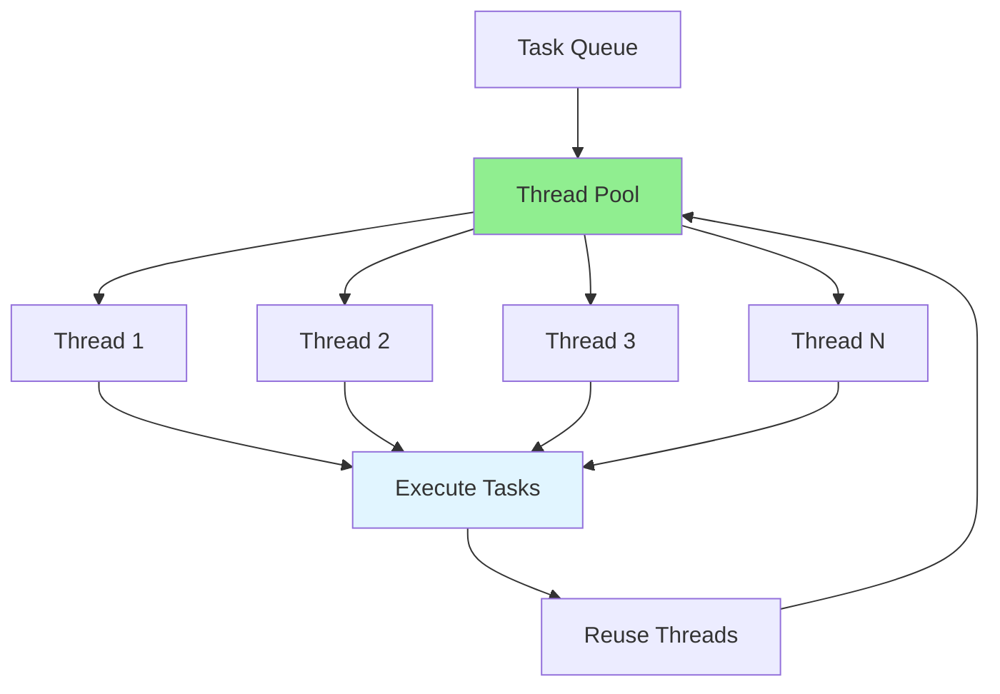

# 09.03 Data Aggregation / Thread Pool - Quản lý thread pool

## Table of Contents / Mục lục
1. [Introduction / Giới thiệu](#introduction--giới-thiệu)
2. [Thread Pool Types / Loại thread pool](#thread-pool-types--loại-thread-pool)
3. [Thread Pool Configuration / Cấu hình thread pool](#thread-pool-configuration--cấu-hình-thread-pool)
4. [Best Practices / Thực hành tốt nhất](#best-practices--thực-hành-tốt-nhất)
5. [Summary / Tóm tắt](#summary--tóm-tắt)

---

## Introduction / Giới thiệu

### Overview / Tổng quan

**English**: Thread pools manage a group of worker threads efficiently, reusing threads and controlling resource usage. Proper thread pool configuration is crucial for performance.

**Vietnamese**: Thread pool quản lý nhóm worker thread hiệu quả, tái sử dụng thread và kiểm soát sử dụng tài nguyên. Cấu hình thread pool đúng cách rất quan trọng cho hiệu năng.

### Thread Pool Architecture / Kiến trúc thread pool



---

## Thread Pool Types / Loại thread pool

### Example 1: Pool Types / Ví dụ 1: Loại pool

```typescript
// Fixed thread pool / Thread pool cố định
class FixedThreadPool {
  private workers: Worker[] = [];
  private queue: Task[] = [];
  
  constructor(private size: number) {
    for (let i = 0; i < size; i++) {
      this.workers.push(this.createWorker());
    }
  }
  
  async execute(task: Task): Promise<any> {
    return new Promise((resolve, reject) => {
      this.queue.push({ task, resolve, reject });
      this.processQueue();
    });
  }
}

// Cached thread pool / Thread pool cache
class CachedThreadPool {
  private workers: Worker[] = [];
  private maxSize: number;
  
  constructor(maxSize: number = 100) {
    this.maxSize = maxSize;
  }
  
  async execute(task: Task): Promise<any> {
    let worker = this.workers.find(w => !w.busy);
    
    if (!worker && this.workers.length < this.maxSize) {
      worker = this.createWorker();
      this.workers.push(worker);
    }
    
    if (!worker) {
      // Wait for available worker / Đợi worker có sẵn
      worker = await this.waitForWorker();
    }
    
    return this.runTask(worker, task);
  }
}

// Scheduled thread pool / Thread pool lên lịch
class ScheduledThreadPool {
  async schedule(task: Task, delay: number): Promise<void> {
    setTimeout(() => {
      this.execute(task);
    }, delay);
  }
  
  async scheduleAtFixedRate(
    task: Task,
    initialDelay: number,
    period: number
  ): Promise<void> {
    setTimeout(() => {
      this.execute(task);
      setInterval(() => this.execute(task), period);
    }, initialDelay);
  }
}
```

---

## Thread Pool Configuration / Cấu hình thread pool

### Example 2: Configuration / Ví dụ 2: Cấu hình

```typescript
interface ThreadPoolConfig {
  corePoolSize: number; // Minimum threads / Thread tối thiểu
  maxPoolSize: number; // Maximum threads / Thread tối đa
  queueSize: number; // Queue capacity / Dung lượng hàng đợi
  keepAliveTime: number; // Seconds / Giây
  rejectionPolicy: 'Abort' | 'CallerRuns' | 'Discard' | 'DiscardOldest';
}

const config: ThreadPoolConfig = {
  corePoolSize: 5,
  maxPoolSize: 20,
  queueSize: 100,
  keepAliveTime: 60,
  rejectionPolicy: 'CallerRuns'
};

// Configure based on workload / Cấu hình dựa trên khối lượng công việc
function calculateOptimalPoolSize(): number {
  const cpuCount = require('os').cpus().length;
  const ioBoundMultiplier = 2; // For I/O bound tasks / Cho tác vụ I/O bound
  return cpuCount * ioBoundMultiplier;
}
```

---

## Best Practices / Thực hành tốt nhất

1. **Right size** - Calculate optimal pool size
2. **Monitor pool** - Track thread usage
3. **Handle rejections** - Appropriate rejection policy
4. **Cleanup** - Properly shutdown pool
5. **Tune parameters** - Adjust based on workload

---

## Summary / Tóm tắt

### Key Takeaways / Điểm chính

- **Types**: Fixed, cached, scheduled pools
- **Configuration**: Size, queue, rejection policy
- **Optimization**: Right size for workload
- **Monitoring**: Track usage and performance

### Next Steps / Bước tiếp theo

- [09.04 Batch Operations](./09.04_Batch_Operations.md) - Next: Batch Operations

---

**Last Updated / Cập nhật lần cuối**: 2024

