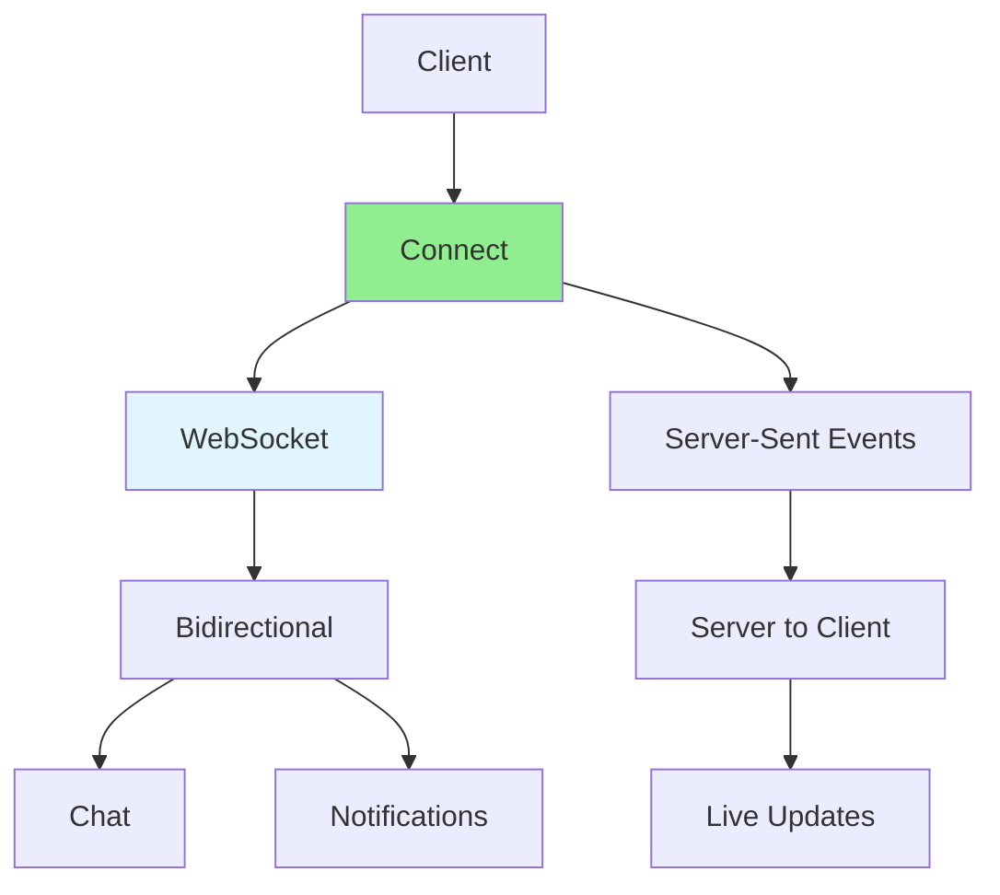

# 09.04 Batch Operations / Real-time Features - WebSocket và SSE

## Table of Contents / Mục lục
1. [Introduction / Giới thiệu](#introduction--giới-thiệu)
2. [WebSocket Implementation / Triển khai WebSocket](#websocket-implementation--triển-khai-websocket)
3. [Server-Sent Events / Server-Sent Events](#server-sent-events--server-sent-events)
4. [Real-time Features / Tính năng real-time](#real-time-features--tính-năng-real-time)
5. [Best Practices / Thực hành tốt nhất](#best-practices--thực-hành-tốt-nhất)
6. [Summary / Tóm tắt](#summary--tóm-tắt)

---

## Introduction / Giới thiệu

### Overview / Tổng quan

**English**: Real-time features enable instant updates and bidirectional communication. WebSocket and Server-Sent Events (SSE) provide efficient real-time communication for modern applications.

**Vietnamese**: Tính năng real-time cho phép cập nhật tức thì và giao tiếp hai chiều. WebSocket và Server-Sent Events (SSE) cung cấp giao tiếp real-time hiệu quả cho ứng dụng hiện đại.

### Real-time Communication / Giao tiếp real-time



---

## WebSocket Implementation / Triển khai WebSocket

### Example 1: WebSocket Server / Ví dụ 1: WebSocket Server

```typescript
// NestJS WebSocket Gateway / NestJS WebSocket Gateway
import { WebSocketGateway, WebSocketServer, SubscribeMessage } from '@nestjs/websockets';
import { Server, Socket } from 'socket.io';

@WebSocketGateway({
  cors: { origin: '*' }
})
export class ChatGateway {
  @WebSocketServer()
  server: Server;
  
  @SubscribeMessage('message')
  handleMessage(client: Socket, payload: { room: string; message: string }) {
    // Broadcast to room / Phát sóng đến phòng
    this.server.to(payload.room).emit('message', {
      user: client.id,
      message: payload.message,
      timestamp: new Date()
    });
  }
  
  @SubscribeMessage('joinRoom')
  handleJoinRoom(client: Socket, room: string) {
    client.join(room);
    client.emit('joined', room);
  }
  
  @SubscribeMessage('leaveRoom')
  handleLeaveRoom(client: Socket, room: string) {
    client.leave(room);
    client.emit('left', room);
  }
  
  handleConnection(client: Socket) {
    console.log('Client connected:', client.id);
  }
  
  handleDisconnect(client: Socket) {
    console.log('Client disconnected:', client.id);
  }
}
```

---

## Server-Sent Events / Server-Sent Events

### Example 2: SSE Implementation / Ví dụ 2: Triển khai SSE

```typescript
// Express SSE endpoint / Endpoint SSE Express
import express from 'express';

app.get('/events', (req, res) => {
  // Set headers for SSE / Đặt header cho SSE
  res.setHeader('Content-Type', 'text/event-stream');
  res.setHeader('Cache-Control', 'no-cache');
  res.setHeader('Connection', 'keep-alive');
  
  // Send initial connection / Gửi kết nối ban đầu
  res.write('data: Connected\n\n');
  
  // Send periodic updates / Gửi cập nhật định kỳ
  const interval = setInterval(() => {
    const data = {
      timestamp: new Date().toISOString(),
      message: 'Live update'
    };
    res.write(`data: ${JSON.stringify(data)}\n\n`);
  }, 1000);
  
  // Cleanup on disconnect / Dọn dẹp khi ngắt kết nối
  req.on('close', () => {
    clearInterval(interval);
    res.end();
  });
});

// Client-side / Phía client
// const eventSource = new EventSource('/events');
// eventSource.onmessage = (event) => {
//   const data = JSON.parse(event.data);
//   console.log('Update:', data);
// };
```

---

## Real-time Features / Tính năng real-time

### Example 3: Real-time Notifications / Ví dụ 3: Thông báo real-time

```typescript
@Injectable()
export class NotificationService {
  constructor(
    @InjectWebSocketServer() private server: Server,
    private prisma: PrismaService
  ) {}
  
  async sendNotification(userId: string, notification: Notification) {
    // Save to database / Lưu vào database
    await this.prisma.notification.create({
      data: {
        userId,
        title: notification.title,
        message: notification.message,
        type: notification.type
      }
    });
    
    // Send via WebSocket / Gửi qua WebSocket
    this.server.to(`user:${userId}`).emit('notification', notification);
  }
  
  async broadcastUpdate(type: string, data: any) {
    // Broadcast to all connected clients / Phát sóng đến tất cả client đã kết nối
    this.server.emit('update', { type, data });
  }
}
```

---

## Best Practices / Thực hành tốt nhất

1. **Connection management** - Handle reconnections
2. **Error handling** - Graceful error handling
3. **Scalability** - Use Redis adapter for scaling
4. **Security** - Authenticate connections
5. **Monitoring** - Track connection metrics

---

## Summary / Tóm tắt

### Key Takeaways / Điểm chính

- **WebSocket**: Bidirectional communication
- **SSE**: Server to client streaming
- **Use cases**: Chat, notifications, live updates
- **Scalability**: Redis adapter for multiple servers

### Next Steps / Bước tiếp theo

- [09.05 Scheduled Tasks](./09.05_Scheduled_Tasks.md) - Next: Scheduled Tasks

---

**Last Updated / Cập nhật lần cuối**: 2024

