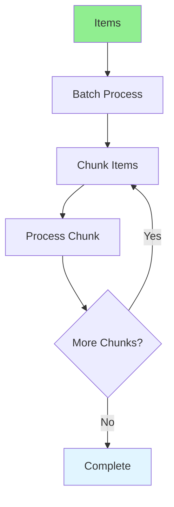

# 09.04 Batch Operations / Thao tác hàng loạt

## Table of Contents / Mục lục
1. [Introduction / Giới thiệu](#introduction--giới-thiệu)
2. [Batch Processing / Xử lý hàng loạt](#batch-processing--xử-lý-hàng-loạt)
3. [Implementation / Triển khai](#implementation--triển-khai)
4. [Best Practices / Thực hành tốt nhất](#best-practices--thực-hành-tốt-nhất)
5. [Summary / Tóm tắt](#summary--tóm-tắt)

---

## Introduction / Giới thiệu

### Overview / Tổng quan

**English**: Batch operations process multiple items efficiently. Learn to implement batch create, update, and delete operations.

**Vietnamese**: Thao tác hàng loạt xử lý nhiều mục hiệu quả. Học cách triển khai thao tác tạo, cập nhật và xóa hàng loạt.

### Batch Operations Flow / Luồng thao tác hàng loạt



---

## Batch Processing / Xử lý hàng loạt

### Example 1: Batch Operations / Ví dụ 1: Thao tác hàng loạt

```typescript
// Batch create / Tạo hàng loạt
async function batchCreateUsers(users: CreateUserDto[]) {
  // Process in chunks / Xử lý theo chunk
  const chunkSize = 100;
  const chunks = [];
  
  for (let i = 0; i < users.length; i += chunkSize) {
    chunks.push(users.slice(i, i + chunkSize));
  }
  
  const results = [];
  for (const chunk of chunks) {
    const result = await prisma.user.createMany({
      data: chunk,
      skipDuplicates: true
    });
    results.push(result);
  }
  
  return results;
}

// Batch update / Cập nhật hàng loạt
async function batchUpdateProducts(updates: { id: string; data: any }[]) {
  const results = [];
  
  for (const update of updates) {
    const result = await prisma.product.update({
      where: { id: update.id },
      data: update.data
    });
    results.push(result);
  }
  
  return results;
}

// Batch delete / Xóa hàng loạt
async function batchDeleteOrders(orderIds: string[]) {
  return await prisma.order.deleteMany({
    where: {
      id: { in: orderIds }
    }
  });
}

// Batch with transaction / Hàng loạt với transaction
async function batchProcessOrders(orders: Order[]) {
  return await prisma.$transaction(async (tx) => {
    const createdOrders = await tx.order.createMany({
      data: orders
    });
    
    const orderItems = orders.flatMap(order => order.items);
    await tx.orderItem.createMany({
      data: orderItems
    });
    
    return createdOrders;
  });
}
```

---

## Best Practices / Thực hành tốt nhất

1. **Process in chunks** - Don't process all at once
2. **Use transactions** - For related operations
3. **Handle errors** - Rollback on failure
4. **Progress tracking** - Track batch progress
5. **Limit size** - Don't make batches too large

---

## Summary / Tóm tắt

### Key Takeaways / Điểm chính

- **Batch operations**: Process multiple items efficiently
- **Chunking**: Process in manageable chunks
- **Transactions**: Use for related operations
- **Error handling**: Handle batch failures
- **Performance**: More efficient than individual operations

### Next Steps / Bước tiếp theo

- [09.05 Scheduled Tasks](./09.05_Scheduled_Tasks.md) - Next: Scheduled Tasks

---

**Last Updated / Cập nhật lần cuối**: 2024


