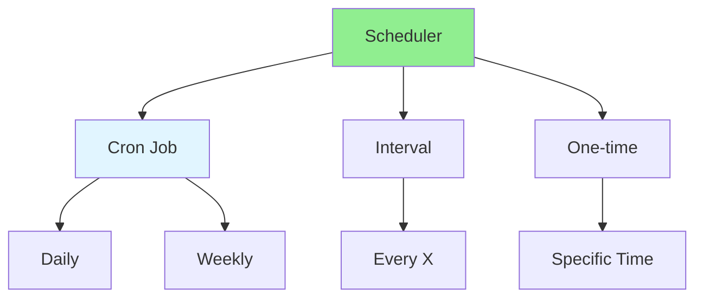

# 09.05 Scheduled Tasks / Tác vụ theo lịch

## Table of Contents / Mục lục
1. [Introduction / Giới thiệu](#introduction--giới-thiệu)
2. [Scheduling Tools / Công cụ lập lịch](#scheduling-tools--công-cụ-lập-lịch)
3. [Implementation / Triển khai](#implementation--triển-khai)
4. [Best Practices / Thực hành tốt nhất](#best-practices--thực-hành-tốt-nhất)
5. [Summary / Tóm tắt](#summary--tóm-tắt)

---

## Introduction / Giới thiệu

### Overview / Tổng quan

**English**: Scheduled tasks run automatically at specified times. Learn to implement cron jobs and scheduled tasks for background processing.

**Vietnamese**: Tác vụ theo lịch chạy tự động tại thời điểm chỉ định. Học cách triển khai cron job và tác vụ theo lịch cho xử lý nền.

### Scheduled Tasks / Tác vụ theo lịch



---

## Scheduling Tools / Công cụ lập lịch

### Example 1: Node-cron / Ví dụ 1: Node-cron

```typescript
// Scheduled tasks with node-cron / Tác vụ theo lịch với node-cron
import cron from 'node-cron';

// Daily task at 2 AM / Tác vụ hàng ngày lúc 2 giờ sáng
cron.schedule('0 2 * * *', async () => {
  console.log('Running daily cleanup...');
  await cleanupOldData();
});

// Every hour / Mỗi giờ
cron.schedule('0 * * * *', async () => {
  console.log('Running hourly task...');
  await processPendingOrders();
});

// Every 5 minutes / Mỗi 5 phút
cron.schedule('*/5 * * * *', async () => {
  console.log('Running frequent task...');
  await checkSystemHealth();
});

// Weekly on Monday at 9 AM / Hàng tuần vào thứ Hai lúc 9 giờ sáng
cron.schedule('0 9 * * 1', async () => {
  console.log('Running weekly report...');
  await generateWeeklyReport();
});

// Cron expression format: / Định dạng biểu thức cron:
// * * * * * *
// | | | | | |
// | | | | | day of week (0-7)
// | | | | month (1-12)
// | | | day of month (1-31)
// | | hour (0-23)
// | minute (0-59)
// second (0-59, optional)
```

### Example 2: Bull Queue / Ví dụ 2: Bull Queue

```typescript
// Scheduled tasks with Bull / Tác vụ theo lịch với Bull
import Queue from 'bull';

const emailQueue = new Queue('email', {
  redis: { host: 'localhost', port: 6379 }
});

// Schedule email sending / Lập lịch gửi email
emailQueue.add('send-newsletter', {}, {
  repeat: { cron: '0 9 * * 1' } // Every Monday at 9 AM
});

// Process scheduled jobs / Xử lý job theo lịch
emailQueue.process('send-newsletter', async (job) => {
  await sendNewsletter();
});
```

---

## Best Practices / Thực hành tốt nhất

1. **Use appropriate tool** - Choose right scheduler
2. **Handle errors** - Proper error handling
3. **Log execution** - Log task execution
4. **Monitor** - Monitor task health
5. **Idempotent** - Make tasks idempotent

---

## Summary / Tóm tắt

### Key Takeaways / Điểm chính

- **Scheduled tasks**: Run automatically at specified times
- **Cron**: Use cron expressions for scheduling
- **Tools**: node-cron, Bull, Agenda
- **Error handling**: Handle task failures
- **Monitoring**: Monitor task execution

### Next Steps / Bước tiếp theo

- [09.06 Background Jobs](./09.06_Background_Jobs.md) - Next: Background Jobs

---

**Last Updated / Cập nhật lần cuối**: 2024

