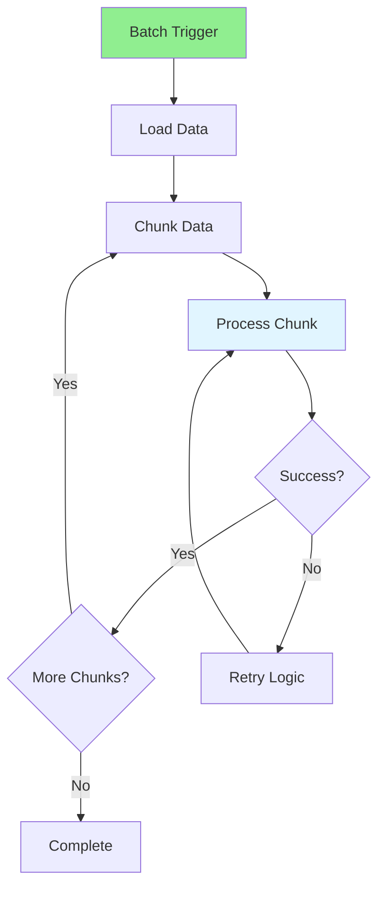

# 09.05 Scheduled Tasks / Batch Processing - Xử lý hàng loạt

## Table of Contents / Mục lục
1. [Introduction / Giới thiệu](#introduction--giới-thiệu)
2. [Batch Processing Concepts / Khái niệm xử lý hàng loạt](#batch-processing-concepts--khái-niệm-xử-lý-hàng-loạt)
3. [Batch Job Implementation / Triển khai batch job](#batch-job-implementation--triển-khai-batch-job)
4. [Error Handling and Retry / Xử lý lỗi và thử lại](#error-handling-and-retry--xử-lý-lỗi-và-thử-lại)
5. [Best Practices / Thực hành tốt nhất](#best-practices--thực-hành-tốt-nhất)
6. [Summary / Tóm tắt](#summary--tóm-tắt)

---

## Introduction / Giới thiệu

### Overview / Tổng quan

**English**: Batch processing handles large volumes of data efficiently. Implementing batch jobs with proper error handling and retry logic ensures reliable data processing.

**Vietnamese**: Xử lý hàng loạt xử lý khối lượng dữ liệu lớn hiệu quả. Triển khai batch job với xử lý lỗi và logic thử lại đúng cách đảm bảo xử lý dữ liệu đáng tin cậy.

### Batch Processing Flow / Luồng xử lý hàng loạt



---

## Batch Processing Concepts / Khái niệm xử lý hàng loạt

### Example 1: Batch Job Service / Ví dụ 1: Service batch job

```typescript
@Injectable()
export class BatchProcessingService {
  constructor(
    private prisma: PrismaService,
    private logger: Logger
  ) {}
  
  async processBatch<T>(
    items: T[],
    processor: (item: T) => Promise<void>,
    options: BatchOptions = {}
  ): Promise<BatchResult> {
    const {
      chunkSize = 100,
      maxRetries = 3,
      retryDelay = 1000
    } = options;
    
    const chunks = this.chunkArray(items, chunkSize);
    const results: BatchResult = {
      total: items.length,
      processed: 0,
      failed: 0,
      errors: []
    };
    
    for (const chunk of chunks) {
      await this.processChunk(chunk, processor, {
        maxRetries,
        retryDelay
      }, results);
    }
    
    return results;
  }
  
  private async processChunk<T>(
    chunk: T[],
    processor: (item: T) => Promise<void>,
    retryOptions: RetryOptions,
    results: BatchResult
  ) {
    for (const item of chunk) {
      let attempts = 0;
      let success = false;
      
      while (attempts < retryOptions.maxRetries && !success) {
        try {
          await processor(item);
          results.processed++;
          success = true;
        } catch (error) {
          attempts++;
          if (attempts >= retryOptions.maxRetries) {
            results.failed++;
            results.errors.push({
              item,
              error: error.message
            });
          } else {
            await this.delay(retryOptions.retryDelay * attempts);
          }
        }
      }
    }
  }
  
  private chunkArray<T>(array: T[], size: number): T[][] {
    const chunks: T[][] = [];
    for (let i = 0; i < array.length; i += size) {
      chunks.push(array.slice(i, i + size));
    }
    return chunks;
  }
  
  private delay(ms: number): Promise<void> {
    return new Promise(resolve => setTimeout(resolve, ms));
  }
}
```

---

## Batch Job Implementation / Triển khai batch job

### Example 2: Scheduled Batch Job / Ví dụ 2: Batch job lên lịch

```typescript
// NestJS scheduled task / Tác vụ lên lịch NestJS
import { Injectable } from '@nestjs/common';
import { Cron, CronExpression } from '@nestjs/schedule';

@Injectable()
export class ScheduledBatchJob {
  constructor(
    private batchService: BatchProcessingService,
    private prisma: PrismaService
  ) {}
  
  // Run daily at midnight / Chạy hàng ngày lúc nửa đêm
  @Cron(CronExpression.EVERY_DAY_AT_MIDNIGHT)
  async processDailyReports() {
    const users = await this.prisma.user.findMany({
      where: { active: true }
    });
    
    await this.batchService.processBatch(
      users,
      async (user) => {
        await this.generateDailyReport(user.id);
      },
      { chunkSize: 50 }
    );
  }
  
  // Run every hour / Chạy mỗi giờ
  @Cron(CronExpression.EVERY_HOUR)
  async syncExternalData() {
    const syncTasks = await this.getSyncTasks();
    
    await this.batchService.processBatch(
      syncTasks,
      async (task) => {
        await this.syncData(task);
      }
    );
  }
}
```

---

## Error Handling and Retry / Xử lý lỗi và thử lại

### Example 3: Retry Logic / Ví dụ 3: Logic thử lại

```typescript
interface RetryOptions {
  maxRetries: number;
  retryDelay: number;
  backoff: 'linear' | 'exponential';
}

async function withRetry<T>(
  fn: () => Promise<T>,
  options: RetryOptions
): Promise<T> {
  let lastError: Error;
  
  for (let attempt = 0; attempt <= options.maxRetries; attempt++) {
    try {
      return await fn();
    } catch (error) {
      lastError = error;
      
      if (attempt < options.maxRetries) {
        const delay = options.backoff === 'exponential'
          ? options.retryDelay * Math.pow(2, attempt)
          : options.retryDelay * (attempt + 1);
        
        await new Promise(resolve => setTimeout(resolve, delay));
      }
    }
  }
  
  throw lastError!;
}
```

---

## Best Practices / Thực hành tốt nhất

1. **Idempotency** - Make operations idempotent
2. **Chunking** - Process in manageable chunks
3. **Monitoring** - Track batch progress
4. **Logging** - Log batch operations
5. **Recovery** - Handle failures gracefully

---

## Summary / Tóm tắt

### Key Takeaways / Điểm chính

- **Batch processing**: Efficient data processing
- **Chunking**: Process in manageable sizes
- **Retry logic**: Handle failures
- **Scheduling**: Automated batch jobs

### Next Steps / Bước tiếp theo

- [09.06 Background Jobs](./09.06_Background_Jobs.md) - Next: Background Jobs

---

**Last Updated / Cập nhật lần cuối**: 2024

