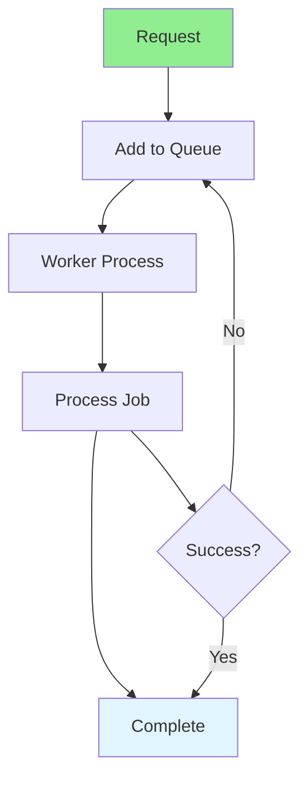

# 09.06 Background Jobs / Job nền

## Table of Contents / Mục lục
1. [Introduction / Giới thiệu](#introduction--giới-thiệu)
2. [Job Queue Systems / Hệ thống hàng đợi job](#job-queue-systems--hệ-thống-hàng-đợi-job)
3. [Implementation / Triển khai](#implementation--triển-khai)
4. [Best Practices / Thực hành tốt nhất](#best-practices--thực-hành-tốt-nhất)
5. [Summary / Tóm tắt](#summary--tóm-tắt)

---

## Introduction / Giới thiệu

### Overview / Tổng quan

**English**: Background jobs process tasks asynchronously without blocking the main thread. Learn to implement job queues for long-running tasks.

**Vietnamese**: Job nền xử lý tác vụ bất đồng bộ mà không chặn luồng chính. Học cách triển khai hàng đợi job cho tác vụ chạy lâu.

### Background Jobs Flow / Luồng job nền



---

## Job Queue Systems / Hệ thống hàng đợi job

### Example 1: Bull Queue / Ví dụ 1: Bull Queue

```typescript
// Background job with Bull / Job nền với Bull
import Queue from 'bull';

// Create queue / Tạo hàng đợi
const emailQueue = new Queue('email', {
  redis: { host: 'localhost', port: 6379 }
});

// Add job to queue / Thêm job vào hàng đợi
async function sendEmailJob(emailData: EmailData) {
  return await emailQueue.add('send-email', emailData, {
    attempts: 3,
    backoff: {
      type: 'exponential',
      delay: 2000
    },
    removeOnComplete: true,
    removeOnFail: false
  });
}

// Process jobs / Xử lý job
emailQueue.process('send-email', async (job) => {
  const { to, subject, body } = job.data;
  await sendEmail(to, subject, body);
});

// Job events / Sự kiện job
emailQueue.on('completed', (job) => {
  console.log(`Job ${job.id} completed`);
});

emailQueue.on('failed', (job, err) => {
  console.error(`Job ${job.id} failed:`, err);
});
```

---

## Best Practices / Thực hành tốt nhất

1. **Use job queues** - For long-running tasks
2. **Retry logic** - Implement retry with backoff
3. **Monitor jobs** - Track job status
4. **Handle failures** - Proper error handling
5. **Scale workers** - Scale worker processes

---

## Summary / Tóm tắt

### Key Takeaways / Điểm chính

- **Background jobs**: Process tasks asynchronously
- **Job queues**: Bull, Agenda, RabbitMQ
- **Retry logic**: Retry failed jobs
- **Monitoring**: Track job status
- **Scaling**: Scale worker processes

### Next Steps / Bước tiếp theo

- [09.07 Real-time Updates](./09.07_Real_time_Updates.md) - Next: Real-time Updates

---

**Last Updated / Cập nhật lần cuối**: 2024


