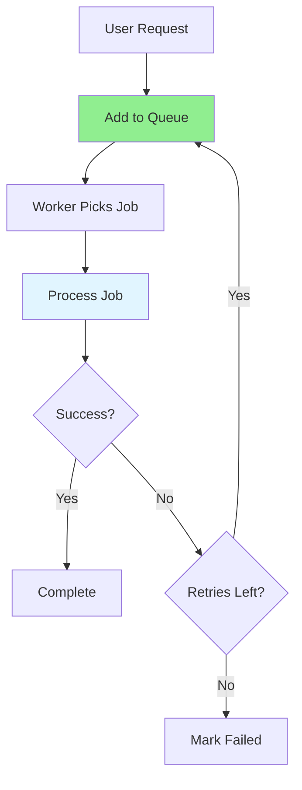

# 09.06 Background Jobs / Background Jobs - Công việc nền

## Table of Contents / Mục lục
1. [Introduction / Giới thiệu](#introduction--giới-thiệu)
2. [Job Queue Concepts / Khái niệm hàng đợi job](#job-queue-concepts--khái-niệm-hàng-đợi-job)
3. [Job Queue Implementation / Triển khai hàng đợi job](#job-queue-implementation--triển-khai-hàng-đợi-job)
4. [Best Practices / Thực hành tốt nhất](#best-practices--thực-hành-tốt-nhất)
5. [Summary / Tóm tắt](#summary--tóm-tắt)

---

## Introduction / Giới thiệu

### Overview / Tổng quan

**English**: Background jobs process tasks asynchronously, improving user experience. Job queues manage job execution, retries, and priorities efficiently.

**Vietnamese**: Background job xử lý tác vụ bất đồng bộ, cải thiện trải nghiệm người dùng. Hàng đợi job quản lý thực thi, thử lại và ưu tiên job hiệu quả.

### Background Job Flow / Luồng background job



---

## Job Queue Concepts / Khái niệm hàng đợi job

### Example 1: Bull Queue Setup / Ví dụ 1: Thiết lập Bull Queue

```typescript
// Bull queue setup / Thiết lập hàng đợi Bull
import { Queue, Worker } from 'bullmq';
import Redis from 'ioredis';

const connection = new Redis({
  host: 'localhost',
  port: 6379
});

// Create queue / Tạo hàng đợi
const emailQueue = new Queue('emails', { connection });

// Add job / Thêm job
async function sendEmailJob(email: string, subject: string, body: string) {
  await emailQueue.add('send-email', {
    email,
    subject,
    body
  }, {
    attempts: 3,
    backoff: {
      type: 'exponential',
      delay: 2000
    },
    priority: 1
  });
}

// Worker / Worker
const emailWorker = new Worker('emails', async (job) => {
  const { email, subject, body } = job.data;
  await sendEmail(email, subject, body);
}, { connection });

emailWorker.on('completed', (job) => {
  console.log(`Job ${job.id} completed`);
});

emailWorker.on('failed', (job, err) => {
  console.error(`Job ${job.id} failed:`, err);
});
```

---

## Job Queue Implementation / Triển khai hàng đợi job

### Example 2: NestJS Queue Module / Ví dụ 2: Module Queue NestJS

```typescript
// NestJS Bull module / Module Bull NestJS
import { Module } from '@nestjs/common';
import { BullModule } from '@nestjs/bull';
import { EmailProcessor } from './email.processor';

@Module({
  imports: [
    BullModule.forRoot({
      redis: {
        host: 'localhost',
        port: 6379
      }
    }),
    BullModule.registerQueue({
      name: 'emails'
    })
  ],
  providers: [EmailProcessor]
})
export class QueueModule {}

// Processor / Processor
import { Processor, Process } from '@nestjs/bull';
import { Job } from 'bull';

@Processor('emails')
export class EmailProcessor {
  @Process('send-email')
  async handleEmail(job: Job) {
    const { email, subject, body } = job.data;
    await this.emailService.send(email, subject, body);
  }
}
```

---

## Best Practices / Thực hành tốt nhất

1. **Job design** - Idempotent, atomic jobs
2. **Error handling** - Proper retry logic
3. **Monitoring** - Track job status
4. **Scaling** - Multiple workers
5. **Priority** - Use job priorities

---

## Summary / Tóm tắt

### Key Takeaways / Điểm chính

- **Queues**: Manage job execution
- **Workers**: Process jobs
- **Retry**: Automatic retry logic
- **Priority**: Job prioritization

### Next Steps / Bước tiếp theo

- [09.07 Real-time Updates](./09.07_Real_time_Updates.md) - Next: Real-time Updates

---

**Last Updated / Cập nhật lần cuối**: 2024

