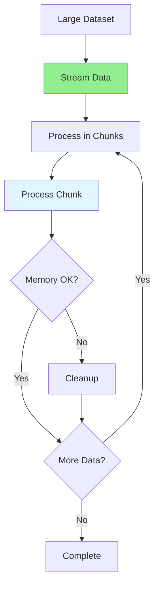

# 09.07 Real-time Updates / Xử lý dữ liệu lớn (Large Data Processing)

## Table of Contents / Mục lục
1. [Introduction / Giới thiệu](#introduction--giới-thiệu)
2. [Large Data Processing / Xử lý dữ liệu lớn](#large-data-processing--xử-lý-dữ-liệu-lớn)
3. [Streaming and Chunking / Streaming và chunking](#streaming-and-chunking--streaming-và-chunking)
4. [Memory Management / Quản lý bộ nhớ](#memory-management--quản-lý-bộ-nhớ)
5. [Best Practices / Thực hành tốt nhất](#best-practices--thực-hành-tốt-nhất)
6. [Summary / Tóm tắt](#summary--tóm-tắt)

---

## Introduction / Giới thiệu

### Overview / Tổng quan

**English**: Processing large datasets requires efficient memory management and streaming techniques. Chunking and cursor-based pagination enable handling of massive data volumes.

**Vietnamese**: Xử lý dataset lớn yêu cầu quản lý bộ nhớ hiệu quả và kỹ thuật streaming. Chunking và phân trang dựa trên cursor cho phép xử lý khối lượng dữ liệu lớn.

### Large Data Processing Flow / Luồng xử lý dữ liệu lớn



---

## Large Data Processing / Xử lý dữ liệu lớn

### Example 1: Streaming Processing / Ví dụ 1: Xử lý streaming

```typescript
// Stream processing / Xử lý stream
import { Readable } from 'stream';

async function processLargeDataset() {
  const stream = new Readable({
    objectMode: true,
    async read() {
      const batch = await this.fetchBatch();
      if (batch.length === 0) {
        this.push(null); // End stream / Kết thúc stream
        return;
      }
      batch.forEach(item => this.push(item));
    }
  });
  
  stream.on('data', async (item) => {
    await processItem(item);
  });
  
  stream.on('end', () => {
    console.log('Processing complete');
  });
}

// Cursor-based pagination / Phân trang dựa trên cursor
async function processWithCursor() {
  let cursor: string | null = null;
  const pageSize = 1000;
  
  while (true) {
    const result = await prisma.user.findMany({
      take: pageSize,
      skip: cursor ? 1 : 0,
      cursor: cursor ? { id: cursor } : undefined,
      orderBy: { id: 'asc' }
    });
    
    if (result.length === 0) break;
    
    await processBatch(result);
    cursor = result[result.length - 1].id;
  }
}
```

---

## Streaming and Chunking / Streaming và chunking

### Example 2: Chunk Processing / Ví dụ 2: Xử lý chunk

```typescript
// Process in chunks / Xử lý theo chunk
async function processInChunks<T>(
  items: T[],
  chunkSize: number,
  processor: (chunk: T[]) => Promise<void>
) {
  for (let i = 0; i < items.length; i += chunkSize) {
    const chunk = items.slice(i, i + chunkSize);
    await processor(chunk);
    
    // Allow garbage collection / Cho phép garbage collection
    if (i % (chunkSize * 10) === 0) {
      await new Promise(resolve => setImmediate(resolve));
    }
  }
}

// File streaming / Streaming file
import * as fs from 'fs';
import * as readline from 'readline';

async function processLargeFile(filePath: string) {
  const fileStream = fs.createReadStream(filePath);
  const rl = readline.createInterface({
    input: fileStream,
    crlfDelay: Infinity
  });
  
  for await (const line of rl) {
    await processLine(line);
  }
}
```

---

## Memory Management / Quản lý bộ nhớ

### Example 3: Memory-Efficient Processing / Ví dụ 3: Xử lý tiết kiệm bộ nhớ

```typescript
// Memory-efficient processing / Xử lý tiết kiệm bộ nhớ
class MemoryEfficientProcessor {
  private maxMemoryUsage = 500 * 1024 * 1024; // 500MB
  
  async processLargeDataset() {
    const memoryBefore = process.memoryUsage().heapUsed;
    
    let processed = 0;
    const batchSize = 100;
    
    while (true) {
      const batch = await this.fetchBatch(batchSize);
      if (batch.length === 0) break;
      
      await this.processBatch(batch);
      processed += batch.length;
      
      // Check memory / Kiểm tra bộ nhớ
      const memoryAfter = process.memoryUsage().heapUsed;
      if (memoryAfter - memoryBefore > this.maxMemoryUsage) {
        // Force garbage collection / Ép garbage collection
        if (global.gc) {
          global.gc();
        }
        await this.delay(100); // Allow GC / Cho phép GC
      }
    }
  }
}
```

---

## Best Practices / Thực hành tốt nhất

1. **Stream processing** - Don't load all data
2. **Chunking** - Process in manageable chunks
3. **Cursor pagination** - For large datasets
4. **Memory monitoring** - Track memory usage
5. **Cleanup** - Release resources

---

## Summary / Tóm tắt

### Key Takeaways / Điểm chính

- **Streaming**: Process data as it arrives
- **Chunking**: Process in batches
- **Memory**: Monitor and manage memory
- **Pagination**: Cursor-based for large data

### Next Steps / Bước tiếp theo

- [09.08 Event-Driven Architecture](./09.08_Event_Driven_Architecture.md) - Next: Event-Driven Architecture

---

**Last Updated / Cập nhật lần cuối**: 2024

