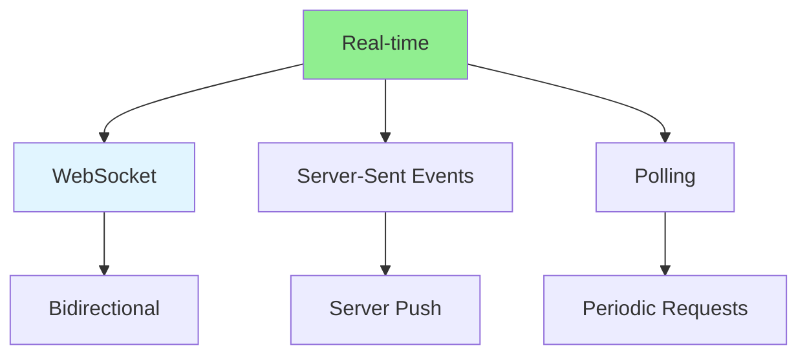

# 09.07 Real-time Updates / Cập nhật thời gian thực

## Table of Contents / Mục lục
1. [Introduction / Giới thiệu](#introduction--giới-thiệu)
2. [Real-time Technologies / Công nghệ thời gian thực](#real-time-technologies--công-nghệ-thời-gian-thực)
3. [Implementation / Triển khai](#implementation--triển-khai)
4. [Best Practices / Thực hành tốt nhất](#best-practices--thực-hành-tốt-nhất)
5. [Summary / Tóm tắt](#summary--tóm-tắt)

---

## Introduction / Giới thiệu

### Overview / Tổng quan

**English**: Real-time updates push data to clients instantly. Learn to implement WebSocket and Server-Sent Events for real-time functionality.

**Vietnamese**: Cập nhật thời gian thực đẩy dữ liệu đến client ngay lập tức. Học cách triển khai WebSocket và Server-Sent Events cho chức năng thời gian thực.

### Real-time Updates / Cập nhật thời gian thực



---

## Real-time Technologies / Công nghệ thời gian thực

### Example 1: WebSocket Implementation / Ví dụ 1: Triển khai WebSocket

```typescript
// WebSocket server with Socket.io / Server WebSocket với Socket.io
import { Server } from 'socket.io';
import { createServer } from 'http';

const httpServer = createServer();
const io = new Server(httpServer, {
  cors: { origin: '*' }
});

// Handle connections / Xử lý kết nối
io.on('connection', (socket) => {
  console.log('Client connected:', socket.id);
  
  // Join room / Tham gia phòng
  socket.on('join-room', (roomId) => {
    socket.join(roomId);
  });
  
  // Send real-time update / Gửi cập nhật thời gian thực
  socket.on('send-message', async (data) => {
    const message = await saveMessage(data);
    io.to(data.roomId).emit('new-message', message);
  });
  
  // Handle disconnection / Xử lý ngắt kết nối
  socket.on('disconnect', () => {
    console.log('Client disconnected:', socket.id);
  });
});

// Broadcast update / Phát sóng cập nhật
async function broadcastOrderUpdate(orderId: string, update: any) {
  io.emit('order-update', { orderId, update });
}

httpServer.listen(3000);
```

### Example 2: Server-Sent Events / Ví dụ 2: Server-Sent Events

```typescript
// Server-Sent Events / Server-Sent Events
app.get('/events', (req, res) => {
  res.setHeader('Content-Type', 'text/event-stream');
  res.setHeader('Cache-Control', 'no-cache');
  res.setHeader('Connection', 'keep-alive');
  
  // Send initial connection / Gửi kết nối ban đầu
  res.write('data: Connected\n\n');
  
  // Send updates / Gửi cập nhật
  const interval = setInterval(() => {
    const data = { time: new Date().toISOString() };
    res.write(`data: ${JSON.stringify(data)}\n\n`);
  }, 1000);
  
  // Cleanup on disconnect / Dọn dẹp khi ngắt kết nối
  req.on('close', () => {
    clearInterval(interval);
  });
});
```

---

## Best Practices / Thực hành tốt nhất

1. **Choose right technology** - WebSocket vs SSE vs polling
2. **Handle reconnection** - Automatic reconnection
3. **Scale horizontally** - Use Redis adapter for scaling
4. **Secure** - Authenticate connections
5. **Monitor** - Monitor connection health

---

## Summary / Tóm tắt

### Key Takeaways / Điểm chính

- **Real-time**: WebSocket, SSE, polling
- **WebSocket**: Bidirectional communication
- **SSE**: Server-to-client push
- **Scaling**: Use Redis for horizontal scaling
- **Security**: Authenticate connections

### Next Steps / Bước tiếp theo

- [09.08 Event-Driven Architecture](./09.08_Event_Driven_Architecture.md) - Next: Event-Driven

---

**Last Updated / Cập nhật lần cuối**: 2024


