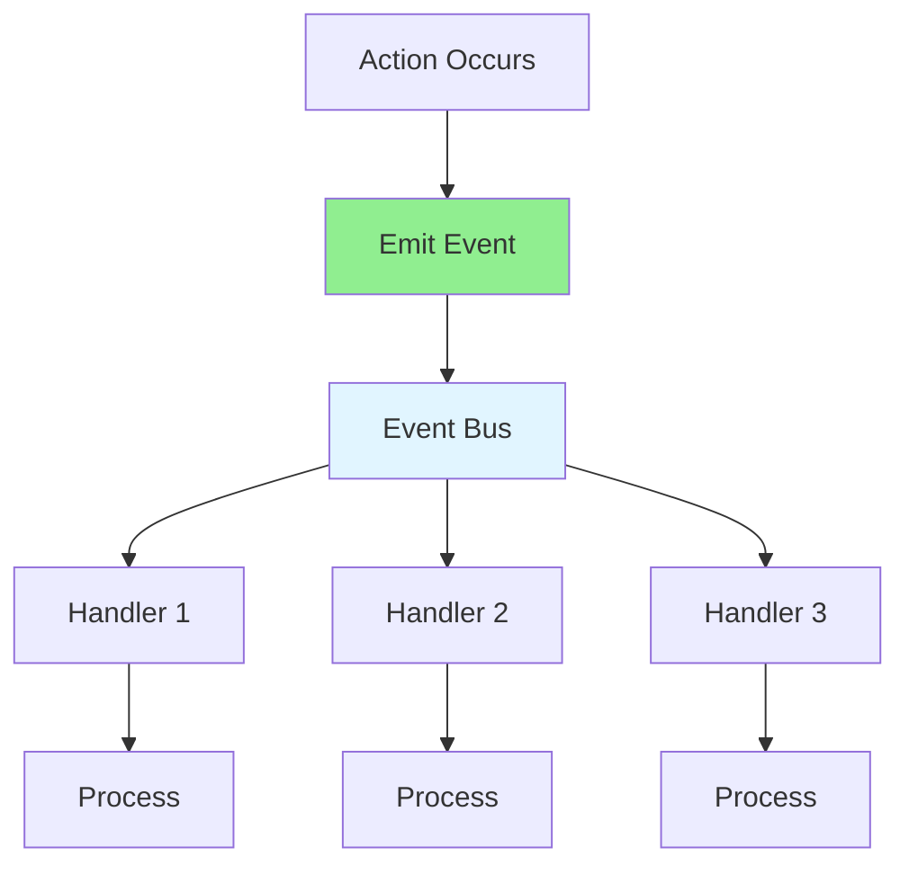

# 09.08 Event-Driven Architecture / Event-Driven Architecture - Kiến trúc hướng sự kiện

## Table of Contents / Mục lục
1. [Introduction / Giới thiệu](#introduction--giới-thiệu)
2. [Event Concepts / Khái niệm event](#event-concepts--khái-niệm-event)
3. [Event Implementation / Triển khai event](#event-implementation--triển-khai-event)
4. [Pub/Sub Pattern / Mẫu Pub/Sub](#pubsub-pattern--mẫu-pubsub)
5. [Best Practices / Thực hành tốt nhất](#best-practices--thực-hành-tốt-nhất)
6. [Summary / Tóm tắt](#summary--tóm-tắt)

---

## Introduction / Giới thiệu

### Overview / Tổng quan

**English**: Event-driven architecture decouples components through events. This enables scalable, flexible systems where components communicate asynchronously.

**Vietnamese**: Kiến trúc hướng sự kiện tách rời component thông qua event. Điều này cho phép hệ thống có thể mở rộng, linh hoạt nơi component giao tiếp bất đồng bộ.

### Event-Driven Flow / Luồng hướng sự kiện



---

## Event Concepts / Khái niệm event

### Example 1: Event System / Ví dụ 1: Hệ thống event

```typescript
// Event emitter / Phát event
import { EventEmitter } from 'events';

class OrderService extends EventEmitter {
  async createOrder(orderData: OrderData) {
    const order = await this.repository.create(orderData);
    
    // Emit event / Phát event
    this.emit('order.created', {
      orderId: order.id,
      userId: order.userId,
      total: order.total
    });
    
    return order;
  }
  
  async cancelOrder(orderId: string) {
    await this.repository.update(orderId, { status: 'cancelled' });
    
    this.emit('order.cancelled', { orderId });
  }
}

// Event handlers / Xử lý event
const orderService = new OrderService();

orderService.on('order.created', async (data) => {
  // Send confirmation email / Gửi email xác nhận
  await emailService.sendConfirmation(data.userId, data.orderId);
  
  // Update inventory / Cập nhật kho
  await inventoryService.reserveItems(data.orderId);
  
  // Send notification / Gửi thông báo
  await notificationService.notify(data.userId, 'Order created');
});

orderService.on('order.cancelled', async (data) => {
  // Release inventory / Giải phóng kho
  await inventoryService.releaseItems(data.orderId);
  
  // Process refund / Xử lý hoàn tiền
  await paymentService.refund(data.orderId);
});
```

---

## Event Implementation / Triển khai event

### Example 2: NestJS Event Emitter / Ví dụ 2: Event Emitter NestJS

```typescript
// Event emitter module / Module event emitter
import { Module } from '@nestjs/common';
import { EventEmitterModule } from '@nestjs/event-emitter';

@Module({
  imports: [EventEmitterModule.forRoot()],
  providers: [OrderService, OrderCreatedHandler]
})
export class AppModule {}

// Emit event / Phát event
import { Injectable } from '@nestjs/common';
import { EventEmitter2 } from '@nestjs/event-emitter';

@Injectable()
export class OrderService {
  constructor(
    private eventEmitter: EventEmitter2,
    private repository: OrderRepository
  ) {}
  
  async createOrder(orderData: OrderData) {
    const order = await this.repository.create(orderData);
    
    this.eventEmitter.emit('order.created', {
      orderId: order.id,
      userId: order.userId
    });
    
    return order;
  }
}

// Handle event / Xử lý event
import { Injectable } from '@nestjs/common';
import { OnEvent } from '@nestjs/event-emitter';

@Injectable()
export class OrderCreatedHandler {
  @OnEvent('order.created')
  async handleOrderCreated(payload: { orderId: string; userId: string }) {
    await this.emailService.sendConfirmation(payload.userId, payload.orderId);
  }
}
```

---

## Pub/Sub Pattern / Mẫu Pub/Sub

### Example 3: Redis Pub/Sub / Ví dụ 3: Redis Pub/Sub

```typescript
// Redis pub/sub / Redis pub/sub
import Redis from 'ioredis';

const publisher = new Redis();
const subscriber = new Redis();

// Subscribe / Đăng ký
subscriber.subscribe('order.created', 'order.cancelled');

subscriber.on('message', async (channel, message) => {
  const data = JSON.parse(message);
  
  switch (channel) {
    case 'order.created':
      await handleOrderCreated(data);
      break;
    case 'order.cancelled':
      await handleOrderCancelled(data);
      break;
  }
});

// Publish / Phát hành
async function publishOrderCreated(orderId: string, userId: string) {
  await publisher.publish('order.created', JSON.stringify({
    orderId,
    userId,
    timestamp: new Date()
  }));
}
```

---

## Best Practices / Thực hành tốt nhất

1. **Event design** - Clear, specific events
2. **Error handling** - Handle event errors
3. **Event ordering** - Consider ordering requirements
4. **Idempotency** - Make handlers idempotent
5. **Monitoring** - Track event processing

---

## Summary / Tóm tắt

### Key Takeaways / Điểm chính

- **Events**: Decouple components
- **Handlers**: Process events
- **Pub/Sub**: Distributed event system
- **Benefits**: Scalability, flexibility

### Next Steps / Bước tiếp theo

- [09.09 Workflow Management](./09.09_Workflow_Management.md) - Next: Workflow Management

---

**Last Updated / Cập nhật lần cuối**: 2024

