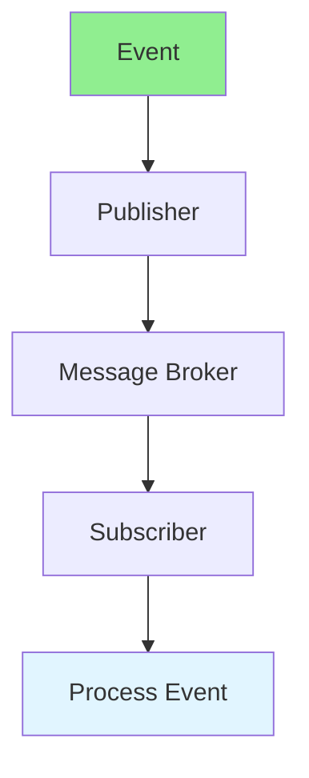

# 09.08 Event-Driven Architecture / Kiến trúc hướng sự kiện

## Table of Contents / Mục lục
1. [Introduction / Giới thiệu](#introduction--giới-thiệu)
2. [Event-Driven Patterns / Mẫu hướng sự kiện](#event-driven-patterns--mẫu-hướng-sự-kiện)
3. [Implementation / Triển khai](#implementation--triển-khai)
4. [Best Practices / Thực hành tốt nhất](#best-practices--thực-hành-tốt-nhất)
5. [Summary / Tóm tắt](#summary--tóm-tắt)

---

## Introduction / Giới thiệu

### Overview / Tổng quan

**English**: Event-driven architecture uses events to communicate between services. Learn to implement pub/sub patterns and event sourcing.

**Vietnamese**: Kiến trúc hướng sự kiện sử dụng sự kiện để giao tiếp giữa các service. Học cách triển khai mẫu pub/sub và event sourcing.

### Event-Driven Architecture / Kiến trúc hướng sự kiện



---

## Event-Driven Patterns / Mẫu hướng sự kiện

### Example 1: Pub/Sub Pattern / Ví dụ 1: Mẫu Pub/Sub

```typescript
// Event-driven with Redis / Hướng sự kiện với Redis
import Redis from 'ioredis';

const redis = new Redis();

// Publisher / Người xuất bản
async function publishEvent(eventType: string, data: any) {
  await redis.publish(eventType, JSON.stringify(data));
}

// Subscriber / Người đăng ký
async function subscribeToEvents() {
  const subscriber = new Redis();
  
  subscriber.subscribe('order.created', 'order.updated', 'order.cancelled');
  
  subscriber.on('message', async (channel, message) => {
    const event = JSON.parse(message);
    
    switch (channel) {
      case 'order.created':
        await handleOrderCreated(event);
        break;
      case 'order.updated':
        await handleOrderUpdated(event);
        break;
      case 'order.cancelled':
        await handleOrderCancelled(event);
        break;
    }
  });
}

// Event handlers / Xử lý sự kiện
async function handleOrderCreated(event: any) {
  // Send notification / Gửi thông báo
  await sendEmail(event.userId, 'Order created');
  
  // Update inventory / Cập nhật tồn kho
  await updateInventory(event.items);
}
```

---

## Best Practices / Thực hành tốt nhất

1. **Event schema** - Define event schemas
2. **Idempotency** - Make handlers idempotent
3. **Error handling** - Handle event processing errors
4. **Monitoring** - Monitor event flow
5. **Versioning** - Version events for compatibility

---

## Summary / Tóm tắt

### Key Takeaways / Điểm chính

- **Event-driven**: Loose coupling via events
- **Pub/Sub**: Publish-subscribe pattern
- **Message broker**: Redis, RabbitMQ, Kafka
- **Idempotency**: Handle duplicate events
- **Scalability**: Horizontal scaling

### Next Steps / Bước tiếp theo

- [09.09 Workflow Management](./09.09_Workflow_Management.md) - Next: Workflow

---

**Last Updated / Cập nhật lần cuối**: 2024

