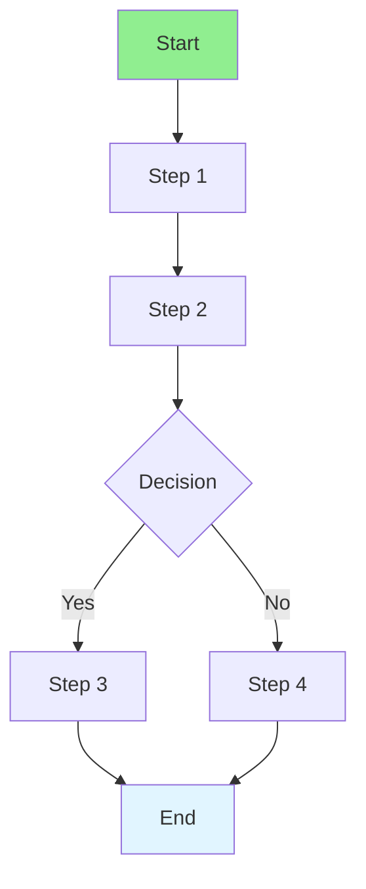

# 09.09 Workflow Management / Quản lý quy trình

## Table of Contents / Mục lục
1. [Introduction / Giới thiệu](#introduction--giới-thiệu)
2. [Workflow Concepts / Khái niệm quy trình](#workflow-concepts--khái-niệm-quy-trình)
3. [Implementation / Triển khai](#implementation--triển-khai)
4. [Best Practices / Thực hành tốt nhất](#best-practices--thực-hành-tốt-nhất)
5. [Summary / Tóm tắt](#summary--tóm-tắt)

---

## Introduction / Giới thiệu

### Overview / Tổng quan

**English**: Workflow management orchestrates multi-step processes. Learn to implement workflows for complex business processes.

**Vietnamese**: Quản lý quy trình điều phối quy trình nhiều bước. Học cách triển khai quy trình cho quy trình nghiệp vụ phức tạp.

### Workflow Management / Quản lý quy trình



---

## Workflow Concepts / Khái niệm quy trình

### Example 1: Order Workflow / Ví dụ 1: Quy trình đơn hàng

```typescript
// Workflow states / Trạng thái quy trình
enum OrderStatus {
  PENDING = 'pending',
  PAYMENT_PROCESSING = 'payment_processing',
  PAID = 'paid',
  SHIPPED = 'shipped',
  DELIVERED = 'delivered',
  CANCELLED = 'cancelled'
}

// Workflow transitions / Chuyển đổi quy trình
const workflowTransitions = {
  [OrderStatus.PENDING]: [OrderStatus.PAYMENT_PROCESSING, OrderStatus.CANCELLED],
  [OrderStatus.PAYMENT_PROCESSING]: [OrderStatus.PAID, OrderStatus.CANCELLED],
  [OrderStatus.PAID]: [OrderStatus.SHIPPED, OrderStatus.CANCELLED],
  [OrderStatus.SHIPPED]: [OrderStatus.DELIVERED],
  [OrderStatus.DELIVERED]: [],
  [OrderStatus.CANCELLED]: []
};

// Workflow execution / Thực thi quy trình
async function processOrderWorkflow(orderId: string, action: string) {
  const order = await prisma.order.findUnique({ where: { id: orderId } });
  if (!order) throw new Error('Order not found');
  
  const currentStatus = order.status as OrderStatus;
  const allowedTransitions = workflowTransitions[currentStatus];
  
  let nextStatus: OrderStatus;
  
  switch (action) {
    case 'process_payment':
      if (!allowedTransitions.includes(OrderStatus.PAYMENT_PROCESSING)) {
        throw new Error('Invalid transition');
      }
      nextStatus = OrderStatus.PAYMENT_PROCESSING;
      await processPayment(order);
      break;
    case 'confirm_payment':
      nextStatus = OrderStatus.PAID;
      await shipOrder(order);
      break;
    case 'ship':
      nextStatus = OrderStatus.SHIPPED;
      await updateShipping(order);
      break;
    case 'deliver':
      nextStatus = OrderStatus.DELIVERED;
      await markDelivered(order);
      break;
    default:
      throw new Error('Invalid action');
  }
  
  await prisma.order.update({
    where: { id: orderId },
    data: { status: nextStatus }
  });
  
  return nextStatus;
}
```

---

## Best Practices / Thực hành tốt nhất

1. **Define states** - Clear workflow states
2. **Validate transitions** - Only allow valid transitions
3. **Track history** - Log workflow history
4. **Handle errors** - Rollback on failure
5. **Monitor** - Monitor workflow execution

---

## Summary / Tóm tắt

### Key Takeaways / Điểm chính

- **Workflow**: Multi-step process orchestration
- **States**: Define workflow states
- **Transitions**: Validate state transitions
- **History**: Track workflow history
- **Error handling**: Handle workflow errors

### Next Steps / Bước tiếp theo

- [09.10 State Machines](./09.10_State_Machines.md) - Next: State Machines

---

**Last Updated / Cập nhật lần cuối**: 2024


