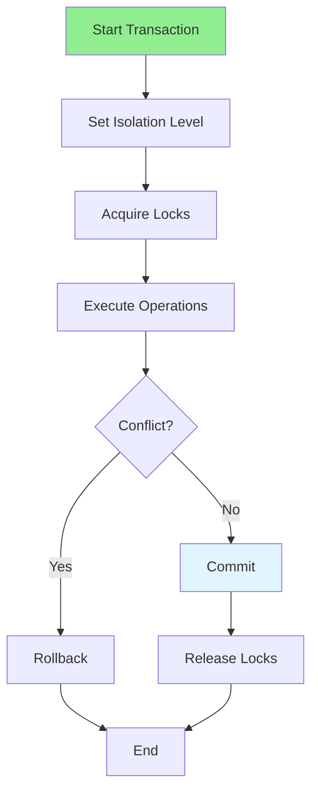

# 09.09 Workflow Management / Transaction Management nâng cao

## Table of Contents / Mục lục
1. [Introduction / Giới thiệu](#introduction--giới-thiệu)
2. [Advanced Transactions / Giao dịch nâng cao](#advanced-transactions--giao-dịch-nâng-cao)
3. [Transaction Isolation / Cô lập giao dịch](#transaction-isolation--cô-lập-giao-dịch)
4. [Locking Strategies / Chiến lược khóa](#locking-strategies--chiến-lược-khóa)
5. [Best Practices / Thực hành tốt nhất](#best-practices--thực-hành-tốt-nhất)
6. [Summary / Tóm tắt](#summary--tóm-tắt)

---

## Introduction / Giới thiệu

### Overview / Tổng quan

**English**: Advanced transaction management ensures data consistency in complex scenarios. Understanding isolation levels and locking strategies prevents concurrency issues.

**Vietnamese**: Quản lý giao dịch nâng cao đảm bảo tính nhất quán dữ liệu trong scenario phức tạp. Hiểu mức cô lập và chiến lược khóa ngăn chặn vấn đề đồng thời.

### Transaction Management / Quản lý giao dịch



---

## Advanced Transactions / Giao dịch nâng cao

### Example 1: Nested Transactions / Ví dụ 1: Giao dịch lồng nhau

```typescript
// Transaction with Prisma / Giao dịch với Prisma
async function transferMoney(fromId: string, toId: string, amount: number) {
  return await prisma.$transaction(async (tx) => {
    // Debit from account / Ghi nợ tài khoản
    const fromAccount = await tx.account.update({
      where: { id: fromId },
      data: { balance: { decrement: amount } }
    });
    
    if (fromAccount.balance < 0) {
      throw new Error('Insufficient funds');
    }
    
    // Credit to account / Ghi có tài khoản
    const toAccount = await tx.account.update({
      where: { id: toId },
      data: { balance: { increment: amount } }
    });
    
    // Create transaction record / Tạo bản ghi giao dịch
    await tx.transaction.create({
      data: {
        fromAccountId: fromId,
        toAccountId: toId,
        amount,
        type: 'transfer'
      }
    });
    
    return { fromAccount, toAccount };
  });
}
```

---

## Transaction Isolation / Cô lập giao dịch

### Example 2: Isolation Levels / Ví dụ 2: Mức cô lập

```typescript
// Isolation levels / Mức cô lập
enum IsolationLevel {
  READ_UNCOMMITTED = 'READ UNCOMMITTED',
  READ_COMMITTED = 'READ COMMITTED',
  REPEATABLE_READ = 'REPEATABLE READ',
  SERIALIZABLE = 'SERIALIZABLE'
}

// Use isolation level / Sử dụng mức cô lập
async function readWithIsolation(level: IsolationLevel) {
  return await prisma.$transaction(
    async (tx) => {
      // Read operations / Thao tác đọc
      const data = await tx.user.findMany();
      return data;
    },
    {
      isolationLevel: level
    }
  );
}

// Serializable for critical operations / Serializable cho thao tác quan trọng
async function criticalOperation() {
  return await prisma.$transaction(
    async (tx) => {
      // Critical operations / Thao tác quan trọng
      const account = await tx.account.findUnique({
        where: { id: 'account-id' }
      });
      
      await tx.account.update({
        where: { id: 'account-id' },
        data: { balance: account.balance + 100 }
      });
    },
    {
      isolationLevel: 'Serializable'
    }
  );
}
```

---

## Locking Strategies / Chiến lược khóa

### Example 3: Optimistic and Pessimistic Locking / Ví dụ 3: Khóa lạc quan và bi quan

```typescript
// Optimistic locking / Khóa lạc quan
interface Entity {
  id: string;
  version: number;
  data: any;
}

async function updateWithOptimisticLock(
  id: string,
  updates: any,
  currentVersion: number
) {
  const result = await prisma.entity.updateMany({
    where: {
      id,
      version: currentVersion // Only update if version matches / Chỉ cập nhật nếu version khớp
    },
    data: {
      ...updates,
      version: { increment: 1 }
    }
  });
  
  if (result.count === 0) {
    throw new Error('Concurrent modification detected');
  }
}

// Pessimistic locking / Khóa bi quan
async function updateWithPessimisticLock(id: string, updates: any) {
  return await prisma.$transaction(async (tx) => {
    // Lock row / Khóa hàng
    const entity = await tx.entity.findUnique({
      where: { id },
      // FOR UPDATE locks the row / FOR UPDATE khóa hàng
    });
    
    // Update / Cập nhật
    return await tx.entity.update({
      where: { id },
      data: updates
    });
  });
}
```

---

## Best Practices / Thực hành tốt nhất

1. **Keep short** - Minimize transaction duration
2. **Right isolation** - Choose appropriate level
3. **Handle deadlocks** - Retry on deadlock
4. **Lock ordering** - Consistent lock order
5. **Monitor** - Track transaction performance

---

## Summary / Tóm tắt

### Key Takeaways / Điểm chính

- **Transactions**: Ensure data consistency
- **Isolation**: Choose right level
- **Locking**: Optimistic vs pessimistic
- **Deadlocks**: Handle and prevent

### Next Steps / Bước tiếp theo

- [09.10 State Machines](./09.10_State_Machines.md) - Next: State Machines

---

**Last Updated / Cập nhật lần cuối**: 2024

