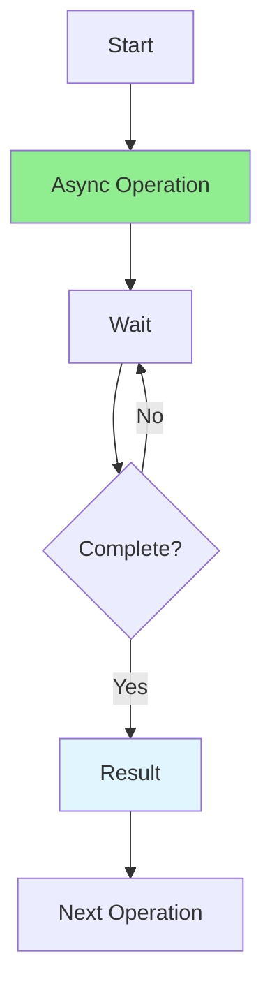

# 09.10 State Machines / Asynchronous Programming - Lập trình bất đồng bộ

## Table of Contents / Mục lục
1. [Introduction / Giới thiệu](#introduction--giới-thiệu)
2. [Async/Await / Async/Await](#asyncawait--asyncawait)
3. [Promises / Promises](#promises--promises)
4. [Error Handling / Xử lý lỗi](#error-handling--xử-lý-lỗi)
5. [Best Practices / Thực hành tốt nhất](#best-practices--thực-hành-tốt-nhất)
6. [Summary / Tóm tắt](#summary--tóm-tắt)

---

## Introduction / Giới thiệu

### Overview / Tổng quan

**English**: Asynchronous programming enables non-blocking operations, improving application performance. Mastering async/await and promises is essential for modern JavaScript/TypeScript development.

**Vietnamese**: Lập trình bất đồng bộ cho phép thao tác không chặn, cải thiện hiệu năng ứng dụng. Thành thạo async/await và promises rất quan trọng cho phát triển JavaScript/TypeScript hiện đại.

### Async Flow / Luồng bất đồng bộ



---

## Async/Await / Async/Await

### Example 1: Async/Await Usage / Ví dụ 1: Sử dụng Async/Await

```typescript
// Async/await / Async/await
async function fetchUserData(userId: string) {
  try {
    // Sequential execution / Thực thi tuần tự
    const user = await userRepository.findById(userId);
    const orders = await orderRepository.findByUserId(userId);
    const preferences = await preferenceRepository.findByUserId(userId);
    
    return {
      user,
      orders,
      preferences
    };
  } catch (error) {
    console.error('Error fetching user data:', error);
    throw error;
  }
}

// Parallel execution / Thực thi song song
async function fetchUserDataParallel(userId: string) {
  try {
    // Execute in parallel / Thực thi song song
    const [user, orders, preferences] = await Promise.all([
      userRepository.findById(userId),
      orderRepository.findByUserId(userId),
      preferenceRepository.findByUserId(userId)
    ]);
    
    return { user, orders, preferences };
  } catch (error) {
    console.error('Error:', error);
    throw error;
  }
}
```

---

## Promises / Promises

### Example 2: Promise Patterns / Ví dụ 2: Mẫu Promise

```typescript
// Promise chaining / Chuỗi Promise
function processData(data: string): Promise<string> {
  return fetchData(data)
    .then(result => transformData(result))
    .then(transformed => saveData(transformed))
    .then(saved => {
      console.log('Data saved:', saved);
      return saved;
    })
    .catch(error => {
      console.error('Error:', error);
      throw error;
    });
}

// Promise.all / Promise.all
async function processMultiple(items: string[]) {
  const results = await Promise.all(
    items.map(item => processItem(item))
  );
  return results;
}

// Promise.allSettled / Promise.allSettled
async function processWithFailures(items: string[]) {
  const results = await Promise.allSettled(
    items.map(item => processItem(item))
  );
  
  const successful = results
    .filter(r => r.status === 'fulfilled')
    .map(r => (r as PromiseFulfilledResult<any>).value);
  
  const failed = results
    .filter(r => r.status === 'rejected')
    .map(r => (r as PromiseRejectedResult).reason);
  
  return { successful, failed };
}
```

---

## Error Handling / Xử lý lỗi

### Example 3: Error Handling Patterns / Ví dụ 3: Mẫu xử lý lỗi

```typescript
// Try-catch with async / Try-catch với async
async function safeOperation() {
  try {
    const result = await riskyOperation();
    return result;
  } catch (error) {
    if (error instanceof ValidationError) {
      // Handle validation error / Xử lý lỗi validation
      return { error: 'Validation failed', details: error.message };
    } else if (error instanceof NetworkError) {
      // Handle network error / Xử lý lỗi mạng
      return { error: 'Network error', retry: true };
    } else {
      // Handle unknown error / Xử lý lỗi không xác định
      console.error('Unknown error:', error);
      throw error;
    }
  }
}

// Retry pattern / Mẫu thử lại
async function withRetry<T>(
  fn: () => Promise<T>,
  maxRetries: number = 3
): Promise<T> {
  for (let i = 0; i < maxRetries; i++) {
    try {
      return await fn();
    } catch (error) {
      if (i === maxRetries - 1) throw error;
      await new Promise(resolve => setTimeout(resolve, 1000 * (i + 1)));
    }
  }
  throw new Error('Max retries exceeded');
}
```

---

## Best Practices / Thực hành tốt nhất

1. **Use async/await** - Prefer over callbacks
2. **Parallel execution** - Use Promise.all when possible
3. **Error handling** - Always handle errors
4. **Avoid callback hell** - Use async/await
5. **Timeout** - Add timeouts to async operations

---

## Summary / Tóm tắt

### Key Takeaways / Điểm chính

- **Async/await**: Modern async syntax
- **Promises**: Handle async operations
- **Error handling**: Try-catch, retry patterns
- **Parallel**: Promise.all for concurrent operations

### Next Steps / Bước tiếp theo

- [09.11 Complex Validation](./09.11_Complex_Validation.md) - Next: Complex Validation

---

**Last Updated / Cập nhật lần cuối**: 2024

