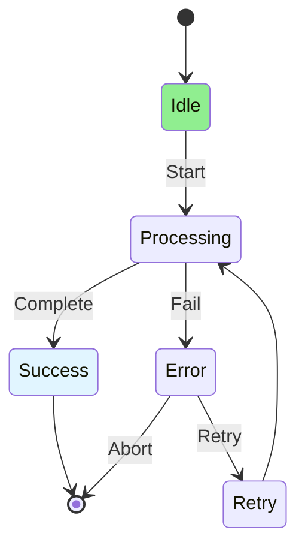

# 09.10 State Machines / Máy trạng thái

## Table of Contents / Mục lục
1. [Introduction / Giới thiệu](#introduction--giới-thiệu)
2. [State Machine Concepts / Khái niệm máy trạng thái](#state-machine-concepts--khái-niệm-máy-trạng-thái)
3. [Implementation / Triển khai](#implementation--triển-khai)
4. [Best Practices / Thực hành tốt nhất](#best-practices--thực-hành-tốt-nhất)
5. [Summary / Tóm tắt](#summary--tóm-tắt)

---

## Introduction / Giới thiệu

### Overview / Tổng quan

**English**: State machines manage state transitions systematically. Learn to implement finite state machines for complex state management.

**Vietnamese**: Máy trạng thái quản lý chuyển đổi trạng thái có hệ thống. Học cách triển khai máy trạng thái hữu hạn cho quản lý trạng thái phức tạp.

### State Machine / Máy trạng thái



---

## State Machine Concepts / Khái niệm máy trạng thái

### Example 1: State Machine Implementation / Ví dụ 1: Triển khai máy trạng thái

```typescript
// State machine with XState / Máy trạng thái với XState
import { createMachine, interpret } from 'xstate';

const orderMachine = createMachine({
  id: 'order',
  initial: 'pending',
  states: {
    pending: {
      on: {
        PAY: 'processing_payment',
        CANCEL: 'cancelled'
      }
    },
    processing_payment: {
      on: {
        PAYMENT_SUCCESS: 'paid',
        PAYMENT_FAILED: 'payment_failed',
        CANCEL: 'cancelled'
      }
    },
    payment_failed: {
      on: {
        RETRY: 'processing_payment',
        CANCEL: 'cancelled'
      }
    },
    paid: {
      on: {
        SHIP: 'shipped'
      }
    },
    shipped: {
      on: {
        DELIVER: 'delivered'
      }
    },
    delivered: {
      type: 'final'
    },
    cancelled: {
      type: 'final'
    }
  }
});

// Use state machine / Sử dụng máy trạng thái
const orderService = interpret(orderMachine)
  .onTransition((state) => {
    console.log('Current state:', state.value);
  })
  .start();

// Send events / Gửi sự kiện
orderService.send('PAY');
orderService.send('PAYMENT_SUCCESS');
orderService.send('SHIP');
```

---

## Best Practices / Thực hành tốt nhất

1. **Define states clearly** - All possible states
2. **Validate transitions** - Only allow valid transitions
3. **Handle all events** - Handle all possible events
4. **Test thoroughly** - Test all state transitions
5. **Document** - Document state machine

---

## Summary / Tóm tắt

### Key Takeaways / Điểm chính

- **State machine**: Systematic state management
- **States**: All possible states
- **Transitions**: Valid state transitions
- **Events**: Trigger transitions
- **Tools**: XState, Statecharts

### Next Steps / Bước tiếp theo

- [09.11 Complex Validation](./09.11_Complex_Validation.md) - Next: Complex Validation

---

**Last Updated / Cập nhật lần cuối**: 2024

