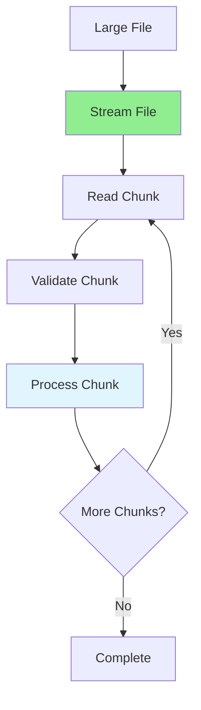

# 09.11 Complex Validation / File Processing - Xử lý file lớn

## Table of Contents / Mục lục
1. [Introduction / Giới thiệu](#introduction--giới-thiệu)
2. [Large File Processing / Xử lý file lớn](#large-file-processing--xử-lý-file-lớn)
3. [Streaming Files / Streaming file](#streaming-files--streaming-file)
4. [File Validation / Validation file](#file-validation--validation-file)
5. [Best Practices / Thực hành tốt nhất](#best-practices--thực-hành-tốt-nhất)
6. [Summary / Tóm tắt](#summary--tóm-tắt)

---

## Introduction / Giới thiệu

### Overview / Tổng quan

**English**: Processing large files requires streaming and chunking techniques. Efficient file processing prevents memory issues and enables handling of massive files.

**Vietnamese**: Xử lý file lớn yêu cầu kỹ thuật streaming và chunking. Xử lý file hiệu quả ngăn chặn vấn đề bộ nhớ và cho phép xử lý file lớn.

### File Processing Flow / Luồng xử lý file



---

## Large File Processing / Xử lý file lớn

### Example 1: Stream Processing / Ví dụ 1: Xử lý stream

```typescript
import * as fs from 'fs';
import * as readline from 'readline';
import * as csv from 'csv-parse';

// Stream CSV file / Stream file CSV
async function processLargeCSV(filePath: string) {
  const fileStream = fs.createReadStream(filePath);
  const rl = readline.createInterface({
    input: fileStream,
    crlfDelay: Infinity
  });
  
  let lineNumber = 0;
  const batchSize = 1000;
  let batch: any[] = [];
  
  for await (const line of rl) {
    if (lineNumber === 0) {
      // Skip header / Bỏ qua header
      lineNumber++;
      continue;
    }
    
    const record = parseCSVLine(line);
    batch.push(record);
    
    if (batch.length >= batchSize) {
      await processBatch(batch);
      batch = [];
    }
    
    lineNumber++;
  }
  
  // Process remaining / Xử lý phần còn lại
  if (batch.length > 0) {
    await processBatch(batch);
  }
}

// Excel file processing / Xử lý file Excel
import * as XLSX from 'xlsx';

async function processLargeExcel(filePath: string) {
  const workbook = XLSX.readFile(filePath, {
    type: 'buffer',
    cellDates: true
  });
  
  const sheet = workbook.Sheets[workbook.SheetNames[0]];
  const stream = XLSX.stream.to_json(sheet, { raw: false });
  
  const batch: any[] = [];
  const batchSize = 1000;
  
  for await (const row of stream) {
    batch.push(row);
    
    if (batch.length >= batchSize) {
      await processBatch(batch);
      batch = [];
    }
  }
  
  if (batch.length > 0) {
    await processBatch(batch);
  }
}
```

---

## Streaming Files / Streaming file

### Example 2: File Upload Streaming / Ví dụ 2: Streaming upload file

```typescript
// Stream file upload / Stream upload file
import { Readable } from 'stream';
import * as multer from 'multer';

const upload = multer({
  storage: multer.memoryStorage(),
  limits: { fileSize: 100 * 1024 * 1024 } // 100MB
});

app.post('/upload', upload.single('file'), async (req, res) => {
  if (!req.file) {
    return res.status(400).json({ error: 'No file uploaded' });
  }
  
  const stream = Readable.from(req.file.buffer);
  await processStream(stream);
  
  res.json({ message: 'File processed successfully' });
});

async function processStream(stream: Readable) {
  return new Promise((resolve, reject) => {
    stream.on('data', async (chunk) => {
      await processChunk(chunk);
    });
    
    stream.on('end', () => {
      resolve();
    });
    
    stream.on('error', (error) => {
      reject(error);
    });
  });
}
```

---

## File Validation / Validation file

### Example 3: File Validation / Ví dụ 3: Validation file

```typescript
// File validation / Validation file
interface FileValidation {
  size: number;
  type: string;
  extension: string;
}

async function validateFile(
  file: Express.Multer.File,
  rules: FileValidation
): Promise<{ valid: boolean; errors: string[] }> {
  const errors: string[] = [];
  
  // Size validation / Validation kích thước
  if (file.size > rules.size) {
    errors.push(`File size exceeds ${rules.size} bytes`);
  }
  
  // Type validation / Validation loại
  if (!file.mimetype.startsWith(rules.type)) {
    errors.push(`File type must be ${rules.type}`);
  }
  
  // Extension validation / Validation phần mở rộng
  const extension = file.originalname.split('.').pop();
  if (extension !== rules.extension) {
    errors.push(`File extension must be .${rules.extension}`);
  }
  
  // Content validation / Validation nội dung
  if (file.mimetype === 'text/csv') {
    const isValid = await validateCSVContent(file.buffer);
    if (!isValid) {
      errors.push('Invalid CSV content');
    }
  }
  
  return {
    valid: errors.length === 0,
    errors
  };
}
```

---

## Best Practices / Thực hành tốt nhất

1. **Stream processing** - Don't load entire file
2. **Chunking** - Process in batches
3. **Validation** - Validate before processing
4. **Progress tracking** - Track processing progress
5. **Error handling** - Handle file errors gracefully

---

## Summary / Tóm tắt

### Key Takeaways / Điểm chính

- **Streaming**: Process files as stream
- **Chunking**: Process in batches
- **Validation**: Validate files before processing
- **Memory**: Efficient memory usage

### Next Steps / Bước tiếp theo

- [09.12 Business Rules Engine](./09.12_Business_Rules_Engine.md) - Next: Business Rules Engine

---

**Last Updated / Cập nhật lần cuối**: 2024

