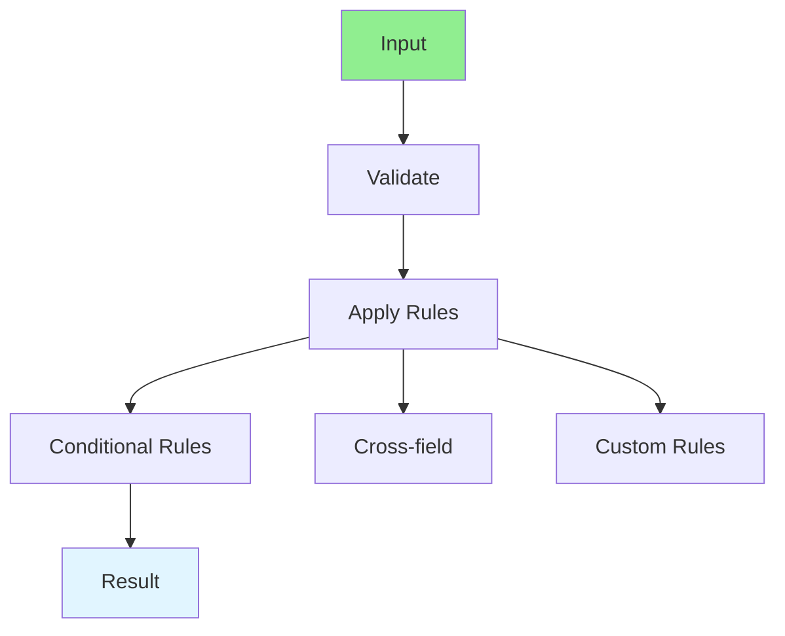

# 09.11 Complex Validation / Xác thực phức tạp

## Table of Contents / Mục lục
1. [Introduction / Giới thiệu](#introduction--giới-thiệu)
2. [Validation Strategies / Chiến lược xác thực](#validation-strategies--chiến-lược-xác-thực)
3. [Implementation / Triển khai](#implementation--triển-khai)
4. [Best Practices / Thực hành tốt nhất](#best-practices--thực-hành-tốt-nhất)
5. [Summary / Tóm tắt](#summary--tóm-tắt)

---

## Introduction / Giới thiệu

### Overview / Tổng quan

**English**: Complex validation involves multiple rules, conditional logic, and cross-field validation. Learn to implement comprehensive validation.

**Vietnamese**: Xác thực phức tạp liên quan đến nhiều quy tắc, logic có điều kiện và xác thực liên trường. Học cách triển khai xác thực toàn diện.

### Complex Validation / Xác thực phức tạp



---

## Validation Strategies / Chiến lược xác thực

### Example 1: Complex Validation / Ví dụ 1: Xác thực phức tạp

```typescript
// Complex validation with Zod / Xác thực phức tạp với Zod
import { z } from 'zod';

// Conditional validation / Xác thực có điều kiện
const userSchema = z.object({
  email: z.string().email(),
  age: z.number().min(18),
  country: z.string(),
  taxId: z.string().optional()
}).refine((data) => {
  // Conditional: taxId required for certain countries / Có điều kiện: taxId bắt buộc cho một số quốc gia
  if (['US', 'CA'].includes(data.country)) {
    return !!data.taxId;
  }
  return true;
}, {
  message: 'Tax ID is required for US and Canada',
  path: ['taxId']
});

// Cross-field validation / Xác thực liên trường
const passwordSchema = z.object({
  password: z.string().min(8),
  confirmPassword: z.string()
}).refine((data) => data.password === data.confirmPassword, {
  message: 'Passwords do not match',
  path: ['confirmPassword']
});

// Custom validation / Xác thực tùy chỉnh
const orderSchema = z.object({
  items: z.array(z.object({
    productId: z.string(),
    quantity: z.number().min(1),
    price: z.number().positive()
  })),
  discountCode: z.string().optional()
}).refine(async (data) => {
  // Async validation: Check discount code / Xác thực bất đồng bộ: Kiểm tra mã giảm giá
  if (data.discountCode) {
    const valid = await checkDiscountCode(data.discountCode);
    return valid;
  }
  return true;
}, {
  message: 'Invalid discount code',
  path: ['discountCode']
});
```

---

## Best Practices / Thực hành tốt nhất

1. **Validate early** - Validate on input
2. **Clear messages** - Provide clear error messages
3. **Client and server** - Validate on both sides
4. **Async validation** - For database checks
5. **Reusable rules** - Create reusable validators

---

## Summary / Tóm tắt

### Key Takeaways / Điểm chính

- **Complex validation**: Multiple rules, conditional logic
- **Cross-field**: Validate relationships between fields
- **Async**: For database-dependent validation
- **Clear errors**: Provide helpful error messages
- **Reusable**: Create reusable validators

### Next Steps / Bước tiếp theo

- [09.12 Business Rules Engine](./09.12_Business_Rules_Engine.md) - Next: Business Rules

---

**Last Updated / Cập nhật lần cuối**: 2024

