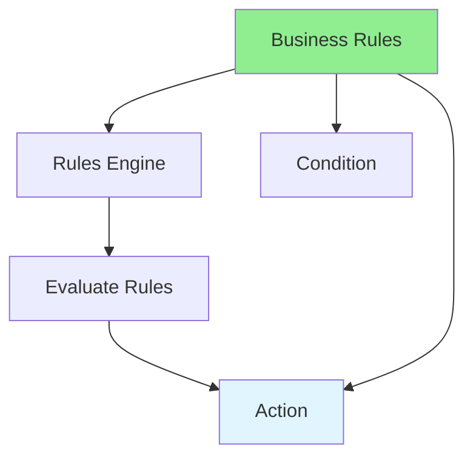

# 09.12 Business Rules Engine / Engine quy tắc nghiệp vụ

## Table of Contents / Mục lục
1. [Introduction / Giới thiệu](#introduction--giới-thiệu)
2. [Rules Engine Concepts / Khái niệm engine quy tắc](#rules-engine-concepts--khái-niệm-engine-quy-tắc)
3. [Implementation / Triển khai](#implementation--triển-khai)
4. [Best Practices / Thực hành tốt nhất](#best-practices--thực-hành-tốt-nhất)
5. [Summary / Tóm tắt](#summary--tóm-tắt)

---

## Introduction / Giới thiệu

### Overview / Tổng quan

**English**: Business rules engines execute business logic declaratively. Learn to implement rules engines for flexible business logic.

**Vietnamese**: Engine quy tắc nghiệp vụ thực thi logic nghiệp vụ theo cách khai báo. Học cách triển khai engine quy tắc cho logic nghiệp vụ linh hoạt.

### Business Rules Engine / Engine quy tắc nghiệp vụ



---

## Rules Engine Concepts / Khái niệm engine quy tắc

### Example 1: Rules Engine / Ví dụ 1: Engine quy tắc

```typescript
// Business rules engine / Engine quy tắc nghiệp vụ
interface Rule {
  name: string;
  condition: (context: any) => boolean;
  action: (context: any) => void;
  priority: number;
}

class RulesEngine {
  private rules: Rule[] = [];
  
  addRule(rule: Rule) {
    this.rules.push(rule);
    this.rules.sort((a, b) => b.priority - a.priority);
  }
  
  execute(context: any) {
    for (const rule of this.rules) {
      if (rule.condition(context)) {
        rule.action(context);
        break; // Stop after first matching rule / Dừng sau quy tắc khớp đầu tiên
      }
    }
  }
}

// Define rules / Định nghĩa quy tắc
const discountRules = new RulesEngine();

discountRules.addRule({
  name: 'VIP Customer Discount',
  priority: 100,
  condition: (context) => context.customerType === 'VIP' && context.total > 1000,
  action: (context) => {
    context.discount = context.total * 0.2; // 20% discount
  }
});

discountRules.addRule({
  name: 'Bulk Order Discount',
  priority: 50,
  condition: (context) => context.quantity > 10,
  action: (context) => {
    context.discount = context.total * 0.1; // 10% discount
  }
});

// Execute rules / Thực thi quy tắc
const orderContext = {
  customerType: 'VIP',
  total: 1500,
  quantity: 5
};

discountRules.execute(orderContext);
// Result: 20% discount applied / Kết quả: Áp dụng giảm giá 20%
```

---

## Best Practices / Thực hành tốt nhất

1. **Separate rules** - Keep rules separate from code
2. **Priority** - Define rule priority
3. **Testable** - Make rules testable
4. **Document** - Document all rules
5. **Version** - Version rules for changes

---

## Summary / Tóm tắt

### Key Takeaways / Điểm chính

- **Rules engine**: Execute business rules declaratively
- **Rules**: Condition-action pairs
- **Priority**: Rule execution order
- **Flexible**: Easy to add/modify rules
- **Testable**: Test rules independently

### Next Steps / Bước tiếp theo

- [09.13 Multi-tenancy](./09.13_Multi_tenancy.md) - Next: Multi-tenancy

---

**Last Updated / Cập nhật lần cuối**: 2024


