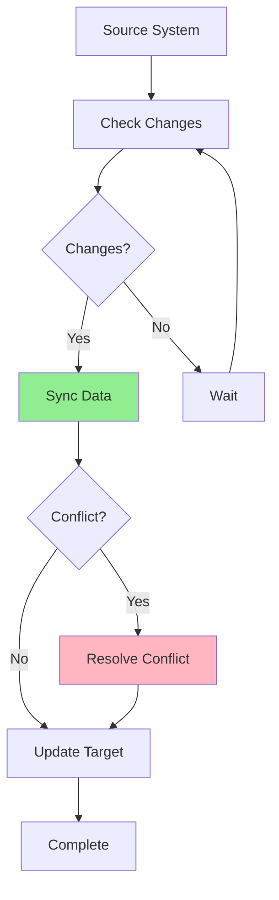

# 09.12 Business Rules Engine / Data Synchronization - Đồng bộ dữ liệu

## Table of Contents / Mục lục
1. [Introduction / Giới thiệu](#introduction--giới-thiệu)
2. [Sync Strategies / Chiến lược đồng bộ](#sync-strategies--chiến-lược-đồng-bộ)
3. [Conflict Resolution / Giải quyết xung đột](#conflict-resolution--giải-quyết-xung-đột)
4. [Sync Implementation / Triển khai đồng bộ](#sync-implementation--triển-khai-đồng-bộ)
5. [Best Practices / Thực hành tốt nhất](#best-practices--thực-hành-tốt-nhất)
6. [Summary / Tóm tắt](#summary--tóm-tắt)

---

## Introduction / Giới thiệu

### Overview / Tổng quan

**English**: Data synchronization keeps data consistent across systems. Implementing sync strategies with conflict resolution ensures reliable data consistency.

**Vietnamese**: Đồng bộ dữ liệu giữ dữ liệu nhất quán giữa các hệ thống. Triển khai chiến lược đồng bộ với giải quyết xung đột đảm bảo tính nhất quán dữ liệu đáng tin cậy.

### Data Sync Flow / Luồng đồng bộ dữ liệu



---

## Sync Strategies / Chiến lược đồng bộ

### Example 1: Sync Strategies / Ví dụ 1: Chiến lược đồng bộ

```typescript
// Full sync / Đồng bộ đầy đủ
async function fullSync(source: DataSource, target: DataSource) {
  const sourceData = await source.getAll();
  const targetData = await target.getAll();
  
  // Compare and sync / So sánh và đồng bộ
  for (const sourceItem of sourceData) {
    const targetItem = targetData.find(t => t.id === sourceItem.id);
    
    if (!targetItem) {
      // Create new / Tạo mới
      await target.create(sourceItem);
    } else if (sourceItem.updatedAt > targetItem.updatedAt) {
      // Update / Cập nhật
      await target.update(sourceItem.id, sourceItem);
    }
  }
}

// Incremental sync / Đồng bộ tăng dần
async function incrementalSync(
  source: DataSource,
  target: DataSource,
  lastSyncTime: Date
) {
  const changes = await source.getChangesSince(lastSyncTime);
  
  for (const change of changes) {
    switch (change.type) {
      case 'create':
        await target.create(change.data);
        break;
      case 'update':
        await target.update(change.id, change.data);
        break;
      case 'delete':
        await target.delete(change.id);
        break;
    }
  }
  
  await target.updateLastSyncTime(new Date());
}
```

---

## Conflict Resolution / Giải quyết xung đột

### Example 2: Conflict Resolution / Ví dụ 2: Giải quyết xung đột

```typescript
// Conflict resolution strategies / Chiến lược giải quyết xung đột
enum ConflictStrategy {
  LAST_WRITE_WINS = 'last_write_wins',
  SOURCE_WINS = 'source_wins',
  TARGET_WINS = 'target_wins',
  MANUAL = 'manual'
}

async function resolveConflict(
  sourceItem: any,
  targetItem: any,
  strategy: ConflictStrategy
): Promise<any> {
  switch (strategy) {
    case ConflictStrategy.LAST_WRITE_WINS:
      return sourceItem.updatedAt > targetItem.updatedAt
        ? sourceItem
        : targetItem;
    
    case ConflictStrategy.SOURCE_WINS:
      return sourceItem;
    
    case ConflictStrategy.TARGET_WINS:
      return targetItem;
    
    case ConflictStrategy.MANUAL:
      // Queue for manual resolution / Xếp hàng để giải quyết thủ công
      await queueForManualResolution(sourceItem, targetItem);
      return null;
    
    default:
      throw new Error(`Unknown strategy: ${strategy}`);
  }
}

// Merge strategy / Chiến lược merge
function mergeData(source: any, target: any): any {
  return {
    ...target,
    ...source,
    // Preserve target's specific fields / Giữ các trường cụ thể của target
    id: target.id,
    createdAt: target.createdAt,
    updatedAt: new Date()
  };
}
```

---

## Sync Implementation / Triển khai đồng bộ

### Example 3: Sync Service / Ví dụ 3: Service đồng bộ

```typescript
@Injectable()
export class DataSyncService {
  constructor(
    private prisma: PrismaService,
    private externalApi: ExternalApiService
  ) {}
  
  async syncUsers() {
    const lastSync = await this.getLastSyncTime('users');
    const externalUsers = await this.externalApi.getUsersSince(lastSync);
    
    for (const externalUser of externalUsers) {
      const localUser = await this.prisma.user.findUnique({
        where: { externalId: externalUser.id }
      });
      
      if (!localUser) {
        // Create / Tạo
        await this.prisma.user.create({
          data: this.mapExternalToLocal(externalUser)
        });
      } else {
        // Check for conflicts / Kiểm tra xung đột
        if (this.hasConflict(localUser, externalUser)) {
          const resolved = await this.resolveConflict(
            localUser,
            externalUser
          );
          await this.prisma.user.update({
            where: { id: localUser.id },
            data: resolved
          });
        } else {
          // Update / Cập nhật
          await this.prisma.user.update({
            where: { id: localUser.id },
            data: this.mapExternalToLocal(externalUser)
          });
        }
      }
    }
    
    await this.updateLastSyncTime('users', new Date());
  }
}
```

---

## Best Practices / Thực hành tốt nhất

1. **Incremental sync** - Sync only changes
2. **Conflict resolution** - Clear strategy
3. **Track changes** - Monitor sync status
4. **Error handling** - Handle sync errors
5. **Optimize** - Efficient sync algorithms

---

## Summary / Tóm tắt

### Key Takeaways / Điểm chính

- **Strategies**: Full sync, incremental sync
- **Conflicts**: Resolution strategies
- **Tracking**: Monitor sync status
- **Optimization**: Efficient sync

### Next Steps / Bước tiếp theo

- [09.13 Multi-tenancy](./09.13_Multi_tenancy.md) - Next: Multi-tenancy

---

**Last Updated / Cập nhật lần cuối**: 2024

