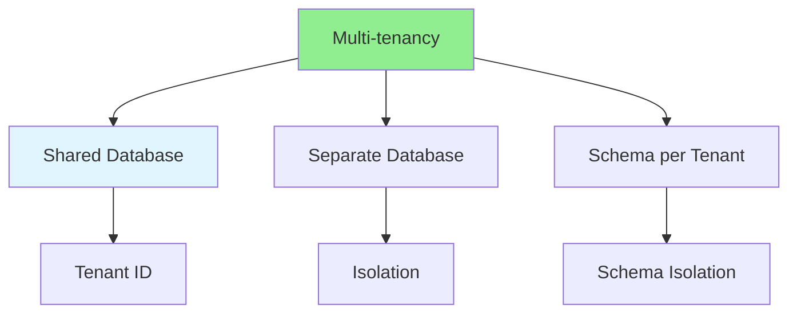

# 09.13 Multi-tenancy / Đa tenant

## Table of Contents / Mục lục
1. [Introduction / Giới thiệu](#introduction--giới-thiệu)
2. [Multi-tenancy Models / Mô hình đa tenant](#multi-tenancy-models--mô-hình-đa-tenant)
3. [Implementation / Triển khai](#implementation--triển-khai)
4. [Best Practices / Thực hành tốt nhất](#best-practices--thực-hành-tốt-nhất)
5. [Summary / Tóm tắt](#summary--tóm-tắt)

---

## Introduction / Giới thiệu

### Overview / Tổng quan

**English**: Multi-tenancy allows one application to serve multiple tenants. Learn to implement tenant isolation and data separation.

**Vietnamese**: Đa tenant cho phép một ứng dụng phục vụ nhiều tenant. Học cách triển khai cô lập tenant và tách biệt dữ liệu.

### Multi-tenancy Models / Mô hình đa tenant



---

## Multi-tenancy Models / Mô hình đa tenant

### Example 1: Multi-tenancy Implementation / Ví dụ 1: Triển khai đa tenant

```typescript
// Multi-tenancy with shared database / Đa tenant với database chung
// Add tenantId to all tables / Thêm tenantId vào tất cả bảng
interface TenantContext {
  tenantId: string;
}

// Middleware to extract tenant / Middleware để trích xuất tenant
function tenantMiddleware(req: Request, res: Response, next: NextFunction) {
  const tenantId = req.headers['x-tenant-id'] as string;
  if (!tenantId) {
    return res.status(400).json({ error: 'Tenant ID required' });
  }
  req.tenantId = tenantId;
  next();
}

// Prisma middleware for tenant filtering / Prisma middleware để lọc tenant
prisma.$use(async (params, next) => {
  if (params.model && params.action !== 'create') {
    params.args.where = {
      ...params.args.where,
      tenantId: params.args.tenantId || getCurrentTenantId()
    };
  }
  if (params.action === 'create') {
    params.args.data.tenantId = params.args.data.tenantId || getCurrentTenantId();
  }
  return next(params);
});

// Query with tenant isolation / Truy vấn với cô lập tenant
async function getTenantOrders(tenantId: string) {
  return await prisma.order.findMany({
    where: { tenantId } // Automatically filtered / Tự động lọc
  });
}
```

---

## Best Practices / Thực hành tốt nhất

1. **Isolate data** - Ensure tenant data isolation
2. **Validate tenant** - Always validate tenant access
3. **Index tenantId** - Index tenant columns
4. **Secure** - Prevent cross-tenant access
5. **Monitor** - Monitor per-tenant usage

---

## Summary / Tóm tắt

### Key Takeaways / Điểm chính

- **Multi-tenancy**: One app, multiple tenants
- **Isolation**: Tenant data isolation
- **Models**: Shared DB, separate DB, schema per tenant
- **Security**: Prevent cross-tenant access
- **Scalability**: Scale per tenant

### Next Steps / Bước tiếp theo

- [09.14 Data Synchronization](./09.14_Data_Synchronization.md) - Next: Data Sync

---

**Last Updated / Cập nhật lần cuối**: 2024


