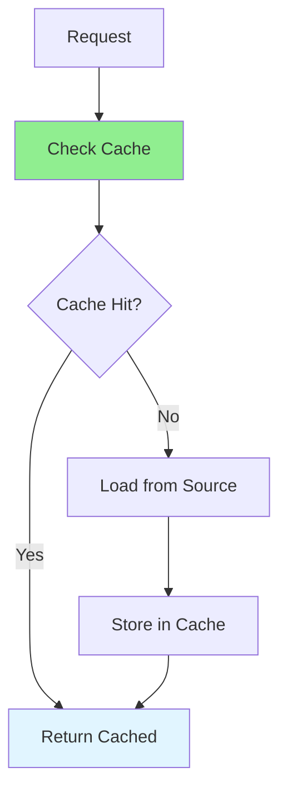

# 09.13 Multi-tenancy / Caching Strategies - Chiến lược cache

## Table of Contents / Mục lục
1. [Introduction / Giới thiệu](#introduction--giới-thiệu)
2. [Caching Strategies / Chiến lược cache](#caching-strategies--chiến-lược-cache)
3. [Cache Implementation / Triển khai cache](#cache-implementation--triển-khai-cache)
4. [Cache Invalidation / Vô hiệu hóa cache](#cache-invalidation--vô-hiệu-hóa-cache)
5. [Best Practices / Thực hành tốt nhất](#best-practices--thực-hành-tốt-nhất)
6. [Summary / Tóm tắt](#summary--tóm-tắt)

---

## Introduction / Giới thiệu

### Overview / Tổng quan

**English**: Caching strategies improve performance by storing frequently accessed data. Understanding different caching patterns helps optimize application performance.

**Vietnamese**: Chiến lược cache cải thiện hiệu năng bằng cách lưu trữ dữ liệu thường truy cập. Hiểu các mẫu cache khác nhau giúp tối ưu hiệu năng ứng dụng.

### Caching Strategies / Chiến lược cache



---

## Caching Strategies / Chiến lược cache

### Example 1: Cache Patterns / Ví dụ 1: Mẫu cache

```typescript
// Cache-aside pattern / Mẫu cache-aside
class CacheAsideService {
  constructor(
    private cache: Redis,
    private repository: Repository
  ) {}
  
  async get(id: string) {
    // Check cache / Kiểm tra cache
    const cached = await this.cache.get(`item:${id}`);
    if (cached) {
      return JSON.parse(cached);
    }
    
    // Load from database / Tải từ database
    const item = await this.repository.findById(id);
    
    // Store in cache / Lưu vào cache
    await this.cache.setex(
      `item:${id}`,
      3600, // TTL: 1 hour / TTL: 1 giờ
      JSON.stringify(item)
    );
    
    return item;
  }
}

// Write-through pattern / Mẫu write-through
class WriteThroughService {
  async update(id: string, data: any) {
    // Update database / Cập nhật database
    const updated = await this.repository.update(id, data);
    
    // Update cache / Cập nhật cache
    await this.cache.setex(
      `item:${id}`,
      3600,
      JSON.stringify(updated)
    );
    
    return updated;
  }
}

// Write-back pattern / Mẫu write-back
class WriteBackService {
  private writeQueue: Map<string, any> = new Map();
  
  async update(id: string, data: any) {
    // Update cache immediately / Cập nhật cache ngay lập tức
    await this.cache.set(`item:${id}`, JSON.stringify(data));
    
    // Queue for database write / Xếp hàng để ghi database
    this.writeQueue.set(id, data);
    
    // Flush periodically / Xả định kỳ
    if (this.writeQueue.size >= 100) {
      await this.flush();
    }
  }
  
  private async flush() {
    for (const [id, data] of this.writeQueue) {
      await this.repository.update(id, data);
    }
    this.writeQueue.clear();
  }
}
```

---

## Cache Implementation / Triển khai cache

### Example 2: Redis Cache / Ví dụ 2: Cache Redis

```typescript
import Redis from 'ioredis';

class CacheService {
  private redis: Redis;
  
  constructor() {
    this.redis = new Redis({
      host: 'localhost',
      port: 6379
    });
  }
  
  async get<T>(key: string): Promise<T | null> {
    const value = await this.redis.get(key);
    return value ? JSON.parse(value) : null;
  }
  
  async set(key: string, value: any, ttl?: number): Promise<void> {
    const serialized = JSON.stringify(value);
    if (ttl) {
      await this.redis.setex(key, ttl, serialized);
    } else {
      await this.redis.set(key, serialized);
    }
  }
  
  async invalidate(pattern: string): Promise<void> {
    const keys = await this.redis.keys(pattern);
    if (keys.length > 0) {
      await this.redis.del(...keys);
    }
  }
  
  async invalidatePrefix(prefix: string): Promise<void> {
    await this.invalidate(`${prefix}:*`);
  }
}
```

---

## Cache Invalidation / Vô hiệu hóa cache

### Example 3: Invalidation Strategies / Ví dụ 3: Chiến lược vô hiệu hóa

```typescript
// Event-based invalidation / Vô hiệu hóa dựa trên event
@Injectable()
export class CacheInvalidationService {
  constructor(
    private cache: CacheService,
    @Inject(EventEmitter2) private eventEmitter: EventEmitter2
  ) {
    this.setupEventListeners();
  }
  
  private setupEventListeners() {
    this.eventEmitter.on('user.updated', async (data: { userId: string }) => {
      await this.cache.invalidate(`user:${data.userId}`);
      await this.cache.invalidate(`user:${data.userId}:orders`);
    });
    
    this.eventEmitter.on('order.created', async (data: { userId: string }) => {
      await this.cache.invalidate(`user:${data.userId}:orders`);
    });
  }
}

// TTL-based invalidation / Vô hiệu hóa dựa trên TTL
async function cacheWithTTL(key: string, value: any, ttl: number) {
  await cache.setex(key, ttl, JSON.stringify(value));
}

// Manual invalidation / Vô hiệu hóa thủ công
async function invalidateUserCache(userId: string) {
  await cache.invalidatePrefix(`user:${userId}`);
}
```

---

## Best Practices / Thực hành tốt nhất

1. **Choose strategy** - Right pattern for use case
2. **Set TTL** - Appropriate expiration
3. **Invalidate** - Clear stale data
4. **Monitor** - Track cache hit rate
5. **Optimize** - Cache frequently accessed data

---

## Summary / Tóm tắt

### Key Takeaways / Điểm chính

- **Strategies**: Cache-aside, write-through, write-back
- **Implementation**: Redis, in-memory cache
- **Invalidation**: Event-based, TTL-based
- **Optimization**: Monitor and tune

### Next Steps / Bước tiếp theo

- [09.14 Data Synchronization](./09.14_Data_Synchronization.md) - Next: Data Synchronization

---

**Last Updated / Cập nhật lần cuối**: 2024

