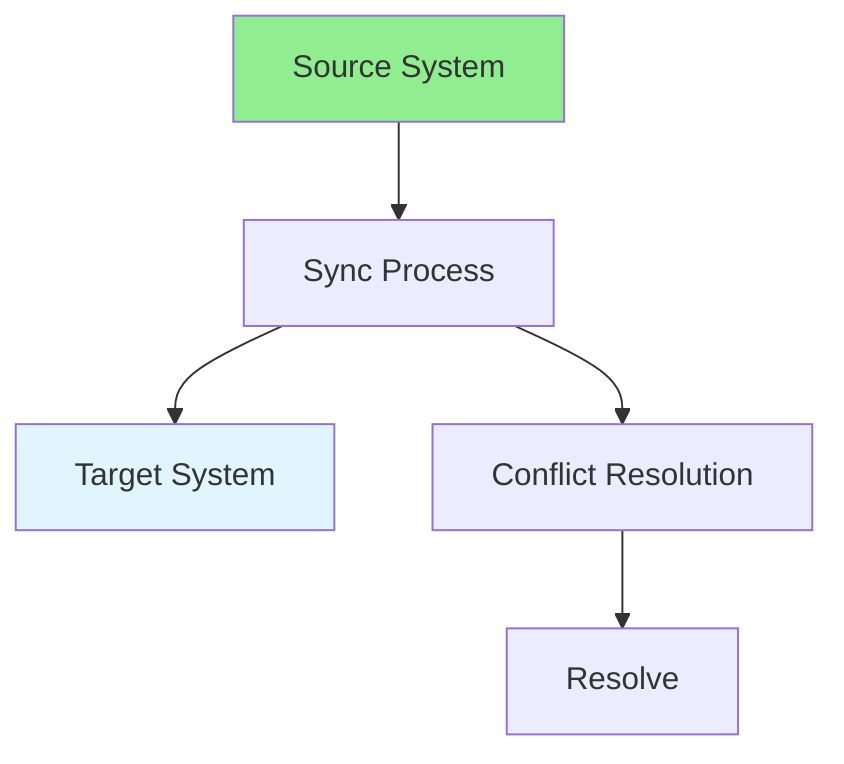

# 09.14 Data Synchronization / Đồng bộ dữ liệu

## Table of Contents / Mục lục
1. [Introduction / Giới thiệu](#introduction--giới-thiệu)
2. [Sync Strategies / Chiến lược đồng bộ](#sync-strategies--chiến-lược-đồng-bộ)
3. [Implementation / Triển khai](#implementation--triển-khai)
4. [Best Practices / Thực hành tốt nhất](#best-practices--thực-hành-tốt-nhất)
5. [Summary / Tóm tắt](#summary--tóm-tắt)

---

## Introduction / Giới thiệu

### Overview / Tổng quan

**English**: Data synchronization keeps data consistent across systems. Learn to implement sync strategies for distributed systems.

**Vietnamese**: Đồng bộ dữ liệu giữ cho dữ liệu nhất quán giữa các hệ thống. Học cách triển khai chiến lược đồng bộ cho hệ thống phân tán.

### Data Synchronization / Đồng bộ dữ liệu



---

## Sync Strategies / Chiến lược đồng bộ

### Example 1: Data Synchronization / Ví dụ 1: Đồng bộ dữ liệu

```typescript
// Data synchronization / Đồng bộ dữ liệu
interface SyncConfig {
  source: string;
  target: string;
  syncInterval: number;
  conflictResolution: 'source' | 'target' | 'merge';
}

class DataSynchronizer {
  async syncData(config: SyncConfig) {
    const sourceData = await this.fetchSourceData(config.source);
    const targetData = await this.fetchTargetData(config.target);
    
    // Compare and sync / So sánh và đồng bộ
    const changes = this.detectChanges(sourceData, targetData);
    
    for (const change of changes) {
      if (change.type === 'create') {
        await this.createInTarget(change.data);
      } else if (change.type === 'update') {
        await this.updateInTarget(change.data);
      } else if (change.type === 'delete') {
        await this.deleteInTarget(change.id);
      } else if (change.type === 'conflict') {
        await this.resolveConflict(change, config.conflictResolution);
      }
    }
  }
  
  detectChanges(source: any[], target: any[]): Change[] {
    const changes: Change[] = [];
    const sourceMap = new Map(source.map(item => [item.id, item]));
    const targetMap = new Map(target.map(item => [item.id, item]));
    
    // Find new items / Tìm mục mới
    for (const [id, item] of sourceMap) {
      if (!targetMap.has(id)) {
        changes.push({ type: 'create', data: item });
      } else {
        const targetItem = targetMap.get(id);
        if (this.hasChanges(item, targetItem)) {
          if (item.updatedAt > targetItem.updatedAt) {
            changes.push({ type: 'update', data: item });
          } else {
            changes.push({ type: 'conflict', source: item, target: targetItem });
          }
        }
      }
    }
    
    // Find deleted items / Tìm mục đã xóa
    for (const [id] of targetMap) {
      if (!sourceMap.has(id)) {
        changes.push({ type: 'delete', id });
      }
    }
    
    return changes;
  }
}
```

---

## Best Practices / Thực hành tốt nhất

1. **Idempotent** - Make sync idempotent
2. **Conflict resolution** - Define conflict resolution strategy
3. **Incremental** - Sync only changes
4. **Monitor** - Monitor sync status
5. **Retry** - Implement retry logic

---

## Summary / Tóm tắt

### Key Takeaways / Điểm chính

- **Data sync**: Keep data consistent across systems
- **Strategies**: Full sync, incremental sync
- **Conflict resolution**: Handle conflicts
- **Idempotent**: Safe to retry
- **Monitoring**: Track sync status

### Next Steps / Bước tiếp theo

- [09.15 Complex Reporting](./09.15_Complex_Reporting.md) - Next: Complex Reporting

---

**Last Updated / Cập nhật lần cuối**: 2024

