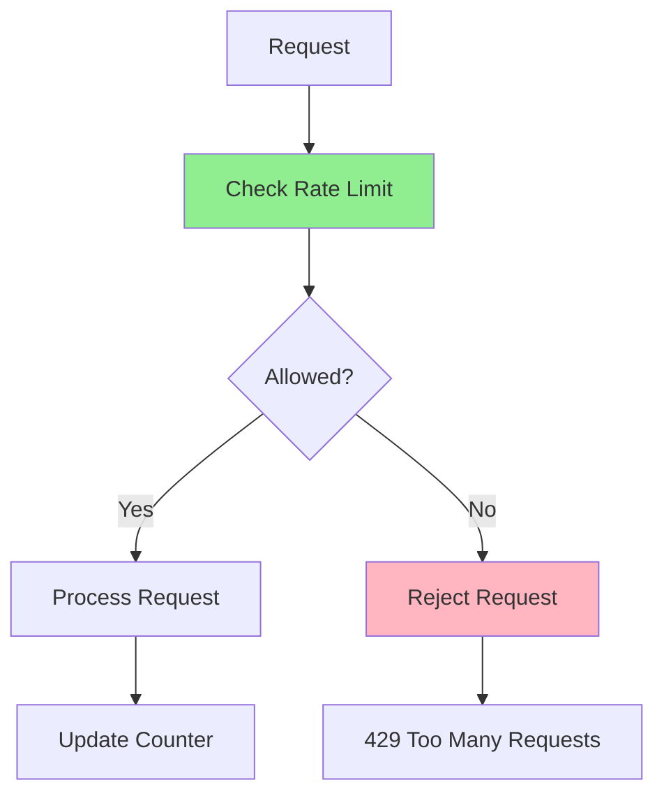

# 09.14 Data Synchronization / Rate Limiting và Throttling

## Table of Contents / Mục lục
1. [Introduction / Giới thiệu](#introduction--giới-thiệu)
2. [Rate Limiting Strategies / Chiến lược giới hạn tốc độ](#rate-limiting-strategies--chiến-lược-giới-hạn-tốc-độ)
3. [Throttling / Throttling](#throttling--throttling)
4. [Implementation / Triển khai](#implementation--triển-khai)
5. [Best Practices / Thực hành tốt nhất](#best-practices--thực-hành-tốt-nhất)
6. [Summary / Tóm tắt](#summary--tóm-tắt)

---

## Introduction / Giới thiệu

### Overview / Tổng quan

**English**: Rate limiting and throttling protect APIs from abuse and ensure fair resource usage. Implementing effective rate limiting improves system stability and security.

**Vietnamese**: Rate limiting và throttling bảo vệ API khỏi lạm dụng và đảm bảo sử dụng tài nguyên công bằng. Triển khai rate limiting hiệu quả cải thiện tính ổn định và bảo mật hệ thống.

### Rate Limiting Flow / Luồng rate limiting



---

## Rate Limiting Strategies / Chiến lược giới hạn tốc độ

### Example 1: Rate Limiting Algorithms / Ví dụ 1: Thuật toán rate limiting

```typescript
// Fixed window / Cửa sổ cố định
class FixedWindowRateLimiter {
  private requests: Map<string, number> = new Map();
  private windowStart: Map<string, number> = new Map();
  
  constructor(
    private limit: number,
    private windowMs: number
  ) {}
  
  async isAllowed(identifier: string): Promise<boolean> {
    const now = Date.now();
    const windowStart = this.windowStart.get(identifier) || now;
    
    // Reset window if expired / Đặt lại cửa sổ nếu hết hạn
    if (now - windowStart >= this.windowMs) {
      this.requests.set(identifier, 0);
      this.windowStart.set(identifier, now);
    }
    
    const count = this.requests.get(identifier) || 0;
    
    if (count >= this.limit) {
      return false;
    }
    
    this.requests.set(identifier, count + 1);
    return true;
  }
}

// Sliding window / Cửa sổ trượt
class SlidingWindowRateLimiter {
  private requests: Map<string, number[]> = new Map();
  
  constructor(
    private limit: number,
    private windowMs: number
  ) {}
  
  async isAllowed(identifier: string): Promise<boolean> {
    const now = Date.now();
    const timestamps = this.requests.get(identifier) || [];
    
    // Remove old timestamps / Xóa timestamp cũ
    const validTimestamps = timestamps.filter(
      ts => now - ts < this.windowMs
    );
    
    if (validTimestamps.length >= this.limit) {
      return false;
    }
    
    validTimestamps.push(now);
    this.requests.set(identifier, validTimestamps);
    return true;
  }
}

// Token bucket / Xô token
class TokenBucketRateLimiter {
  private buckets: Map<string, { tokens: number; lastRefill: number }> = new Map();
  
  constructor(
    private capacity: number,
    private refillRate: number // tokens per second / token mỗi giây
  ) {}
  
  async isAllowed(identifier: string): Promise<boolean> {
    const now = Date.now();
    const bucket = this.buckets.get(identifier) || {
      tokens: this.capacity,
      lastRefill: now
    };
    
    // Refill tokens / Nạp lại token
    const elapsed = (now - bucket.lastRefill) / 1000;
    bucket.tokens = Math.min(
      this.capacity,
      bucket.tokens + elapsed * this.refillRate
    );
    bucket.lastRefill = now;
    
    if (bucket.tokens >= 1) {
      bucket.tokens -= 1;
      this.buckets.set(identifier, bucket);
      return true;
    }
    
    this.buckets.set(identifier, bucket);
    return false;
  }
}
```

---

## Throttling / Throttling

### Example 2: Throttling Implementation / Ví dụ 2: Triển khai throttling

```typescript
// Throttle function calls / Throttle lời gọi hàm
function throttle<T extends (...args: any[]) => any>(
  fn: T,
  delay: number
): T {
  let lastCall = 0;
  let timeout: NodeJS.Timeout | null = null;
  
  return ((...args: any[]) => {
    const now = Date.now();
    
    if (now - lastCall >= delay) {
      lastCall = now;
      return fn(...args);
    }
    
    if (timeout) {
      clearTimeout(timeout);
    }
    
    timeout = setTimeout(() => {
      lastCall = Date.now();
      fn(...args);
    }, delay - (now - lastCall));
  }) as T;
}

// Debounce function calls / Debounce lời gọi hàm
function debounce<T extends (...args: any[]) => any>(
  fn: T,
  delay: number
): T {
  let timeout: NodeJS.Timeout | null = null;
  
  return ((...args: any[]) => {
    if (timeout) {
      clearTimeout(timeout);
    }
    
    timeout = setTimeout(() => {
      fn(...args);
    }, delay);
  }) as T;
}
```

---

## Implementation / Triển khai

### Example 3: NestJS Rate Limiter / Ví dụ 3: Rate limiter NestJS

```typescript
// Rate limiter guard / Guard rate limiter
import { Injectable, CanActivate, ExecutionContext } from '@nestjs/common';
import { ThrottlerGuard, ThrottlerException } from '@nestjs/throttler';

@Injectable()
export class CustomThrottlerGuard extends ThrottlerGuard {
  async canActivate(context: ExecutionContext): Promise<boolean> {
    const request = context.switchToHttp().getRequest();
    const identifier = this.getIdentifier(request);
    
    const { totalHits, ttl } = await this.storageService.increment(
      identifier,
      this.options.ttl
    );
    
    if (totalHits > this.options.limit) {
      throw new ThrottlerException();
    }
    
    return true;
  }
  
  protected getIdentifier(request: any): string {
    // Rate limit by IP / Giới hạn theo IP
    return request.ip;
    
    // Or by user ID / Hoặc theo user ID
    // return request.user?.id || request.ip;
  }
}

// Apply to route / Áp dụng cho route
@Controller('api')
@UseGuards(CustomThrottlerGuard)
export class ApiController {
  @Get('data')
  getData() {
    return { data: 'protected' };
  }
}
```

---

## Best Practices / Thực hành tốt nhất

1. **Choose algorithm** - Right strategy for use case
2. **Set limits** - Appropriate limits per user/IP
3. **User-friendly** - Clear error messages
4. **Monitor** - Track rate limit hits
5. **Whitelist** - Allow trusted sources

---

## Summary / Tóm tắt

### Key Takeaways / Điểm chính

- **Strategies**: Fixed window, sliding window, token bucket
- **Throttling**: Limit function call frequency
- **Implementation**: Guards, middleware
- **Protection**: Prevent abuse and ensure fairness

### Next Steps / Bước tiếp theo

- [09.15 Complex Reporting](./09.15_Complex_Reporting.md) - Next: Complex Reporting

---

**Last Updated / Cập nhật lần cuối**: 2024

