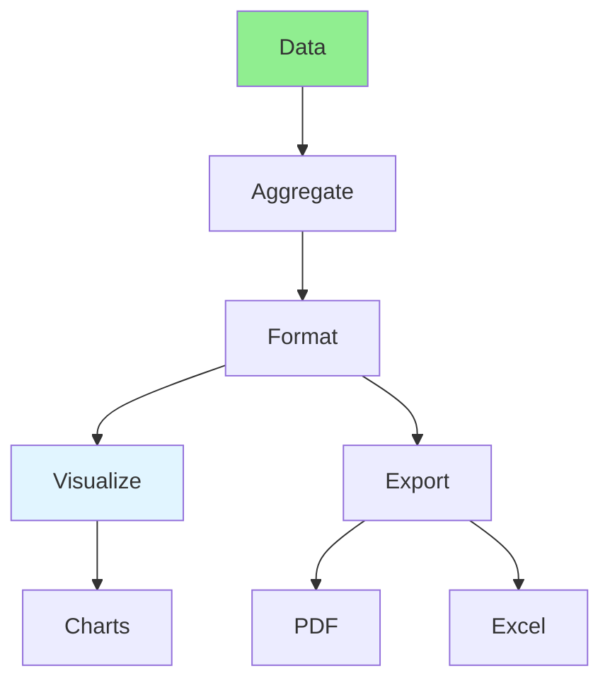

# 09.15 Complex Reporting / Báo cáo phức tạp

## Table of Contents / Mục lục
1. [Introduction / Giới thiệu](#introduction--giới-thiệu)
2. [Reporting Features / Tính năng báo cáo](#reporting-features--tính-năng-báo-cáo)
3. [Implementation / Triển khai](#implementation--triển-khai)
4. [Best Practices / Thực hành tốt nhất](#best-practices--thực-hành-tốt-nhất)
5. [Summary / Tóm tắt](#summary--tóm-tắt)

---

## Introduction / Giới thiệu

### Overview / Tổng quan

**English**: Complex reporting generates detailed analytics and insights. Learn to implement reporting with aggregations, charts, and exports.

**Vietnamese**: Báo cáo phức tạp tạo phân tích và thông tin chi tiết. Học cách triển khai báo cáo với tổng hợp, biểu đồ và xuất dữ liệu.

### Complex Reporting / Báo cáo phức tạp



---

## Reporting Features / Tính năng báo cáo

### Example 1: Complex Reporting / Ví dụ 1: Báo cáo phức tạp

```typescript
// Complex sales report / Báo cáo bán hàng phức tạp
async function generateSalesReport(startDate: Date, endDate: Date) {
  // Aggregate sales data / Tổng hợp dữ liệu bán hàng
  const salesData = await prisma.order.groupBy({
    by: ['createdAt'],
    where: {
      createdAt: { gte: startDate, lte: endDate }
    },
    _sum: { totalAmount: true },
    _count: { id: true },
    _avg: { totalAmount: true }
  });
  
  // Sales by category / Bán hàng theo danh mục
  const salesByCategory = await prisma.orderItem.groupBy({
    by: ['product', 'category'],
    where: {
      order: {
        createdAt: { gte: startDate, lte: endDate }
      }
    },
    _sum: { quantity: true, price: true }
  });
  
  // Top customers / Khách hàng hàng đầu
  const topCustomers = await prisma.order.groupBy({
    by: ['userId'],
    where: {
      createdAt: { gte: startDate, lte: endDate }
    },
    _sum: { totalAmount: true },
    orderBy: { _sum: { totalAmount: 'desc' } },
    take: 10
  });
  
  // Generate report / Tạo báo cáo
  return {
    summary: {
      totalSales: salesData.reduce((sum, item) => sum + item._sum.totalAmount, 0),
      totalOrders: salesData.reduce((sum, item) => sum + item._count.id, 0),
      averageOrderValue: salesData.reduce((sum, item) => sum + item._avg.totalAmount, 0) / salesData.length
    },
    salesByCategory,
    topCustomers,
    chartData: formatChartData(salesData)
  };
}

// Export to PDF / Xuất ra PDF
async function exportReportToPDF(report: any) {
  // Use PDF library like pdfkit / Sử dụng thư viện PDF như pdfkit
  // Generate PDF from report data / Tạo PDF từ dữ liệu báo cáo
}
```

---

## Best Practices / Thực hành tốt nhất

1. **Optimize queries** - Efficient aggregation queries
2. **Cache reports** - Cache expensive reports
3. **Async generation** - Generate large reports asynchronously
4. **Format options** - Support multiple export formats
5. **Visualization** - Include charts and graphs

---

## Summary / Tóm tắt

### Key Takeaways / Điểm chính

- **Complex reporting**: Aggregations, analytics, insights
- **Visualization**: Charts and graphs
- **Export**: PDF, Excel, CSV
- **Performance**: Optimize and cache
- **Async**: Generate large reports asynchronously

### Next Steps / Bước tiếp theo

- [09.16 System Integration](./09.16_System_Integration.md) - Next: System Integration

---

**Last Updated / Cập nhật lần cuối**: 2024


