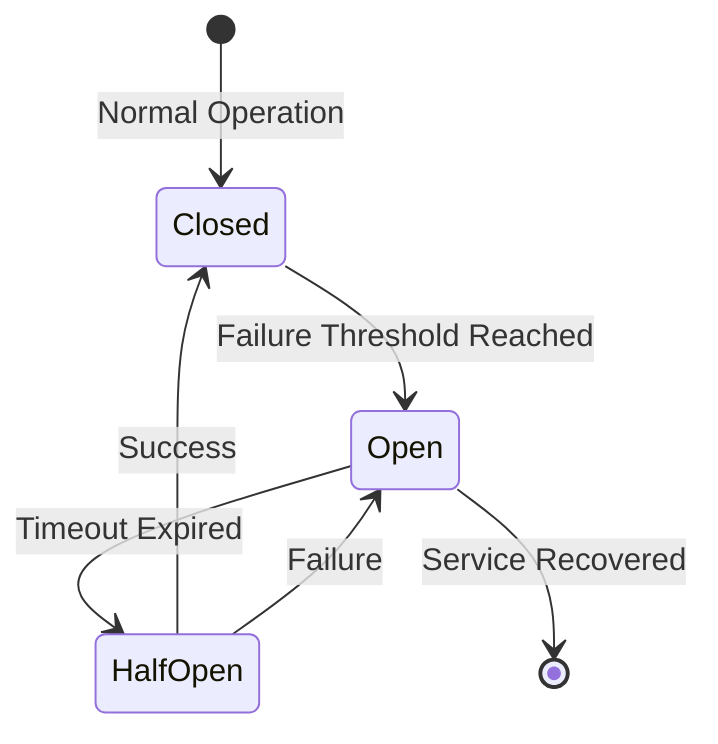

# 09.15 Complex Reporting / Circuit Breaker Pattern - Pattern ngắt mạch

## Table of Contents / Mục lục
1. [Introduction / Giới thiệu](#introduction--giới-thiệu)
2. [Circuit Breaker Pattern / Mẫu circuit breaker](#circuit-breaker-pattern--mẫu-circuit-breaker)
3. [Implementation / Triển khai](#implementation--triển-khai)
4. [Best Practices / Thực hành tốt nhất](#best-practices--thực-hành-tốt-nhất)
5. [Summary / Tóm tắt](#summary--tóm-tắt)

---

## Introduction / Giới thiệu

### Overview / Tổng quan

**English**: Circuit breaker pattern prevents cascading failures by stopping requests to failing services. This improves system resilience and prevents resource exhaustion.

**Vietnamese**: Mẫu circuit breaker ngăn chặn lỗi dây chuyền bằng cách dừng yêu cầu đến dịch vụ đang lỗi. Điều này cải thiện khả năng phục hồi hệ thống và ngăn chặn cạn kiệt tài nguyên.

### Circuit Breaker States / Trạng thái circuit breaker



---

## Circuit Breaker Pattern / Mẫu circuit breaker

### Example 1: Circuit Breaker Implementation / Ví dụ 1: Triển khai circuit breaker

```typescript
enum CircuitState {
  CLOSED = 'closed',
  OPEN = 'open',
  HALF_OPEN = 'half_open'
}

class CircuitBreaker {
  private state: CircuitState = CircuitState.CLOSED;
  private failureCount = 0;
  private lastFailureTime: number | null = null;
  
  constructor(
    private failureThreshold: number = 5,
    private timeout: number = 60000, // 1 minute / 1 phút
    private successThreshold: number = 2
  ) {}
  
  async execute<T>(fn: () => Promise<T>): Promise<T> {
    if (this.state === CircuitState.OPEN) {
      if (this.shouldAttemptReset()) {
        this.state = CircuitState.HALF_OPEN;
      } else {
        throw new Error('Circuit breaker is OPEN');
      }
    }
    
    try {
      const result = await fn();
      this.onSuccess();
      return result;
    } catch (error) {
      this.onFailure();
      throw error;
    }
  }
  
  private onSuccess() {
    this.failureCount = 0;
    
    if (this.state === CircuitState.HALF_OPEN) {
      // Count successes in half-open / Đếm thành công trong half-open
      this.successCount++;
      if (this.successCount >= this.successThreshold) {
        this.state = CircuitState.CLOSED;
        this.successCount = 0;
      }
    }
  }
  
  private onFailure() {
    this.failureCount++;
    this.lastFailureTime = Date.now();
    
    if (this.state === CircuitState.HALF_OPEN) {
      this.state = CircuitState.OPEN;
    } else if (this.failureCount >= this.failureThreshold) {
      this.state = CircuitState.OPEN;
    }
  }
  
  private shouldAttemptReset(): boolean {
    if (!this.lastFailureTime) return false;
    return Date.now() - this.lastFailureTime >= this.timeout;
  }
}
```

---

## Implementation / Triển khai

### Example 2: Using Circuit Breaker / Ví dụ 2: Sử dụng circuit breaker

```typescript
// External API call with circuit breaker / Gọi API bên ngoài với circuit breaker
const circuitBreaker = new CircuitBreaker({
  failureThreshold: 5,
  timeout: 60000,
  successThreshold: 2
});

async function callExternalAPI(url: string) {
  return await circuitBreaker.execute(async () => {
    const response = await fetch(url);
    if (!response.ok) {
      throw new Error(`API call failed: ${response.status}`);
    }
    return response.json();
  });
}

// Service with circuit breaker / Service với circuit breaker
@Injectable()
export class ExternalApiService {
  private circuitBreaker: CircuitBreaker;
  
  constructor() {
    this.circuitBreaker = new CircuitBreaker({
      failureThreshold: 5,
      timeout: 60000
    });
  }
  
  async fetchData(id: string) {
    try {
      return await this.circuitBreaker.execute(async () => {
        return await this.httpService.get(`/api/data/${id}`).toPromise();
      });
    } catch (error) {
      // Fallback / Dự phòng
      return this.getCachedData(id);
    }
  }
  
  private getCachedData(id: string) {
    // Return cached data / Trả về dữ liệu cache
    return { id, cached: true };
  }
}
```

---

## Best Practices / Thực hành tốt nhất

1. **Configure thresholds** - Appropriate failure/success thresholds
2. **Monitor state** - Track circuit breaker state
3. **Fallback** - Provide fallback mechanisms
4. **Timeout** - Set appropriate timeout
5. **Logging** - Log state changes

---

## Summary / Tóm tắt

### Key Takeaways / Điểm chính

- **States**: Closed, open, half-open
- **Protection**: Prevent cascading failures
- **Resilience**: Improve system reliability
- **Fallback**: Provide alternative paths

### Next Steps / Bước tiếp theo

- [09.16 System Integration](./09.16_System_Integration.md) - Next: System Integration

---

**Last Updated / Cập nhật lần cuối**: 2024

