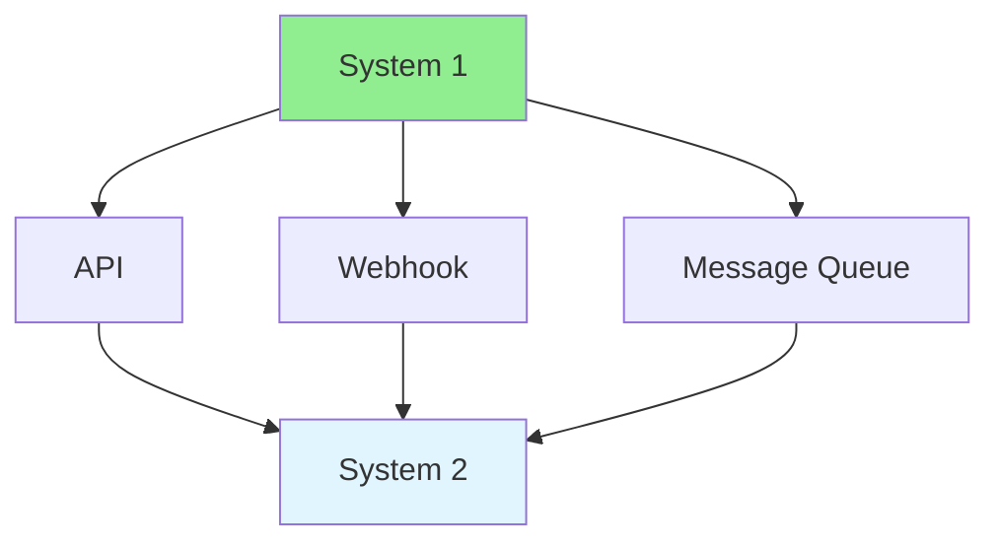

# 09.16 System Integration / Tích hợp hệ thống

## Table of Contents / Mục lục
1. [Introduction / Giới thiệu](#introduction--giới-thiệu)
2. [Integration Patterns / Mẫu tích hợp](#integration-patterns--mẫu-tích-hợp)
3. [Implementation / Triển khai](#implementation--triển-khai)
4. [Best Practices / Thực hành tốt nhất](#best-practices--thực-hành-tốt-nhất)
5. [Summary / Tóm tắt](#summary--tóm-tắt)

---

## Introduction / Giới thiệu

### Overview / Tổng quan

**English**: System integration connects different systems to work together. Learn to implement API integrations, webhooks, and message queues.

**Vietnamese**: Tích hợp hệ thống kết nối các hệ thống khác nhau để làm việc cùng nhau. Học cách triển khai tích hợp API, webhook và hàng đợi tin nhắn.

### System Integration / Tích hợp hệ thống



---

## Integration Patterns / Mẫu tích hợp

### Example 1: API Integration / Ví dụ 1: Tích hợp API

```typescript
// API integration / Tích hợp API
class PaymentGatewayIntegration {
  private apiKey: string;
  private baseUrl: string;
  
  constructor(apiKey: string, baseUrl: string) {
    this.apiKey = apiKey;
    this.baseUrl = baseUrl;
  }
  
  async processPayment(amount: number, currency: string, orderId: string) {
    const response = await fetch(`${this.baseUrl}/payments`, {
      method: 'POST',
      headers: {
        'Authorization': `Bearer ${this.apiKey}`,
        'Content-Type': 'application/json'
      },
      body: JSON.stringify({
        amount,
        currency,
        orderId
      })
    });
    
    if (!response.ok) {
      throw new Error(`Payment failed: ${response.statusText}`);
    }
    
    return await response.json();
  }
  
  async handleWebhook(payload: any, signature: string) {
    // Verify webhook signature / Xác minh chữ ký webhook
    if (!this.verifySignature(payload, signature)) {
      throw new Error('Invalid webhook signature');
    }
    
    // Process webhook event / Xử lý sự kiện webhook
    switch (payload.event) {
      case 'payment.succeeded':
        await this.handlePaymentSuccess(payload.data);
        break;
      case 'payment.failed':
        await this.handlePaymentFailure(payload.data);
        break;
    }
  }
}
```

### Example 2: Message Queue Integration / Ví dụ 2: Tích hợp hàng đợi tin nhắn

```typescript
// Message queue integration / Tích hợp hàng đợi tin nhắn
import { Queue } from 'bull';

const integrationQueue = new Queue('integrations', {
  redis: { host: 'localhost', port: 6379 }
});

// Send message to external system / Gửi tin nhắn đến hệ thống bên ngoài
async function syncToExternalSystem(data: any) {
  await integrationQueue.add('sync-data', {
    system: 'external',
    data
  });
}

// Process integration jobs / Xử lý job tích hợp
integrationQueue.process('sync-data', async (job) => {
  const { system, data } = job.data;
  
  // Call external API / Gọi API bên ngoài
  await fetch(`https://${system}.com/api/sync`, {
    method: 'POST',
    body: JSON.stringify(data)
  });
});
```

---

## Best Practices / Thực hành tốt nhất

1. **Error handling** - Handle integration failures
2. **Retry logic** - Retry failed integrations
3. **Idempotency** - Make integrations idempotent
4. **Monitoring** - Monitor integration health
5. **Documentation** - Document integration contracts

---

## Summary / Tóm tắt

### Key Takeaways / Điểm chính

- **System integration**: Connect different systems
- **APIs**: REST, GraphQL integrations
- **Webhooks**: Event-driven integration
- **Message queues**: Async integration
- **Error handling**: Handle failures gracefully

### Next Steps / Bước tiếp theo

- ✅ Complete Group 09: Complex Functions
- All Groups 1-9 are now complete! 🎉

---

**Last Updated / Cập nhật lần cuối**: 2024

