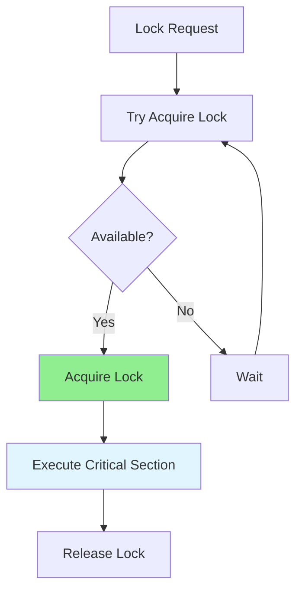

# 09.16 System Integration / Distributed Locking - Khóa phân tán

## Table of Contents / Mục lục
1. [Introduction / Giới thiệu](#introduction--giới-thiệu)
2. [Distributed Locking Concepts / Khái niệm khóa phân tán](#distributed-locking-concepts--khái-niệm-khóa-phân-tán)
3. [Lock Implementation / Triển khai khóa](#lock-implementation--triển-khai-khóa)
4. [Best Practices / Thực hành tốt nhất](#best-practices--thực-hành-tốt-nhất)
5. [Summary / Tóm tắt](#summary--tóm-tắt)

---

## Introduction / Giới thiệu

### Overview / Tổng quan

**English**: Distributed locking coordinates access to shared resources across multiple systems. Implementing distributed locks prevents race conditions and ensures data consistency.

**Vietnamese**: Khóa phân tán điều phối truy cập tài nguyên dùng chung giữa nhiều hệ thống. Triển khai khóa phân tán ngăn chặn race condition và đảm bảo tính nhất quán dữ liệu.

### Distributed Lock Flow / Luồng khóa phân tán



---

## Distributed Locking Concepts / Khái niệm khóa phân tán

### Example 1: Redis Distributed Lock / Ví dụ 1: Khóa phân tán Redis

```typescript
import Redis from 'ioredis';

class DistributedLock {
  constructor(private redis: Redis) {}
  
  async acquire(
    key: string,
    ttl: number = 10000, // milliseconds / mili giây
    retryDelay: number = 100
  ): Promise<string | null> {
    const lockValue = `${Date.now()}-${Math.random()}`;
    const maxRetries = 10;
    let retries = 0;
    
    while (retries < maxRetries) {
      // Try to acquire lock / Thử lấy khóa
      const result = await this.redis.set(
        `lock:${key}`,
        lockValue,
        'PX', // Expire in milliseconds / Hết hạn sau mili giây
        ttl,
        'NX' // Only set if not exists / Chỉ đặt nếu không tồn tại
      );
      
      if (result === 'OK') {
        return lockValue;
      }
      
      // Wait before retry / Đợi trước khi thử lại
      await new Promise(resolve => setTimeout(resolve, retryDelay));
      retries++;
    }
    
    return null; // Failed to acquire / Không thể lấy được
  }
  
  async release(key: string, lockValue: string): Promise<boolean> {
    // Lua script to ensure we only release our own lock / Script Lua để đảm bảo chỉ giải phóng khóa của chúng ta
    const script = `
      if redis.call("get", KEYS[1]) == ARGV[1] then
        return redis.call("del", KEYS[1])
      else
        return 0
      end
    `;
    
    const result = await this.redis.eval(
      script,
      1,
      `lock:${key}`,
      lockValue
    );
    
    return result === 1;
  }
  
  async withLock<T>(
    key: string,
    fn: () => Promise<T>,
    ttl: number = 10000
  ): Promise<T> {
    const lockValue = await this.acquire(key, ttl);
    
    if (!lockValue) {
      throw new Error('Failed to acquire lock');
    }
    
    try {
      return await fn();
    } finally {
      await this.release(key, lockValue);
    }
  }
}
```

---

## Lock Implementation / Triển khai khóa

### Example 2: Using Distributed Lock / Ví dụ 2: Sử dụng khóa phân tán

```typescript
// Use distributed lock / Sử dụng khóa phân tán
const lock = new DistributedLock(redis);

async function processOrder(orderId: string) {
  return await lock.withLock(
    `order:${orderId}`,
    async () => {
      // Critical section / Phần quan trọng
      const order = await prisma.order.findUnique({
        where: { id: orderId }
      });
      
      if (order.status !== 'pending') {
        throw new Error('Order already processed');
      }
      
      await prisma.order.update({
        where: { id: orderId },
        data: { status: 'processing' }
      });
      
      // Process order / Xử lý đơn hàng
      await processOrderItems(order);
      
      await prisma.order.update({
        where: { id: orderId },
        data: { status: 'completed' }
      });
      
      return order;
    },
    30000 // 30 seconds timeout / Hết hạn sau 30 giây
  );
}

// Read-write lock / Khóa đọc-ghi
class ReadWriteLock {
  private readLocks: Map<string, number> = new Map();
  private writeLock: Map<string, string | null> = new Map();
  
  async acquireRead(key: string): Promise<void> {
    while (this.writeLock.get(key)) {
      await this.delay(10);
    }
    this.readLocks.set(key, (this.readLocks.get(key) || 0) + 1);
  }
  
  async releaseRead(key: string): Promise<void> {
    const count = (this.readLocks.get(key) || 1) - 1;
    if (count === 0) {
      this.readLocks.delete(key);
    } else {
      this.readLocks.set(key, count);
    }
  }
  
  async acquireWrite(key: string): Promise<string> {
    while (this.writeLock.get(key) || (this.readLocks.get(key) || 0) > 0) {
      await this.delay(10);
    }
    const lockValue = `${Date.now()}-${Math.random()}`;
    this.writeLock.set(key, lockValue);
    return lockValue;
  }
  
  async releaseWrite(key: string, lockValue: string): Promise<void> {
    if (this.writeLock.get(key) === lockValue) {
      this.writeLock.delete(key);
    }
  }
}
```

---

## Best Practices / Thực hành tốt nhất

1. **Lock timeout** - Set appropriate TTL
2. **Deadlock prevention** - Consistent lock ordering
3. **Lock release** - Always release locks
4. **Error handling** - Handle lock failures
5. **Monitoring** - Track lock usage

---

## Summary / Tóm tắt

### Key Takeaways / Điểm chính

- **Distributed locks**: Coordinate across systems
- **Implementation**: Redis, ZooKeeper
- **Lock types**: Exclusive, read-write
- **Best practices**: Timeout, ordering, release

### Next Steps / Bước tiếp theo

- Complete Group 09: Complex Functions ✅
- Move to [Group 10: Team Collaboration](../Group-10-Team-Collaboration/) - Coming soon

---

**Last Updated / Cập nhật lần cuối**: 2024

