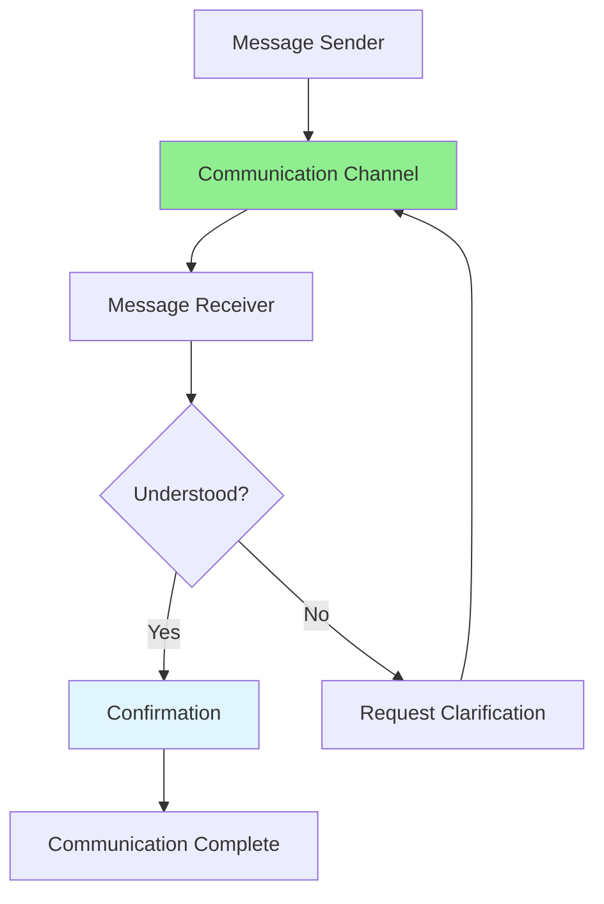

# 10.01 Team Communication / Giao tiếp trong nhóm

## Table of Contents / Mục lục
1. [Introduction / Giới thiệu](#introduction--giới-thiệu)
2. [Communication Channels / Kênh giao tiếp](#communication-channels--kênh-giao-tiếp)
3. [Effective Communication / Giao tiếp hiệu quả](#effective-communication--giao-tiếp-hiệu-quả)
4. [Best Practices / Thực hành tốt nhất](#best-practices--thực-hành-tốt-nhất)
5. [Summary / Tóm tắt](#summary--tóm-tắt)

---

## Introduction / Giới thiệu

### Overview / Tổng quan

**English**: Effective team communication is essential for successful software development. Learn to communicate clearly, use appropriate channels, and maintain professional communication standards.

**Vietnamese**: Giao tiếp nhóm hiệu quả rất quan trọng cho phát triển phần mềm thành công. Học cách giao tiếp rõ ràng, sử dụng kênh phù hợp và duy trì tiêu chuẩn giao tiếp chuyên nghiệp.

### Communication Flow / Luồng giao tiếp



---

## Communication Channels / Kênh giao tiếp

### Example 1: Communication Channels / Ví dụ 1: Kênh giao tiếp

```typescript
// Communication channel types / Loại kênh giao tiếp
enum CommunicationChannel {
  // Synchronous / Đồng bộ
  IN_PERSON = 'in_person',
  VIDEO_CALL = 'video_call',
  PHONE = 'phone',
  
  // Asynchronous / Bất đồng bộ
  EMAIL = 'email',
  SLACK = 'slack',
  JIRA = 'jira',
  GITHUB = 'github',
  DOCUMENTATION = 'documentation'
}

// Choose appropriate channel / Chọn kênh phù hợp
function chooseChannel(
  urgency: 'low' | 'medium' | 'high' | 'critical',
  complexity: 'simple' | 'complex',
  audience: 'individual' | 'team' | 'all'
): CommunicationChannel {
  if (urgency === 'critical') {
    return CommunicationChannel.PHONE;
  }
  
  if (complexity === 'complex' && audience === 'team') {
    return CommunicationChannel.VIDEO_CALL;
  }
  
  if (complexity === 'simple' && audience === 'individual') {
    return CommunicationChannel.SLACK;
  }
  
  return CommunicationChannel.EMAIL;
}
```

---

## Effective Communication / Giao tiếp hiệu quả

### Example 2: Communication Templates / Ví dụ 2: Mẫu giao tiếp

```typescript
// Code review message template / Mẫu tin nhắn code review
interface CodeReviewMessage {
  greeting: string;
  context: string;
  changes: string[];
  questions: string[];
  closing: string;
}

function createCodeReviewMessage(
  prNumber: number,
  changes: string[],
  questions: string[]
): string {
  return `
Hi team,

I've created PR #${prNumber} with the following changes:
${changes.map(c => `- ${c}`).join('\n')}

I'd appreciate your review, especially on:
${questions.map(q => `- ${q}`).join('\n')}

Please let me know if you have any questions or suggestions.

Thanks!
  `.trim();
}

// Status update template / Mẫu cập nhật trạng thái
function createStatusUpdate(
  completed: string[],
  inProgress: string[],
  blockers: string[]
): string {
  return `
## Daily Status Update

**Completed:**
${completed.map(t => `- ${t}`).join('\n')}

**In Progress:**
${inProgress.map(t => `- ${t}`).join('\n')}

**Blockers:**
${blockers.length > 0 
  ? blockers.map(b => `- ${b}`).join('\n')
  : '- None'
}
  `.trim();
}
```

---

## Best Practices / Thực hành tốt nhất

1. **Be clear and concise** - Get to the point quickly
2. **Use appropriate channels** - Match urgency to channel
3. **Provide context** - Include relevant background
4. **Ask questions** - Clarify when uncertain
5. **Respond promptly** - Acknowledge messages quickly

---

## Summary / Tóm tắt

### Key Takeaways / Điểm chính

- **Channels**: Choose right channel for situation
- **Clarity**: Be clear and concise
- **Context**: Provide necessary background
- **Responsiveness**: Respond promptly

### Next Steps / Bước tiếp theo

- [10.02 Collaboration Tools](./10.02_Collaboration_Tools.md) - Next: Collaboration Tools

---

**Last Updated / Cập nhật lần cuối**: 2024


