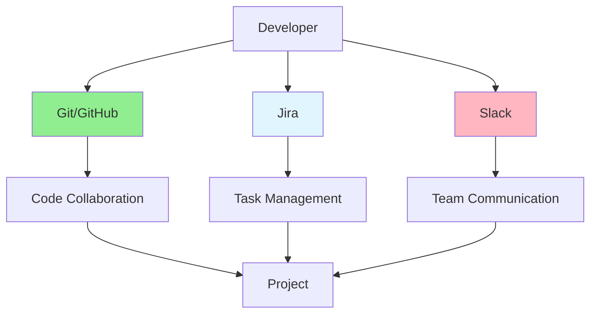

# 10.02 Collaboration Tools / Công cụ cộng tác

## Table of Contents / Mục lục
1. [Introduction / Giới thiệu](#introduction--giới-thiệu)
2. [Version Control / Kiểm soát phiên bản](#version-control--kiểm-soát-phiên-bản)
3. [Project Management / Quản lý dự án](#project-management--quản-lý-dự-án)
4. [Communication Tools / Công cụ giao tiếp](#communication-tools--công-cụ-giao-tiếp)
5. [Best Practices / Thực hành tốt nhất](#best-practices--thực-hành-tốt-nhất)
6. [Summary / Tóm tắt](#summary--tóm-tắt)

---

## Introduction / Giới thiệu

### Overview / Tổng quan

**English**: Collaboration tools enable effective teamwork. Master Git for version control, Jira for project management, and Slack for communication.

**Vietnamese**: Công cụ cộng tác cho phép làm việc nhóm hiệu quả. Thành thạo Git cho kiểm soát phiên bản, Jira cho quản lý dự án và Slack cho giao tiếp.

### Collaboration Tools Ecosystem / Hệ sinh thái công cụ cộng tác



---

## Version Control / Kiểm soát phiên bản

### Example 1: Git Workflow / Ví dụ 1: Quy trình Git

```bash
# Feature branch workflow / Quy trình nhánh tính năng
# Create feature branch / Tạo nhánh tính năng
git checkout -b feature/user-authentication

# Make changes / Thực hiện thay đổi
git add .
git commit -m "feat: add user authentication"

# Push to remote / Đẩy lên remote
git push origin feature/user-authentication

# Create pull request / Tạo pull request
# Use GitHub/GitLab UI or CLI / Sử dụng UI hoặc CLI

# After review, merge / Sau khi review, merge
git checkout main
git pull origin main
git merge feature/user-authentication
git push origin main
```

---

## Project Management / Quản lý dự án

### Example 2: Jira Integration / Ví dụ 2: Tích hợp Jira

```typescript
// Jira issue creation / Tạo issue Jira
interface JiraIssue {
  project: string;
  summary: string;
  description: string;
  issueType: 'Task' | 'Bug' | 'Story' | 'Epic';
  assignee?: string;
  priority: 'Lowest' | 'Low' | 'Medium' | 'High' | 'Highest';
}

// Create issue via API / Tạo issue qua API
async function createJiraIssue(issue: JiraIssue) {
  const response = await fetch('https://your-domain.atlassian.net/rest/api/3/issue', {
    method: 'POST',
    headers: {
      'Authorization': `Basic ${btoa('email:api-token')}`,
      'Content-Type': 'application/json'
    },
    body: JSON.stringify({
      fields: {
        project: { key: issue.project },
        summary: issue.summary,
        description: {
          type: 'doc',
          version: 1,
          content: [{
            type: 'paragraph',
            content: [{ type: 'text', text: issue.description }]
          }]
        },
        issuetype: { name: issue.issueType },
        priority: { name: issue.priority }
      }
    })
  });
  
  return response.json();
}
```

---

## Communication Tools / Công cụ giao tiếp

### Example 3: Slack Integration / Ví dụ 3: Tích hợp Slack

```typescript
// Slack notification / Thông báo Slack
async function sendSlackNotification(
  channel: string,
  message: string,
  attachments?: any[]
) {
  const response = await fetch('https://slack.com/api/chat.postMessage', {
    method: 'POST',
    headers: {
      'Authorization': `Bearer ${process.env.SLACK_BOT_TOKEN}`,
      'Content-Type': 'application/json'
    },
    body: JSON.stringify({
      channel,
      text: message,
      attachments
    })
  });
  
  return response.json();
}

// Deployment notification / Thông báo triển khai
async function notifyDeployment(
  environment: string,
  version: string,
  status: 'success' | 'failure'
) {
  await sendSlackNotification('#deployments', '', [{
    color: status === 'success' ? 'good' : 'danger',
    title: `Deployment ${status}`,
    fields: [
      { title: 'Environment', value: environment, short: true },
      { title: 'Version', value: version, short: true }
    ],
    ts: Math.floor(Date.now() / 1000)
  }]);
}
```

---

## Best Practices / Thực hành tốt nhất

1. **Use Git properly** - Follow branching strategy
2. **Update Jira** - Keep tickets updated
3. **Communicate clearly** - Use appropriate channels
4. **Document decisions** - Record important decisions
5. **Integrate tools** - Connect tools for automation

---

## Summary / Tóm tắt

### Key Takeaways / Điểm chính

- **Git**: Version control and code collaboration
- **Jira**: Project and task management
- **Slack**: Team communication
- **Integration**: Connect tools for efficiency

### Next Steps / Bước tiếp theo

- [10.03 Code Sharing](./10.03_Code_Sharing.md) - Next: Code Sharing

---

**Last Updated / Cập nhật lần cuối**: 2024

