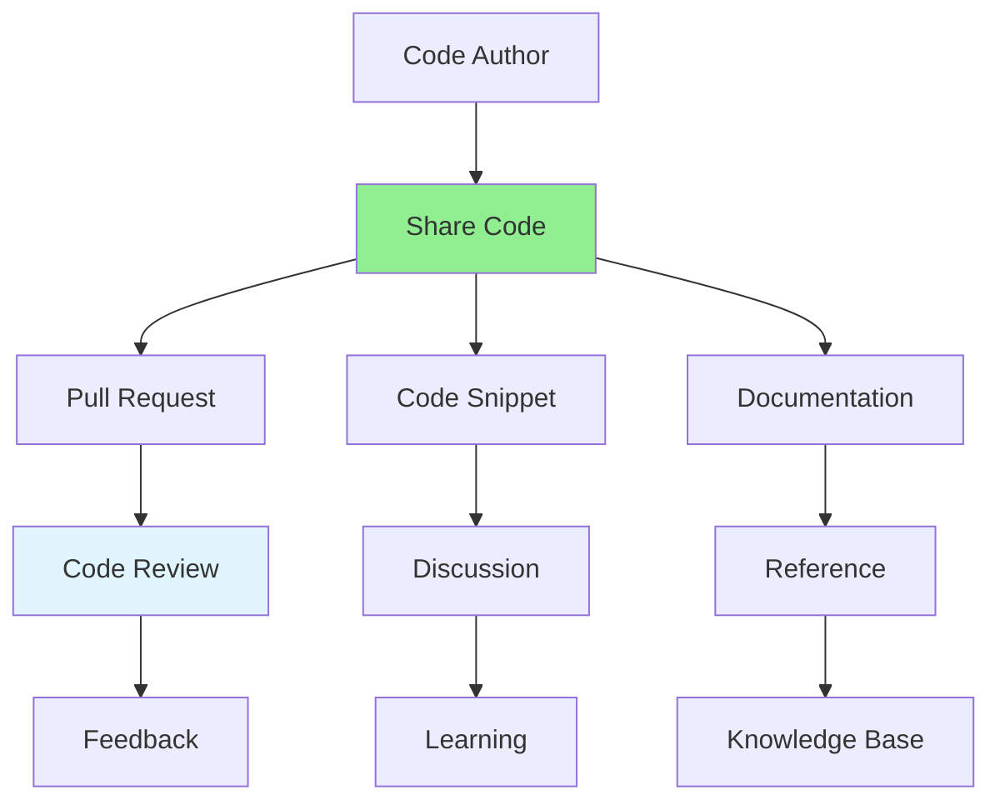

# 10.03 Code Sharing / Chia sẻ code

## Table of Contents / Mục lục
1. [Introduction / Giới thiệu](#introduction--giới-thiệu)
2. [Sharing Methods / Phương pháp chia sẻ](#sharing-methods--phương-pháp-chia-sẻ)
3. [Code Review Sharing / Chia sẻ code review](#code-review-sharing--chia-sẻ-code-review)
4. [Best Practices / Thực hành tốt nhất](#best-practices--thực-hành-tốt-nhất)
5. [Summary / Tóm tắt](#summary--tóm-tắt)

---

## Introduction / Giới thiệu

### Overview / Tổng quan

**English**: Sharing code effectively helps team members learn, collaborate, and maintain code quality. Learn best practices for sharing code snippets, pull requests, and knowledge.

**Vietnamese**: Chia sẻ code hiệu quả giúp thành viên nhóm học hỏi, cộng tác và duy trì chất lượng code. Học thực hành tốt nhất cho chia sẻ code snippet, pull request và kiến thức.

### Code Sharing Flow / Luồng chia sẻ code



---

## Sharing Methods / Phương pháp chia sẻ

### Example 1: Code Snippet Sharing / Ví dụ 1: Chia sẻ code snippet

```typescript
// Share code snippet with context / Chia sẻ code snippet với ngữ cảnh
interface CodeSnippet {
  title: string;
  description: string;
  language: string;
  code: string;
  context: string;
  useCase: string;
}

function shareCodeSnippet(snippet: CodeSnippet): string {
  return `
## ${snippet.title}

**Context:** ${snippet.context}
**Use Case:** ${snippet.useCase}

\`\`\`${snippet.language}
${snippet.code}
\`\`\`

**Description:** ${snippet.description}
  `.trim();
}

// Example usage / Ví dụ sử dụng
const snippet: CodeSnippet = {
  title: 'Async Error Handling Pattern',
  description: 'Pattern for handling async errors in TypeScript',
  language: 'typescript',
  code: `async function safeOperation() {
  try {
    return await riskyOperation();
  } catch (error) {
    logger.error('Operation failed', error);
    throw new AppError('Operation failed', error);
  }
}`,
  context: 'Backend service error handling',
  useCase: 'Use when calling external APIs'
};

console.log(shareCodeSnippet(snippet));
```

---

## Code Review Sharing / Chia sẻ code review

### Example 2: Pull Request Template / Ví dụ 2: Mẫu Pull Request

```markdown
## Description / Mô tả
Brief description of changes / Mô tả ngắn gọn về thay đổi

## Type of Change / Loại thay đổi
- [ ] Bug fix
- [ ] New feature
- [ ] Breaking change
- [ ] Documentation update

## Testing / Kiểm thử
- [ ] Unit tests added
- [ ] Integration tests added
- [ ] Manual testing completed

## Checklist / Danh sách kiểm tra
- [ ] Code follows style guidelines
- [ ] Self-review completed
- [ ] Comments added for complex logic
- [ ] Documentation updated
- [ ] No new warnings generated
```

---

## Best Practices / Thực hành tốt nhất

1. **Provide context** - Explain why and how
2. **Use clear examples** - Show real use cases
3. **Document decisions** - Explain design choices
4. **Request feedback** - Ask for specific feedback
5. **Respond to comments** - Engage in discussion

---

## Summary / Tóm tắt

### Key Takeaways / Điểm chính

- **Methods**: PRs, snippets, documentation
- **Context**: Always provide background
- **Feedback**: Encourage discussion
- **Learning**: Share knowledge actively

### Next Steps / Bước tiếp theo

- [10.04 Pair Programming](./10.04_Pair_Programming.md) - Next: Pair Programming

---

**Last Updated / Cập nhật lần cuối**: 2024

