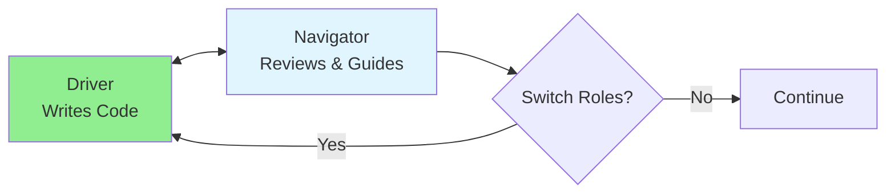

# 10.04 Pair Programming / Lập trình cặp

## Table of Contents / Mục lục
1. [Introduction / Giới thiệu](#introduction--giới-thiệu)
2. [Pair Programming Roles / Vai trò lập trình cặp](#pair-programming-roles--vai-trò-lập-trình-cặp)
3. [Best Practices / Thực hành tốt nhất](#best-practices--thực-hành-tốt-nhất)
4. [Summary / Tóm tắt](#summary--tóm-tắt)

---

## Introduction / Giới thiệu

### Overview / Tổng quan

**English**: Pair programming involves two developers working together on the same code. Learn effective pairing techniques, role switching, and collaboration strategies.

**Vietnamese**: Lập trình cặp bao gồm hai developer làm việc cùng nhau trên cùng code. Học kỹ thuật pairing hiệu quả, chuyển đổi vai trò và chiến lược cộng tác.

### Pair Programming Flow / Luồng lập trình cặp



---

## Pair Programming Roles / Vai trò lập trình cặp

### Example 1: Pair Programming Session / Ví dụ 1: Phiên lập trình cặp

```typescript
// Pair programming session structure / Cấu trúc phiên lập trình cặp
interface PairSession {
  driver: string; // Person writing code / Người viết code
  navigator: string; // Person reviewing / Người review
  task: string;
  duration: number; // minutes / phút
  switchInterval: number; // minutes / phút
}

class PairProgrammingSession {
  private session: PairSession;
  private startTime: Date;
  
  constructor(session: PairSession) {
    this.session = session;
    this.startTime = new Date();
  }
  
  // Switch roles / Chuyển đổi vai trò
  switchRoles() {
    const temp = this.session.driver;
    this.session.driver = this.session.navigator;
    this.session.navigator = temp;
    console.log(`Roles switched. Driver: ${this.session.driver}`);
  }
  
  // Check if time to switch / Kiểm tra có đến lúc chuyển đổi
  shouldSwitch(): boolean {
    const elapsed = (Date.now() - this.startTime.getTime()) / 60000;
    return elapsed >= this.session.switchInterval;
  }
}

// Best practices / Thực hành tốt nhất
const session = new PairProgrammingSession({
  driver: 'Alice',
  navigator: 'Bob',
  task: 'Implement user authentication',
  duration: 120,
  switchInterval: 30 // Switch every 30 minutes / Chuyển đổi mỗi 30 phút
});
```

---

## Best Practices / Thực hành tốt nhất

1. **Switch regularly** - Change roles every 20-30 minutes
2. **Communicate clearly** - Explain thoughts and decisions
3. **Stay focused** - Avoid distractions
4. **Take breaks** - Rest between sessions
5. **Learn from each other** - Share knowledge

---

## Summary / Tóm tắt

### Key Takeaways / Điểm chính

- **Roles**: Driver and Navigator
- **Switching**: Regular role changes
- **Communication**: Clear and constant
- **Benefits**: Better code quality and learning

### Next Steps / Bước tiếp theo

- [10.05 Code Review Process](./10.05_Code_Review_Process.md) - Next: Code Review Process

---

**Last Updated / Cập nhật lần cuối**: 2024

