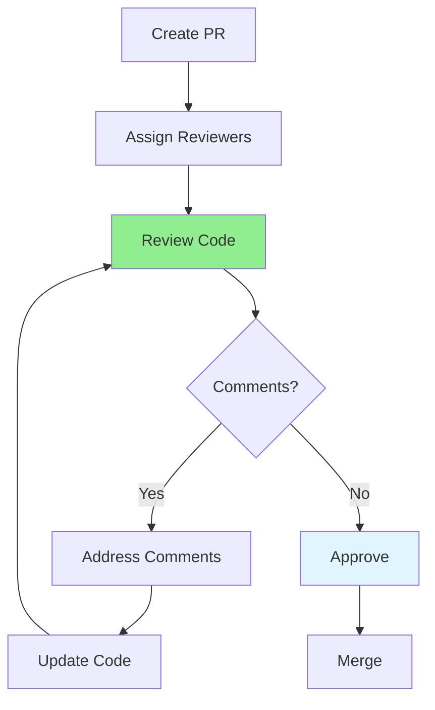

# 10.05 Code Review Process / Quy trình code review

## Table of Contents / Mục lục
1. [Introduction / Giới thiệu](#introduction--giới-thiệu)
2. [Review Workflow / Quy trình review](#review-workflow--quy-trình-review)
3. [Review Checklist / Danh sách kiểm tra review](#review-checklist--danh-sách-kiểm-tra-review)
4. [Best Practices / Thực hành tốt nhất](#best-practices--thực-hành-tốt-nhất)
5. [Summary / Tóm tắt](#summary--tóm-tắt)

---

## Introduction / Giới thiệu

### Overview / Tổng quan

**English**: Code review is essential for maintaining code quality. Learn effective review processes, provide constructive feedback, and handle review comments professionally.

**Vietnamese**: Code review rất quan trọng để duy trì chất lượng code. Học quy trình review hiệu quả, cung cấp phản hồi xây dựng và xử lý comment review chuyên nghiệp.

### Code Review Flow / Luồng code review



---

## Review Workflow / Quy trình review

### Example 1: Review Process / Ví dụ 1: Quy trình review

```typescript
// Code review workflow / Quy trình code review
interface CodeReview {
  prNumber: number;
  author: string;
  reviewers: string[];
  status: 'pending' | 'in_review' | 'approved' | 'changes_requested';
  comments: ReviewComment[];
}

interface ReviewComment {
  reviewer: string;
  file: string;
  line: number;
  comment: string;
  type: 'suggestion' | 'question' | 'blocker';
  resolved: boolean;
}

// Review checklist / Danh sách kiểm tra review
const reviewChecklist = [
  'Code follows style guidelines',
  'Tests are included',
  'Documentation is updated',
  'No security vulnerabilities',
  'Performance is acceptable',
  'Error handling is proper'
];
```

---

## Review Checklist / Danh sách kiểm tra review

### Example 2: Automated Review Checks / Ví dụ 2: Kiểm tra review tự động

```typescript
// Automated review checks / Kiểm tra review tự động
async function performReviewChecks(code: string): Promise<ReviewCheck[]> {
  const checks: ReviewCheck[] = [];
  
  // Check for TODO comments / Kiểm tra comment TODO
  if (code.includes('TODO') || code.includes('FIXME')) {
    checks.push({
      type: 'warning',
      message: 'Contains TODO/FIXME comments',
      suggestion: 'Address before merging'
    });
  }
  
  // Check for console.log / Kiểm tra console.log
  if (code.includes('console.log')) {
    checks.push({
      type: 'warning',
      message: 'Contains console.log statements',
      suggestion: 'Use proper logging'
    });
  }
  
  // Check for error handling / Kiểm tra xử lý lỗi
  if (!code.includes('try') && code.includes('await')) {
    checks.push({
      type: 'error',
      message: 'Missing error handling',
      suggestion: 'Add try-catch blocks'
    });
  }
  
  return checks;
}
```

---

## Best Practices / Thực hành tốt nhất

1. **Review promptly** - Review within 24 hours
2. **Be constructive** - Provide helpful feedback
3. **Ask questions** - Clarify unclear code
4. **Approve when ready** - Don't block unnecessarily
5. **Learn from reviews** - Use feedback to improve

---

## Summary / Tóm tắt

### Key Takeaways / Điểm chính

- **Process**: Clear review workflow
- **Checklist**: Systematic review
- **Feedback**: Constructive and helpful
- **Timeliness**: Review promptly

### Next Steps / Bước tiếp theo

- [10.06 Conflict Resolution](./10.06_Conflict_Resolution.md) - Next: Conflict Resolution

---

**Last Updated / Cập nhật lần cuối**: 2024

