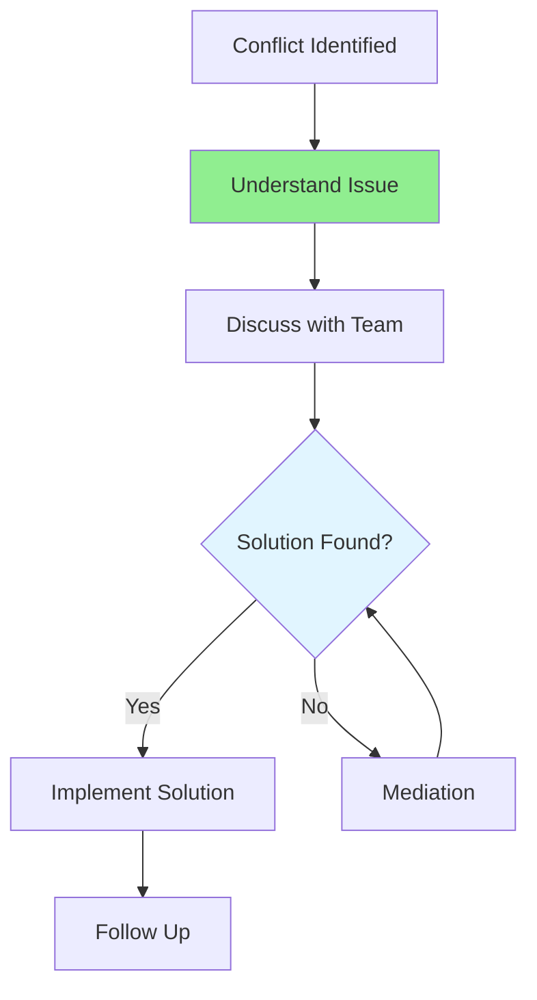

# 10.06 Conflict Resolution / Giải quyết xung đột

## Table of Contents / Mục lục
1. [Introduction / Giới thiệu](#introduction--giới-thiệu)
2. [Conflict Types / Loại xung đột](#conflict-types--loại-xung-đột)
3. [Resolution Strategies / Chiến lược giải quyết](#resolution-strategies--chiến-lược-giải-quyết)
4. [Best Practices / Thực hành tốt nhất](#best-practices--thực-hành-tốt-nhất)
5. [Summary / Tóm tắt](#summary--tóm-tắt)

---

## Introduction / Giới thiệu

### Overview / Tổng quan

**English**: Conflicts are inevitable in team environments. Learn to identify, address, and resolve conflicts professionally to maintain team harmony and productivity.

**Vietnamese**: Xung đột là không thể tránh khỏi trong môi trường nhóm. Học cách xác định, giải quyết và xử lý xung đột chuyên nghiệp để duy trì sự hòa hợp và năng suất nhóm.

### Conflict Resolution Process / Quy trình giải quyết xung đột



---

## Conflict Types / Loại xung đột

### Example 1: Conflict Classification / Ví dụ 1: Phân loại xung đột

```typescript
// Conflict types / Loại xung đột
enum ConflictType {
  TECHNICAL = 'technical', // Code/architecture disagreements / Bất đồng về code/kiến trúc
  PROCESS = 'process', // Workflow disagreements / Bất đồng về quy trình
  PERSONAL = 'personal', // Interpersonal issues / Vấn đề cá nhân
  PRIORITY = 'priority', // Priority disagreements / Bất đồng về ưu tiên
  RESOURCE = 'resource' // Resource allocation / Phân bổ tài nguyên
}

interface Conflict {
  type: ConflictType;
  description: string;
  parties: string[];
  severity: 'low' | 'medium' | 'high';
  resolution?: string;
}

// Conflict resolution strategies / Chiến lược giải quyết xung đột
function resolveConflict(conflict: Conflict): string {
  switch (conflict.type) {
    case ConflictType.TECHNICAL:
      return 'Discuss technical merits, involve senior developer';
    case ConflictType.PROCESS:
      return 'Review process, find compromise';
    case ConflictType.PERSONAL:
      return 'Address privately, focus on work';
    case ConflictType.PRIORITY:
      return 'Consult product owner, align on priorities';
    case ConflictType.RESOURCE:
      return 'Review resource allocation, adjust if needed';
  }
}
```

---

## Resolution Strategies / Chiến lược giải quyết

### Example 2: Conflict Resolution Template / Ví dụ 2: Mẫu giải quyết xung đột

```typescript
// Conflict resolution steps / Các bước giải quyết xung đột
class ConflictResolver {
  async resolve(conflict: Conflict): Promise<Resolution> {
    // Step 1: Acknowledge / Bước 1: Thừa nhận
    await this.acknowledgeConflict(conflict);
    
    // Step 2: Understand / Bước 2: Hiểu
    const perspectives = await this.gatherPerspectives(conflict);
    
    // Step 3: Find common ground / Bước 3: Tìm điểm chung
    const commonGround = this.findCommonGround(perspectives);
    
    // Step 4: Propose solution / Bước 4: Đề xuất giải pháp
    const solution = await this.proposeSolution(commonGround);
    
    // Step 5: Implement / Bước 5: Triển khai
    return await this.implementSolution(solution);
  }
  
  private findCommonGround(perspectives: string[]): string {
    // Find shared goals / Tìm mục tiêu chung
    return 'Shared goal: Deliver quality software';
  }
}
```

---

## Best Practices / Thực hành tốt nhất

1. **Address early** - Don't let conflicts escalate
2. **Listen actively** - Understand all perspectives
3. **Focus on issues** - Not personalities
4. **Find compromise** - Win-win solutions
5. **Document resolution** - Learn from conflicts

---

## Summary / Tóm tắt

### Key Takeaways / Điểm chính

- **Types**: Technical, process, personal, priority, resource
- **Resolution**: Acknowledge, understand, solve
- **Approach**: Professional and respectful
- **Learning**: Document and learn from conflicts

### Next Steps / Bước tiếp theo

- [10.07 Meeting Participation](./10.07_Meeting_Participation.md) - Next: Meeting Participation

---

**Last Updated / Cập nhật lần cuối**: 2024


