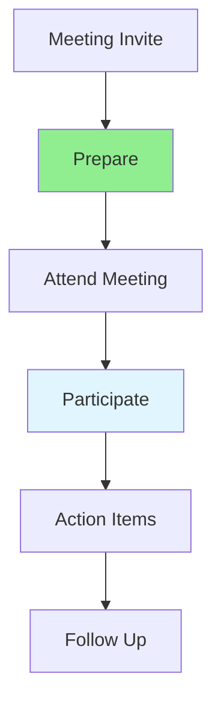

# 10.07 Meeting Participation / Tham gia cuộc họp

## Table of Contents / Mục lục
1. [Introduction / Giới thiệu](#introduction--giới-thiệu)
2. [Meeting Types / Loại cuộc họp](#meeting-types--loại-cuộc-họp)
3. [Effective Participation / Tham gia hiệu quả](#effective-participation--tham-gia-hiệu-quả)
4. [Best Practices / Thực hành tốt nhất](#best-practices--thực-hành-tốt-nhất)
5. [Summary / Tóm tắt](#summary--tóm-tắt)

---

## Introduction / Giới thiệu

### Overview / Tổng quan

**English**: Effective meeting participation contributes to team success. Learn to prepare, contribute, and follow up on meetings professionally.

**Vietnamese**: Tham gia cuộc họp hiệu quả góp phần vào thành công nhóm. Học cách chuẩn bị, đóng góp và theo dõi cuộc họp chuyên nghiệp.

### Meeting Participation Flow / Luồng tham gia cuộc họp



---

## Meeting Types / Loại cuộc họp

### Example 1: Meeting Preparation / Ví dụ 1: Chuẩn bị cuộc họp

```typescript
// Meeting types / Loại cuộc họp
enum MeetingType {
  STANDUP = 'standup', // Daily standup / Họp hàng ngày
  PLANNING = 'planning', // Sprint planning / Lập kế hoạch sprint
  RETROSPECTIVE = 'retrospective', // Sprint retrospective / Tổng kết sprint
  REVIEW = 'review', // Code review / Review code
  ONE_ON_ONE = 'one_on_one' // One-on-one / Một-một
}

interface MeetingPreparation {
  type: MeetingType;
  agenda: string[];
  materials: string[];
  questions: string[];
  updates: string[];
}

// Prepare for meeting / Chuẩn bị cho cuộc họp
function prepareForMeeting(type: MeetingType): MeetingPreparation {
  switch (type) {
    case MeetingType.STANDUP:
      return {
        type,
        agenda: ['What did I do?', 'What will I do?', 'Any blockers?'],
        materials: ['Task list', 'Progress notes'],
        questions: [],
        updates: ['Completed tasks', 'In-progress tasks']
      };
    case MeetingType.PLANNING:
      return {
        type,
        agenda: ['Review backlog', 'Estimate tasks', 'Assign work'],
        materials: ['Backlog items', 'Estimation notes'],
        questions: ['Clarifications needed?'],
        updates: []
      };
    default:
      return { type, agenda: [], materials: [], questions: [], updates: [] };
  }
}
```

---

## Effective Participation / Tham gia hiệu quả

### Example 2: Meeting Notes Template / Ví dụ 2: Mẫu ghi chú cuộc họp

```typescript
// Meeting notes structure / Cấu trúc ghi chú cuộc họp
interface MeetingNotes {
  date: Date;
  attendees: string[];
  agenda: string[];
  discussion: string[];
  decisions: string[];
  actionItems: ActionItem[];
}

interface ActionItem {
  task: string;
  owner: string;
  dueDate: Date;
  status: 'pending' | 'in_progress' | 'completed';
}

// Create meeting notes / Tạo ghi chú cuộc họp
function createMeetingNotes(
  attendees: string[],
  agenda: string[]
): MeetingNotes {
  return {
    date: new Date(),
    attendees,
    agenda,
    discussion: [],
    decisions: [],
    actionItems: []
  };
}
```

---

## Best Practices / Thực hành tốt nhất

1. **Prepare in advance** - Review agenda and materials
2. **Arrive on time** - Respect others' time
3. **Contribute actively** - Share ideas and updates
4. **Take notes** - Document decisions and actions
5. **Follow up** - Complete action items

---

## Summary / Tóm tắt

### Key Takeaways / Điểm chính

- **Preparation**: Review agenda and materials
- **Participation**: Contribute actively
- **Documentation**: Take notes and follow up
- **Respect**: Be on time and engaged

### Next Steps / Bước tiếp theo

- [10.08 Documentation Collaboration](./10.08_Documentation_Collaboration.md) - Next: Documentation Collaboration

---

**Last Updated / Cập nhật lần cuối**: 2024


